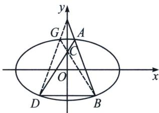

<!-- question-source:start -->
例4 (2024·北京)已知椭圆方程 $E: \frac{x^{2}}{a^{2}} + \frac{y^{2}}{b^{2}} = 1 (a > b > 0)$ , 以椭圆 $E$ 的焦点和短轴端点为顶点的四边形是边长为 2 的正方形. 过点 $(0, t) (t > \sqrt{2})$ 且斜率存在的直线与椭圆 $E$ 交于不同的两点 $A, B$ , 过点 $A$ 和 $C$

(0, 1)的直线 AC 与椭圆 E 的另一个交点为 D.

(1)求椭圆 E 的方程及离心率;

(2)若直线 $BD$ 的斜率为 0，求 $t$ 的值.

(1)椭圆方程 $C: \frac{x^2}{a^2} + \frac{y^2}{b^2} = 1 (a > b > 0)$ , 焦点和短轴端点构成边长为 2 的正方形, 则 $b = c = \frac{2}{\sqrt{2}} = \sqrt{2}$ , 故 $a^2 = b^2 + c^2 = 2$ , 解得 $a = \sqrt{2}$ ; $a = \sqrt{b^2 + c^2} = 2$ , 所以椭圆方程为 $\frac{x^2}{4} + \frac{y^2}{2} = 1$ , 离心率为 $e = \frac{\sqrt{2}}{2}$ ;

(2) 连接 BC 交椭圆于点 G，由于 $k_{BD}=0$ ，所以 $k_{AC}+k_{BG}=0$ ， $k_{AB}+k_{DG}=0$ ，

不妨令 AD: $y=k_{1}x+1$ , BG: $y=-k_{1}x+1$ ,

则以 AD 和 BG 构成的退化二次曲线方程为 $(k_{1}x-y+1)(k_{1}x+y-1)=0$ ;

$$
A B: y = k _ {2} x + t, D G: y = - k _ {2} x + t,
$$

则以 AB 和 DG 构成的退化二次曲线方程为 $(k_{2}x-y+t)(k_{2}x+y-t)=0$ ;

四点联立得： $(k_{2}x - y + t)(k_{2}x + y - t) + \lambda (k_{1}x - y + 1)(k_{1}x + y - 1) = \mu \left(\frac{x^{2}}{4} +\frac{y^{2}}{2} -1\right),$

对比 $y^{2}$ 系数： $-1-\lambda=\frac{\mu}{2}$ ，对比 y 系数： $2t+2\lambda=0$ ，对比常数项： $-t^{2}-\lambda=-\mu$

综上 $t^2 - 3t + 2 = 0$ ， $t = 1$ （舍）或 $t = 2$
<!-- question-source:end -->

![[高中/总复习/专题/2026版高中《mst老唐说题》圆锥曲线专题（数学）/上册/第08章_联立计算高阶篇/第六节_二次曲线方程与四点联立曲线系/二_用曲线系方程破解高考极点极线题型/例题/answers/Q00048730A1.md]]
