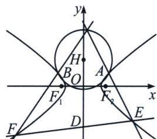

<!-- question-source:start -->
例10 (2024 江苏南京师大附中(25 陪跑课学员林浩然提问))已知点 $A(2,1)$ , $B(-2,1)$ 在双曲线 $C$ : $\frac{x^{2}}{2}-y^{2}=1$ 上, 过点 $D(0,-3)$ 作直线 $l$ 交双曲线于点 $E$ , $F$ (不与点 $A$ , $B$ 重合). 证明:

(1)记点 $P(0, 2 + \sqrt{5})$ ，当直线 l 平行于 x 轴，且与双曲线的右支交点为 E 时，P, A, E 三点共线；

(2) 直线 $AE$ 与直线 $BF$ 的交点在定圆上，并求出该圆的方程.

(1)由题意, 当直线 $l$ 平行于 $x$ 轴时, $l$ 方程为 $y = -3$ , 且与双曲线的右支交点为 $E$ , 则 $\frac{x^2}{2} - (-3)^2 = 1 \Rightarrow E(2\sqrt{5}, -3)$ , $AE$ 的斜率 $k_{AE} = \frac{4}{2 - 2\sqrt{5}} = -\frac{1 + \sqrt{5}}{2}$ , $AP$ 的斜率 $k_{AP} = \frac{1 + \sqrt{5}}{-2} = -\frac{1 + \sqrt{5}}{2} = k_{AE}$ , 所以 $P, A, E$ 三点共线.

(2)解法一：由题知直线 EF 斜率存在，且过 $D(0, -3)$ ，设 EF: y = kx - 3, $E(x_{1}, y_{1})$ , $F(x_{2}, y_{2})$ 与双曲线 $\frac{x^{2}}{2}-y^{2}=1$ 联立得： $(1-2k^{2})x^{2}+12kx-20=0,\quad1-2k^{2}\neq0$ 且 $\Delta=80-16k^{2}>0$

则 $x_{1}x_{2} = \frac{20}{2k^{2} - 1}, x_{1} + x_{2} = \frac{12k}{2k^{2} - 1}$ ，设直线 $AE$ 与直线 $BF$ 的交点为 $G$ ，斜率分别为 $k_{1}, k_{2}$ ，

$$
\tan \angle B G A = \frac {k _ {2} - k _ {1}}{1 + k _ {1} k _ {2}} = \frac {\frac {y _ {2} - 1}{x _ {2} + 2} - \frac {y _ {1} - 1}{x _ {1} - 2}}{1 + \frac {y _ {2} - 1}{x _ {2} + 2} \cdot \frac {y _ {1} - 1}{x _ {1} - 2}} = \frac {(4 - 2 k) (x _ {1} + x _ {2}) - 8 x _ {1} + 1 6}{(k ^ {2} + 1) x _ {1} x _ {2} - (2 + 4 k) (x _ {1} + x _ {2}) + 4 x _ {1} + 1 2} =
$$

$\frac{\frac{-8k^2 - 48k + 16}{1 - 2k^2} - 8x_1}{\frac{4k^2 + 24k - 8}{1 - 2k^2} + 4x_1} = -2$ ， $\tan \angle BGA = -2 \Rightarrow \sin \angle BGA = \frac{2\sqrt{5}}{5}$ ，在 $\triangle BGA$ 中， $\sin \angle BGA = \frac{2\sqrt{5}}{5}$ ， $|AB| = 4$ ，

由正弦定理得 $\triangle BGA$ 外接圆半径 $R = \frac{|AB|}{2\sin\angle BGA} = \frac{4}{\frac{4\sqrt{5}}{5}} = \sqrt{5}$ , 所以 $G$ 在过 $A, B$ 且半径为 $\sqrt{5}$ 的圆上, 设其圆心为 $H$ ，因为 $A(2,1)$ ， $B(-2,1)$ ， $H$ 在线段 $AB$ 的中垂线上，所以 $H$ 在 $y$ 轴上，设 $H(0,t)$ ， $t > 1$ ，则由 $R^2 = \left(\frac{|AB|}{2}\right)^2 + (t - 1)^2 \Rightarrow 5 = 4 + (t - 1)^2 \Rightarrow t = 2$ 或 $t = 0$ （舍），所以定圆方程为 $x^2 + (y - 2)^2 = 5$ .
<!-- question-source:end -->

![[高中/总复习/专题/2026版高中《mst老唐说题》圆锥曲线专题（数学）/上册/第08章_联立计算高阶篇/第六节_二次曲线方程与四点联立曲线系/五_曲线系挖掘四点形斜率关系与隐藏轨迹/例题/answers/Q00048736A1.md]]
