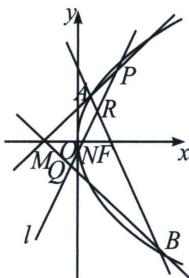

<!-- question-source:start -->
例15（2021·浙江）如图，已知 F 是抛物线 $y^{2}=2px(p>0)$ 的焦点，M 是抛物线的准线与 x 轴的交点，且 $|MF|=2$ .

(1)求抛物线的方程:

(2)设过点 F 的直线交抛物线于 A, B 两点，若斜率为 2 的直线 l 与直线 MA, MB, AB, x 轴依次交于点 P, Q, R, N，且满足 $\left|RN\right|^{2}=\left|PN\right|\cdot\left|QN\right|$ ，求直线 l 在 x 轴上截距的取值范围.

##
<!-- question-source:end -->

![[高中/总复习/专题/2026版高中《mst老唐说题》圆锥曲线专题（数学）/上册/第08章_联立计算高阶篇/第六节_二次曲线方程与四点联立曲线系/八_用退化二次曲线系方程破解浙江21高考压轴题/例题/answers/Q00048740A1.md]]
