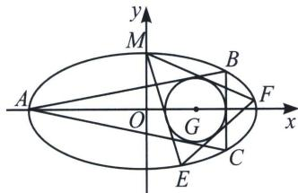

<!-- question-source:start -->
例⑪ (2009·江西)如图, 已知圆 $G: (x - 2)^{2} + y^{2} = r^{2}$ 是椭圆 $\frac{x^{2}}{16} + y^{2} = 1$ 的内接 $\triangle ABC$ 的内切圆, 其中 $A$ 为椭圆的左顶点.

(1)求圆 G 的半径 r;

(2)过点 $M(0,1)$ 作圆 $G$ 的两条切线交椭圆于 $E$ , $F$ 两点, 证明: 直线 $EF$ 与圆 $G$ 相切.

## 解析
(1) $r=\frac{2}{3}$

(2)我们发现 M、E、F 三点在椭圆上，令 ME: $y=k_{1}x+1$ ，MF: $y=k_{2}x+1$ ，EF: $y=kx+m$ ，点 M 处的切线方程为 y=1，故构造曲线系方程，即 $(y-1)(kx-y+m)+\lambda(k_{1}x-y+1)(k_{2}x-y+1)=\mu\left(\frac{x^{2}}{16}+y^{2}-1\right)$ ，且 ME、MF 均与圆 G 相切，故 $\frac{|2k_{1}+1|}{\sqrt{k_{1}^{2}+1}}=\frac{|2k_{2}+1|}{\sqrt{k_{2}^{2}+1}}=\frac{2}{3}$ ，即 $\left\{\begin{aligned}&32k_{1}^{2}+36k_{1}+5=0\\ &32k_{2}^{2}+36k_{2}+5=0\end{aligned}\right.$ ，根据同

构方程思想可知 $\left\{ \begin{array}{l} k_{1} + k_{2} = -\frac{9}{8} \\ k_{1}k_{2} = \frac{5}{32} \end{array} \right.$ ，再看曲线系方程， $\left\{ \begin{array}{l} xy \text{ 系数：} k + \lambda (-k_{1} - k_{2}) = 0 \\ \text{常数项：} -m + \lambda = -\mu \\ x^{2} \text{ 系数：} \lambda k_{1}k_{2} = \frac{\mu}{16} \\ y^{2} \text{ 系数：} -1 + \lambda = \mu \\ y \text{ 系数：} 1 + m - 2\lambda = 0 \end{array} \right.$ 所以 $\left\{ \begin{array}{l} k = \frac{3}{4} \\ m = -\frac{7}{3} \\ \lambda = -\frac{2}{3} \\ \mu = -\frac{5}{3} \end{array} \right.$ ，

所以 $l_{EF}: 3x - 4y = \frac{28}{3}$ ，故 $d = \frac{\left|3 \times 2 - \frac{28}{3}\right|}{5} = \frac{2}{3}$ ，直线 $EF$ 与圆 $G$ 相切.
<!-- question-source:end -->
