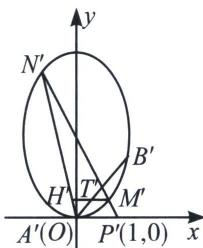

<!-- question-source:start -->
例9 (2022·全国乙卷)已知椭圆 E 的中心为坐标原点，对称轴为 x 轴、y 轴，且过 A(0, -2)，B $\left(\frac{3}{2}, -1\right)$ 两点.

(1)求 $E$ 的方程;

(2)设过点 $P(1, -2)$ 的直线交 $E$ 于 $M, N$ 两点, 过 $M$ 且平行于 $x$ 轴的直线与线段 $A B$ 交于点 $T$ , 点 $H$ 满足 $\overrightarrow{M T} = \overrightarrow{T H}$ . 证明: 直线 $H N$ 过定点.

(1) 设 $E: \frac{x^2}{a^2} + \frac{y^2}{b^2} = 1$ ，将 $(0, -2)$ ， $\left(\frac{3}{2}, -1\right)$ 代入得 $\begin{cases} a^2 = 3 \\ b^2 = 4 \end{cases}$ ，所以 $\frac{x^2}{3} + \frac{y^2}{4} = 1$ .

(2)我们发现曲线上有三点 A、M、N、方便简化计算，我们将 A 移到原点，

将椭圆按 $\overrightarrow{AO}=(0,2)$ 平移得 $E':\frac{x^{2}}{3}+\frac{y^{2}}{4}-y=0,$

$A^{\prime}M^{\prime}: y=k_{1}x, A^{\prime}N^{\prime}: y=k_{2}x, M^{\prime}N^{\prime}: x=ty+1, A^{\prime}$ 处切线 $l_{A^{\prime}P^{\prime}}: y=0$ ,

所以 $(k_{1}x - y)(k_{2}x - y) + \lambda (x - ty - 1)y = \mu \left(\frac{x^{2}}{3} +\frac{y^{2}}{4} -y\right)$

xy 系数： $-k_{1}-k_{2}+\lambda=0$ ，

$x^{2}$ 系数： $k_{1}k_{2}=\frac{\mu}{3}$ ,

y 系数： $-\lambda=-\mu,$

所以 $\frac{k_1 + k_2}{k_1k_2} = \frac{1}{k_1} +\frac{1}{k_2} = 3$ ，由于 $\overrightarrow{MT} = \overrightarrow{TH}$ ，故 $\frac{1}{k_1} +\frac{1}{k_{OH'}} = \frac{2}{k_{OB'}} = 3$ ，故 $H^{\prime}$ 、 $N^{\prime}$ 、 $O$ 三点共线，平移回去可知，直线 $HN$ 恒过(0，-2).
<!-- question-source:end -->

![[高中/总复习/专题/2026版高中《mst老唐说题》圆锥曲线专题（数学）/上册/第08章_联立计算高阶篇/第六节_二次曲线方程与四点联立曲线系/四_曲线上三点构造切线的适配曲线系方程速解斜率和积/例题/answers/Q00048735A1.md]]
