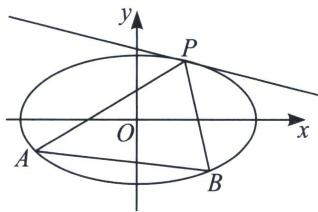

## 四、曲线上三点构造切线的适配曲线系方程速解斜率和积

关于曲线系方程，一定是两对边直线相乘构成退化的二次曲线，不能是邻边的，其实在实际教学过程中，总有学生会问及为什么不能是邻边，我们仅以例6为例，通过平移构造的曲线系方程，如果以

$$
B ^ {\prime} D ^ {\prime}: x = \frac {y}{k _ {4}}, A ^ {\prime} B ^ {\prime}: x = \frac {y}{k _ {1}} - 3 \Rightarrow \left(x - \frac {y}{k _ {4}}\right) \left(x - \frac {y}{k _ {1}} + 3\right) = 0,
$$

$$
A ^ {\prime} C ^ {\prime}: x = \frac {y}{k _ {3}}, C ^ {\prime} D ^ {\prime}: x = \frac {y}{k _ {2}} + m \Rightarrow \left(x - \frac {y}{k _ {3}}\right) \left(x - \frac {y}{k _ {2}} + m\right) = 0,
$$

故曲线系方程为： $\left(x - \frac{y}{k_4}\right)\left(x - \frac{y}{k_1} +3\right) + \lambda \left(x - \frac{y}{k_3}\right)\left(x - \frac{y}{k_2} +m\right) = \mu \left(\frac{x^2}{9} +\frac{y^2}{5} +\frac{2}{9} x - \frac{8}{9}\right)$ ，显然一边有常数项，而另一边没有常数项，这就是一个明显的错误，在学习曲线系的初期，很多同学都容易犯这个错误.

那么相邻两边就不能相乘作为退化的二次曲线方程吗？显然是可以的，那我们就需要有极限思想，其中的一条弦变成了无穷小，那就是某点处的切线，如图，这样对边自然等同了邻边。

如图所示，P、A、B三点在二次曲线C： $F(x, y)=0$ 上，曲线C在P处的切线方程为 $l_{P}=0$ ，故一定有曲线系方程 $l_{PA}(x, y) \cdot l_{PB}(x, y)+\lambda l_{P}(x, y) \cdot l_{AB}(x, y)=\mu F(x, y)$ ，这种方法类比于齐次化求定点定值问题，属于另一种角度解读.

![[高中/总复习/专题/2026版高中《mst老唐说题》圆锥曲线专题（数学）/上册/第08章_联立计算高阶篇/第六节_二次曲线方程与四点联立曲线系/四_曲线上三点构造切线的适配曲线系方程速解斜率和积/例题/Q00053101.md]]
