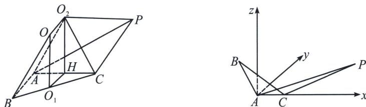
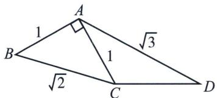
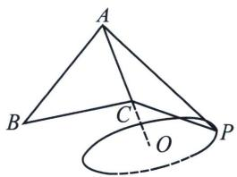
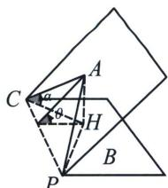
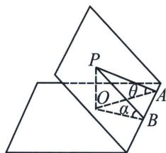

> [!faq]- 《圆锥曲线专题(上册)》例题解析
>
> > [!success]- **【答案】** D
>
> > [!note]- **【解析】**
> > 解析 (1)(i)证明：因为 $AC = CD = 1$ ， $\angle CAD = \angle ADC = 30^{\circ}$ ， $\angle BAD = 120^{\circ}$ 所以 $\angle BAC = 90^{\circ}$ ， $AB \perp AC$ ，翻折后同样有 $AB \perp AC$ ，又 $AB \perp PC$ ， $PC \cap AC = C$ 所以 $AB \perp$ 平面 $PCA$ ，又 $AB \subset$ 平面 $ABC$ ，所以平面 $PAC \perp$ 平面 $ABC$ ；
> >
> > (ii)如图, 因为 $\triangle ABC$ 的外接圆圆心 $O_{1}$ 位于 $BC$ 中点, 作 $C$ 关于 $AP$ 的对称点 $O_{2}$ ,
> >
> > 
> >
> > 则 $O_{2}C=O_{2}A=O_{2}P=1$ ， $O_{2}$ 为 $\triangle ACP$ 的外接圆圆心，作 $O_{1}H\perp AC$ 于 H，则 H 为 AC 中点，则 $O_{1}H\perp$ 平面 ACP， $O_{1}H\perp O_{2}H$ ，又 $\triangle O_{2}AC$ 为等边三角形，所以 $O_{2}H\perp AC$ ，而外接球球心 O，满足 $OO_{1}\perp$ 平面 ABC， $OO_{2}\perp$ 平面 ACP，所以 $OO_{1}=O_{2}H=\frac{\sqrt{3}}{2}$ ， $BO_{1}=\frac{\sqrt{2}}{2}$ ，所以球 O 的半径为 $R=\sqrt{BO_{1}^{2}+OO_{1}^{2}}=\sqrt{\frac{1}{2}+\frac{3}{4}}=\frac{\sqrt{5}}{2}$ ;
> >
> > (2)
> > 解法一: 以 $A$ 为原点, $AC$ 所在直线为 $x$ 轴, 过 $A$ 且垂直底面 $ACP$ 的直线为 $z$ 轴, 建系如图:
> >
> > 则根据题意可得 $C(1,0,0)$ ， $P\left(\frac{3}{2},\frac{\sqrt{3}}{2},0\right)$ ，又 $AB = 1$ ，所以设 $B(0,\cos \theta ,\sin \theta)$
> >
> > 所以 $\overrightarrow{CP} = \left(\frac{1}{2}, \frac{\sqrt{3}}{2}, 0\right)$ , $\overrightarrow{CB} = (-1, \cos \theta, \sin \theta)$ , 易知平面 $ACP$ 的一个法向量为 $n = (0, 0, 1)$ , 设平面 $BCP$ 的法向量为 $m = (x, y, z)$ , 则 $\left\{ \begin{array}{l} m \cdot \overrightarrow{CB} = -x + y \cos \theta + z \sin \theta = 0 \\ m \cdot \overrightarrow{CP} = \frac{1}{2} x + \frac{\sqrt{3}}{2} y = 0 \end{array} \right.$ , 取 $m = (-\sqrt{3} \sin \theta, \sin \theta, -(\sqrt{3} + \cos \theta))$ , 设二面角 $A - CP - B$ 的平面角为 $\varphi$ , 易知 $\varphi$ 为锐角, 所以 $\cos \varphi = |\cos < m, n| = \frac{|m \cdot n|}{|m||n|} = \frac{|\sqrt{3} + \cos \theta|}{\sqrt{7 - 3 \cos^2 \theta + 2 \sqrt{3} \cos \theta}}$ , 令 $t = \cos \theta + \sqrt{3}$ , 则 $t \in [\sqrt{3} - 1, \sqrt{3} + 1]$ , 所以 $\cos \varphi = \frac{|t|}{\sqrt{-3t^2 + 8\sqrt{3} t - 8}} = \frac{1}{\sqrt{-8\left(\frac{1}{t} - \frac{\sqrt{3}}{2}\right)^2 + 3}}$ , 所以当 $\frac{1}{t} = \frac{\sqrt{3}}{2}$ , 即 $\cos \theta = -\frac{\sqrt{3}}{3}$ 时, $\cos \varphi$ 取得最小值 $\frac{\sqrt{3}}{3}$ , 所以二面角 $A - CP - B$ 的余弦值的最小值为 $\frac{\sqrt{3}}{3}$ .
> >
> > 
> >
> > 
> >
> > 
> >
> > 解法二：如上图，利用最大角定理，易知 $P$ 在一个以 $AC$ 延长线上取 $AC = 2CO = 1$ ，且半径为 $\frac{\sqrt{3}}{2}$ 为半径的圆环上运动，如上右图所示，将 $ACP$ 和 $BCP$ 分别置于两个不同半平面内，令 $A - CP - B$ 二面角根据最大为 $\theta$ ， $AC$ 与面 $PBC$ 的夹角为 $\alpha$ ，根据最大角定理， $\sin \theta = \frac{\sin \alpha}{\sin \angle ACP} = \frac{2 \sin \alpha}{\sqrt{3}}$ ，由于 $\angle ACB = 45^\circ$ ，利用最小角定理，即线线角大于线面角，故 $\angle ACB \geqslant \alpha$ ，所以 $\sin \alpha \leqslant \frac{\sqrt{2}}{2}$ ，当且仅当面 $ABC \perp$ 面 $BCP$ 取得等号，所以 $\sin \theta = \frac{\sin \alpha}{\sin \angle ACP} = \frac{2 \sin \alpha}{\sqrt{3}} \leqslant \frac{\sqrt{6}}{3}$ ，所以二面角 $A - CP - B$ 的余弦值的最小值为 $\frac{\sqrt{3}}{3}$ .
> >
> > 最大角定理: 对于一个锐二面角, 在其中一个半平面内的任一条直线与另一个半平面所成的线面角的最大值等于二面角的平面角, 即二面角是最大的线面角. (由三正弦定理 $\sin \theta = \sin \alpha \cdot \sin \angle PAB$ 可得)
> >
> > 
> >
> > 证明如图，过平面 $\gamma_{2}$ 内一点 P 作底平面 $\gamma_{1}$ 的垂线，垂足为 O，则 $\angle PAO$ 为 PB 与底平面所成的角，即 $\angle PAO = \theta$ ，所以 $\sin\theta = \frac{PO}{PA}$ ，在平面 $\gamma_{1}$ 中，过点 A 作棱 OB 的垂线，垂足为 B，连接 OB，则 $OP \perp AB$ ， $\angle PBO$ 为二面角 P - AB - O 的平面角，即 $\angle PBO = \alpha$ ，所以 $\sin\alpha = \frac{OP}{PB}$ 。又 $\sin\angle PAB = \frac{PB}{PA}$ ，
> >
> > $$
> > \sin \theta = \sin \alpha \cdot \sin \angle P A B.
> > $$
