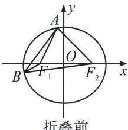
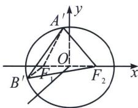

<!-- question-source:start -->
例4 (2024·浙江模拟)已知椭圆 $C: \frac{x^2}{a^2} + \frac{y^2}{b^2} = 1 (a > b > 0)$ 的左、右焦点分别为 $F_1$ 、 $F_2$ ，焦距为 $2\sqrt{3}$ ，离心率为 $\frac{\sqrt{3}}{2}$ ，直线 $l: y = x + m$ 与椭圆交于 $A$ 、 $B$ 两点（其中点 $A$ 在 $x$ 轴上方，点 $B$ 在 $x$ 轴下方）.

(1)求椭圆 C 的标准方程;

(2)如图, 将平面 $xOy$ 沿 $x$ 轴折叠, 使 $y$ 轴正半轴和 $x$ 轴所确定的半平面 (平面 $A^{\prime}F_{1}F_{2}$ ) 与 $y$ 轴负半轴和 $x$ 轴所确定的半平面 (平面 $B^{\prime}F_{1}F_{2}$ ) 垂直.

①若折叠后 $OA' \perp OB'$ ，求 m 的值；

②是否存在 m，使折叠后 $A'$ 、 $B'$ 两点间的距离与折叠前 A、B 两点间的距离之比为 $\frac{3}{4}$ ?

  
折叠前

  
折叠后

(1)由题意 $c = \sqrt{3}$ , $\frac{c}{a} = \frac{\sqrt{3}}{2}$ , 解得 $a = 2$ , $b = 1$ , 所以椭圆 $C$ 的标准方程为: $\frac{x^2}{4} + y^2 = 1$ ;

(2)解法一: ①折叠前设 $A(x_{1}, y_{1})$ , $B(x_{2}, y_{2})$ , 联立 $\left\{ \begin{array}{l} \frac{x^{2}}{4} + y^{2} = 1 \\ y = x + m \end{array} \right.$ , 整理可得: $5x^{2} + 8mx + 4m^{2} - 4 = 0$ , 由题意可得 $\triangle = 64m^{2} - 4 \times 5 \times (4m^{2} - 4) > 0$ , 解得 $m^{2} < 5$ , 从而 $\left\{ \begin{array}{l} x_{1} + x_{2} = -\frac{8m}{5} \\ x_{1}x_{2} = \frac{4m^{2} - 4}{5} \end{array} \right.$ , 因为 $AB$ 位于 $x$ 轴两侧, 则 $m^{2} < 4$ , 从而 $-2 < m < 2$ , 以 $O$ 为坐标原点, 折叠后,

分别以原 y 轴负半轴，原 x 轴，原 y 轴正半轴所在直线为 x，y，z 轴建立空间直角坐标系，则折叠后 $A'(0, x_{1}, y_{1})$ ， $B'(-y_{2}, x_{2}, 0)$ ，折叠后 $OA' \perp OB'$ ，则 $\overrightarrow{OA'} \cdot \overrightarrow{OB'} = 0$ ，即 $x_{1} \cdot x_{2} = 0$ ，所以 $m^{2} = 1$ ， $m = \pm 1$ ，

② 折叠前 $|AB| = \sqrt{2} |x_1 - x_2| = \sqrt{2}\sqrt{(x_1 + x_2)^2 - 4x_1x_2} = \frac{4\sqrt{2}}{5}\sqrt{5 - m^2}$ ，折叠后 $|AB| = \sqrt{y_2^2 + (x_2 - x_1)^2 + y_1^2} = \sqrt{(x_2 + m)^2 + (x_1 + m)^2 + (x_2 - x_1)^2} = \sqrt{2(x_1^2 + x_2^2) + 2m(x_1 + x_2) + 2m^2 - 2x_1x_2} = \sqrt{2(x_1 + x_2)^2 - 6x_1x_2 + 2m(x_1 + x_2) + 2m^2} = \sqrt{2\cdot\frac{64m^2}{25} - 6\cdot\frac{4m^2 - 4}{5} + 2m\cdot\frac{-8m}{5} + 2m^2} = \frac{\sqrt{120 - 22m^2}}{5}$ ，由题意可得 $\frac{\sqrt{120 - 22m^2}}{5} = \frac{3}{4} \cdot \frac{4\sqrt{2}}{5}\sqrt{5 - m^2}$ ，解得 $m = \pm \frac{\sqrt{30}}{2} \notin (-2, 2)$ ，此时直线 $l$ 与椭圆无交点，故不存在 $m$ ，使折叠后的 $A'B'$ 与折叠前的 $AB$ 长度之为 $\frac{3}{4}$ .
<!-- question-source:end -->

![[高中/总复习/专题/2026版高中《mst老唐说题》圆锥曲线专题（数学）/上册/第09章_圆锥曲线跨界综合/第一节_圆锥曲线与立体几何综合/三_折叠问题与圆锥曲线/例题/answers/Q00048743A1.md]]
