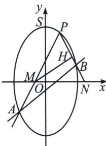
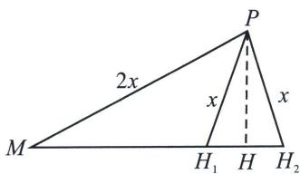
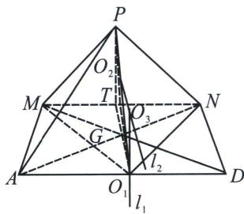

<!-- question-source:start -->
例5 (2025·成都外国语联盟模拟19题)在平面直角坐标系中, 分别以 $x$ 轴和 $y$ 轴为实轴和虚轴建立复平面. 已知复数 $z = x + yi(x, y \in \mathbb{R})$ , 在复平面内满足 $|z + 2i| + |z - 2i|$ 为定值的点 $Z$ 的轨迹为曲线 $\Gamma$ . 且点 $P(1, \sqrt{3})$ 在曲线 $\Gamma$ 上.

(1)求曲线 $\Gamma$ 的平面直角坐标系方程;

(2)若斜率为 $\sqrt{3}$ 的直线 $l$ 与曲线 $\Gamma$ 交于 $A 、 B$ 两点 (直线 $P A$ 斜率为正), 直线 $P A 、 P B$ (若 $P 、 B$ 重合,

直线 $PB$ 即为椭圆 $\Gamma$ 在 $P$ 点处的切线)分别与 $x$ 轴交于 $M 、 N$ 两点, $H$ 为 $PN$ 中点.

(i) 证明： $k_{PA} + k_{PB}$ 为定值；

(ii) $\angle PMH$ 最大时, 将坐标平面沿 $x$ 轴折成二面角 $P - MN - A$ , 在二面角 $P - MN - A$ 大小变化过程中, 求三棱锥 $P - MNA$ 外接球的半径最小时, 三棱锥 $P - MNA$ 的表面积.

(1) 因为 $z = x + yi(x, y \in \mathbb{R})$ ，在复平面内满足 $|z + 2i| + |z - 2i|$ 为定值的点 $Z$ 的轨迹为曲线 $\Gamma$ ，所以曲线 $\Gamma$ 是以 $(0, 2)$ ， $(0, -2)$ 为焦点的椭圆，又点 $P(1, \sqrt{3})$ 在曲线 $\Gamma$ 上，令曲线 $\Gamma: \frac{y^2}{a^2} + \frac{x^2}{b^2} = 1$ ( $a > b > 0$ )，则 $c = 2, \frac{(\sqrt{3})^2}{a^2} + \frac{1}{b^2} = 1$ ，解得 $a = \sqrt{6}, b = \sqrt{2}$ ，所以所求方程为： $\frac{y^2}{6} + \frac{x^2}{2} = 1$ ；

(i) 将椭圆 $\Gamma$ 按向量 $\overrightarrow{PO} = (-1, -\sqrt{3})$ 平移, 则 $\frac{(y + \sqrt{3})^2}{6} + \frac{(x + 1)^2}{2} = 1$ , $y^2 + 3x^2 + (6x + 2\sqrt{3}y) = 0$ ①, 根据题意, 则平移后 $A'B'$ 方程为 $\sqrt{3}mx - my = 1$ , 代入①得: $3x^2 + y^2 + (6x + 2\sqrt{3}y)(\sqrt{3}mx - my) = 0$ , 当 $x \neq 0$ , 同除以 $x^2$ 得: $(1 - 2\sqrt{3}m) \cdot \left(\frac{y}{x}\right)^2 + 3 + 6\sqrt{3}m = 0$ , 令 $\frac{y}{x} = k$ , 所以 $k_1 + k_2 = 0$ ,

(ii)由(i)可知 $\angle PMN=\angle PNM$ ，即PM=PN，
<!-- question-source:end -->

![[高中/总复习/专题/2026版高中《mst老唐说题》圆锥曲线专题（数学）/上册/第09章_圆锥曲线跨界综合/第一节_圆锥曲线与立体几何综合/三_折叠问题与圆锥曲线/例题/answers/Q00048744A1.md]]
