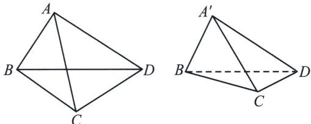

> [!faq]- 《圆锥曲线专题(上册)》例题解析
>
> > [!success]- **【答案】** 详见解析
>
> > [!note]- **【解析】**
> > 解析 (1)由题意 $c = \sqrt{3}$ , $\frac{c}{a} = \frac{\sqrt{3}}{2}$ , 解得 $a = 2$ , $b = 1$ , 所以椭圆 $C$ 的标准方程为: $\frac{x^2}{4} + y^2 = 1$ ;
> >
> > (2)
> > 解法一: ①折叠前设 $A(x_{1}, y_{1})$ , $B(x_{2}, y_{2})$ , 联立 $\left\{ \begin{array}{l} \frac{x^{2}}{4} + y^{2} = 1 \\ y = x + m \end{array} \right.$ , 整理可得: $5x^{2} + 8mx + 4m^{2} - 4 = 0$ , 由题意可得 $\triangle = 64m^{2} - 4 \times 5 \times (4m^{2} - 4) > 0$ , 解得 $m^{2} < 5$ , 从而 $\left\{ \begin{array}{l} x_{1} + x_{2} = -\frac{8m}{5} \\ x_{1}x_{2} = \frac{4m^{2} - 4}{5} \end{array} \right.$ , 因为 $AB$ 位于 $x$ 轴两侧, 则 $m^{2} < 4$ , 从而 $-2 < m < 2$ , 以 $O$ 为坐标原点, 折叠后,
> >
> > 分别以原 y 轴负半轴，原 x 轴，原 y 轴正半轴所在直线为 x，y，z 轴建立空间直角坐标系，则折叠后 $A'(0, x_{1}, y_{1})$ ， $B'(-y_{2}, x_{2}, 0)$ ，折叠后 $OA' \perp OB'$ ，则 $\overrightarrow{OA'} \cdot \overrightarrow{OB'} = 0$ ，即 $x_{1} \cdot x_{2} = 0$ ，所以 $m^{2} = 1$ ， $m = \pm 1$ ，
> > - **②**：折叠前 $|AB| = \sqrt{2} |x_1 - x_2| = \sqrt{2}\sqrt{(x_1 + x_2)^2 - 4x_1x_2} = \frac{4\sqrt{2}}{5}\sqrt{5 - m^2}$ ，折叠后 $|AB| = \sqrt{y_2^2 + (x_2 - x_1)^2 + y_1^2} = \sqrt{(x_2 + m)^2 + (x_1 + m)^2 + (x_2 - x_1)^2} = \sqrt{2(x_1^2 + x_2^2) + 2m(x_1 + x_2) + 2m^2 - 2x_1x_2} = \sqrt{2(x_1 + x_2)^2 - 6x_1x_2 + 2m(x_1 + x_2) + 2m^2} = \sqrt{2\cdot\frac{64m^2}{25} - 6\cdot\frac{4m^2 - 4}{5} + 2m\cdot\frac{-8m}{5} + 2m^2} = \frac{\sqrt{120 - 22m^2}}{5}$ ，由题意可得 $\frac{\sqrt{120 - 22m^2}}{5} = \frac{3}{4} \cdot \frac{4\sqrt{2}}{5}\sqrt{5 - m^2}$ ，解得 $m = \pm \frac{\sqrt{30}}{2} \notin (-2, 2)$ ，此时直线 $l$ 与椭圆无交点，故不存在 $m$ ，使折叠后的 $A'B'$ 与折叠前的 $AB$ 长度之为 $\frac{3}{4}$ .
> >
> > 解法二(三余弦定理+对角线向量定理): ①利用三余弦定理, 设 $\angle AOF_{1} = \theta_{1}$ , $\angle BOF_{1} = \theta_{2}$ , $\angle A'OB' = \theta = \frac{\pi}{2}$ , 根据三余弦定理, $\cos \theta = \cos \theta_{1} \cos \theta_{2} = 0$ , 则 $\cos \theta_{1} = 0$ 或 $\cos \theta_{2} = 0$ , 故 $AB$ 过上顶点或者下顶点, $m = \pm 1$ ;
> > - **②**：利用对角线向量定理， $\cos \langle AB, F_1F_2 \rangle = \frac{\overrightarrow{AB} \cdot \overrightarrow{F_1F_2}}{2|AB||F_1F_2|} = \frac{|AF_2|^2 + |BF_1|^2 - |AF_1|^2 - |BF_2|^2}{2|AB||F_1F_2|}$ ，由于 $\overrightarrow{AB} \cdot \overrightarrow{F_1F_2}$ 不随折叠而改变，故 $\cos \langle A'B', F_1F_2 \rangle = \frac{4}{3}\cos \langle AB, F_1F_2 \rangle = \frac{4}{3} \times \left(-\frac{\sqrt{2}}{2}\right) = -\frac{2\sqrt{2}}{3}$ ，
> >
> > 分别以原 $y$ 轴负半轴，原 $x$ 轴，原 $y$ 轴正半轴所在直线为 $x$ ， $y$ ， $z$ 轴建立空间直角坐标系，则折叠后 $A'(0, x_1, y_1)$ ， $B'(-y_2, x_2, 0)$ ， $\overrightarrow{AB} = (-y_2, x_1 - x_2, -y_1)$ ， $\overrightarrow{F_1F_2} = (0, 2, 0)$ ， $\cos \langle A'B'$ ， $F_1F_2 \rangle = \frac{(x_1 - x_2)}{\sqrt{y_2^2 + y_1^2 + (x_1 - x_2)^2}}$ ，即 $(x_1 - x_2)^2 = 8(y_1^2 + y_2^2)$ ，即 $(y_1 - y_2)^2 = 8(y_1^2 + y_2^2)$ ，无解；故不存在 $m$ ，使折叠后的 $A'B'$ 与折叠前的 $AB$ 长度之为 $\frac{3}{4}$ .
> >
> > 注意：立体几何的一些性质定理，在这些综合问题中发挥很大作用，补充一下对角线向量定理证明.
> >
> > 
> >
> > 如左图所示, 在 $\triangle ABC$ 中, 由余弦定理的向量式有 $\overrightarrow{CA} \cdot \overrightarrow{CB} = \frac{\overrightarrow{CA^2} + \overrightarrow{CB^2} - \overrightarrow{AB^2}}{2}$ ; 在 $\triangle CAD$ 中, 同理有 $\overrightarrow{CA} \cdot \overrightarrow{CD} = \frac{\overrightarrow{CA^2} + \overrightarrow{CD^2} - \overrightarrow{AD^2}}{2}$ . 所以在四边形 $ABCD$ 中, $\overrightarrow{AC} \cdot \overrightarrow{BD} = \overrightarrow{AC} \cdot (\overrightarrow{CD} - \overrightarrow{CB}) = \frac{(\overrightarrow{AD^2} + \overrightarrow{BC^2}) - (\overrightarrow{AB^2} + \overrightarrow{CD^2})}{2}$ , 即 $\overrightarrow{AC} \cdot \overrightarrow{BD} = \frac{(\overrightarrow{AD^2} + \overrightarrow{BC^2}) - (\overrightarrow{AB^2} + \overrightarrow{CD^2})}{2}$ , 这就是对角线向量定理.
> >
> > 推论1： $\cos \langle \overrightarrow{AC},\overrightarrow{BD}\rangle = \frac{(\overrightarrow{AD^2} + \overrightarrow{BC^2}) - (\overrightarrow{AB^2} + \overrightarrow{CD^2})}{2|AC||BD|}$ ②
> >
> > 推论 2：在空间向量中涉及折叠的问题，一定有折痕的向量与任意向量在折叠前后对应的向量的乘积不变；
> >
> > 证明：如右图所示，在四边形 ABCD 中，沿着 BD 折叠后，A 移到了 $A'$ 位置，则 $\overrightarrow{AC} \cdot \overrightarrow{BD} = \frac{\overrightarrow{AD^{2}} + \overrightarrow{BC^{2}} - \overrightarrow{AB^{2}} - \overrightarrow{CD^{2}}}{2} = \frac{\overrightarrow{A'D^{2}} + \overrightarrow{BC^{2}} - \overrightarrow{A'B^{2}} - \overrightarrow{CD^{2}}}{2} = \overrightarrow{A'C} \cdot \overrightarrow{BD}.$
