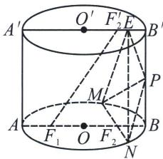
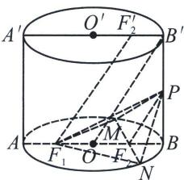
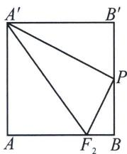
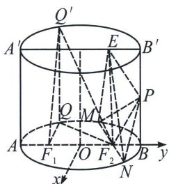

<!-- question-source:start -->
例2 (2025届湖北省“新八校”协作体高三下学期5月联考T18)把底面为椭圆且母线与底面垂直的柱体称为“椭圆柱”. 如图, 椭圆柱 $OO'$ 中底面长轴 $AB = A'B' = 4$ , 短轴长 $2\sqrt{3}$ , $F_1$ , $F_2$ 为下底面椭圆的左右焦点, $F_2'$ 为上底面椭圆的右焦点, $AA' = 4$ , $P$ 为 $BB'$ 上的中点, $E$ 为线段 $A'B'$ 上的动点, $MN$ 为过点 $F_2$ 的下底面的一条动弦(不与AB重合).

(1)求证： $F_{1}F_{2}^{\prime}$ 平面 PMN.

(2) 若点 $Q$ 是下底面椭圆上的动点, $Q'$ 是点 $Q$ 在上底面的投影, 且 $Q'F_1$ , $Q'F_2$ 与下底面所成的角分别为 $\alpha$ , $\beta$ , 试求出 $\tan (\alpha + \beta)$ 的最小值.

(3)求三棱锥 E-PMN 的体积的取值范围.

(1)由题设, 长轴长 $|AB| = |A'B'| = 4$ , 短轴长 $2\sqrt{3}$ , 则 $|OF_1| = |OF_2| = |O'F_2'| = 1$ , 所以 $F_2, F_2'$ 分别是 $OB, O'B'$ 的中点, 而柱体中 $ABB'A'$ 为矩形, 连接 $OB'$ , 由 $B'F_2'OF_1, |B'F_2'| = |OF_1| = 1$ , 故四边形 $F_1OB'F_2'$ 为平行四边形, 则 $OB'F_1F_2'$ , 当 $P$ 为 $BB'$ 的中点时, 则 $PF_2OB'$ , 故 $PF_2F_1F_2', PF_2 \subset$ 面 $PMN, F_1F_2' \not\subset$ 面 $PMN$ , 故 $F_1F_2'$ 平面 $PMN$ .

(2)由题设，令 $|QF_{1}| = m$ ， $|QF_{2}| = n$ ，则 $m + n = 4$ ，又 $|QQ'| = 4$ ，所以 $\tan \alpha = \frac{4}{m},\tan \beta = \frac{4}{n}$ ，则 $\tan (\alpha +\beta) = \frac{\tan\alpha + \tan\beta}{1 - \tan\alpha\tan\beta} = \frac{4(m + n)}{mn - 16} = \frac{16}{mn - 16}$ ，因为 $mn\leqslant \left(\frac{m + n}{2}\right)^2 = 4$ ，当且仅当 $m = n$ ，即 $\tan \alpha = \tan \beta$ 上式取等号，所以 $\tan (\alpha +\beta)\geqslant -\frac{4}{3}$

(3)由 $V_{E - PMN} = V_{M - PEF_2} + V_{N - PEF_2}$ ，正方形 $ABB^{\prime}A^{\prime}$ 中 $P$ 为中点，易得 $E$ 与 $A^{\prime}$ 重合时 $F_{2}P$ 与 $EP$ 垂直，

此时 $PF_{2} = \sqrt{5}$ ， $EP = \sqrt{20}$ ，则 $S_{\triangle PEF_2}$ 最大值为 $\frac{1}{2}\sqrt{5}\cdot \sqrt{20} = 5$ ，构建如上图空间直角坐标系且 $B(0,2)$ 底面椭圆方程为 $\frac{y^2}{4} +\frac{x^2}{3} = 1$ ， $V_{E - PMN} = V_{M - PEF_2} + V_{N - PEF_2} = \frac{1}{3} S_{\triangle PEF_2}\cdot |MN|\sin \angle MF_2F_1$ ，令 $\angle MF_2F_1 = \theta$ 利用焦长公式（自证） $|MN| = \frac{2ab^2}{b^2 + c^2\sin^2\theta} = \frac{12}{3 + \sin^2\theta}$ 所以 $\frac{1}{3} S_{\triangle PEF_2}\cdot |MN|\sin \angle MF_2F_1 = \frac{1}{3} S_{\triangle PEF_2}\cdot$ $\frac{12}{\frac{3}{\sin\theta} + \sin\theta}\leqslant 5$ ，当且仅当 $\sin \theta = 1$ 时取等，综上， $V_{E - PMN}\in (0,5]$
<!-- question-source:end -->

![[高中/总复习/专题/2026版高中《mst老唐说题》圆锥曲线专题（数学）/上册/第09章_圆锥曲线跨界综合/第一节_圆锥曲线与立体几何综合/二_椭圆柱的几何综合/例题/answers/Q00048741A1.md]]
