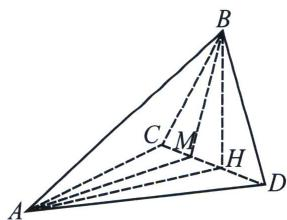

<!-- question-source:start -->
例3 (2025·广东揭阳三模 T19)如图, 三棱锥 $A - BCD$ 中, 点 $B$ 在平面 $ACD$ 的射影 $H$ 恰在 $CD$ 上,

M 为 HC 中点， $\angle BAH=\frac{\pi}{6}$ ，AB=2， $S_{\triangle ABM}=S_{\triangle ABD}=1$ .

(1)若 $CD \perp$ 平面 $BAH$ , 证明: $M$ 是 $CD$ 的三等分点;

(2)记 D 的轨迹为曲线 W，判断 W 是什么曲线，并说明理由；

(3) 求 CD 的最小值.
<!-- question-source:end -->

![[高中/总复习/专题/2026版高中《mst老唐说题》圆锥曲线专题（数学）/上册/第09章_圆锥曲线跨界综合/第一节_圆锥曲线与立体几何综合/二_椭圆柱的几何综合/例题/answers/Q00053108A1.md]]
