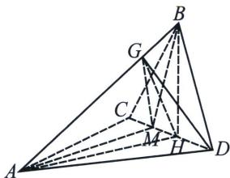
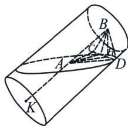
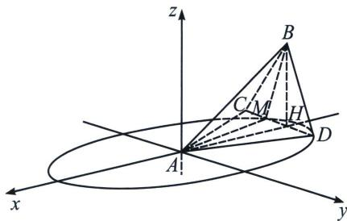

> [!faq]- 《圆锥曲线专题(上册)》例题解析
>
> > [!success]- **【答案】** 详见解析
>
> > [!note]- **【解析】**
> > 解析 (1)由于 $CD \perp$ 平面 $BAH$ , 作 $HG \perp AB$ , 垂足为点 $G$ , 因为 $AB \subset$ 平面 $BAH$ , 则 $CD \perp AB$ ,
> >
> > 又因为 $HG \perp AB$ ，且 $GH \cap MH = H$ ， $MH$ ， $GH \subset$ 平面 $GMH$ ，因此 $AB \perp$ 平面 $GMH$ ，因为 $GM \subset$ 平面 $GMH$ ，所以 $AB \perp GM$ ，同理可证： $AB \perp GD$ ，又因为 $S_{\triangle ABM} = S_{\triangle ABD}$ ，可得 $\frac{1}{2} AB \cdot GM = \frac{1}{2} AB \cdot GD$ ，所以 $GM = GD$ ，因为 $GH \subset$ 面 $ABH$ ，从而 $MD \perp GH$ ，因此 $DH = MH = MC$ ，进而 $M$ 为 $DC$ 的三等分点。
> >
> > 
> >
> > 
> >
> > (2)椭圆, 延长 $BA$ 至 $K$ , 使得 $AK = AB$ , 由于 $S_{\triangle ABM} = S_{\triangle ABD} = 1$ , 可得 $M, D$ 到 $AB$ 的距离为定值, 因此 $M, D$ 应在以 $AK$ 为高线的圆柱上运动, 且上下底面与 $AK$ 垂直, 又因为 $M, D$ 为平面 $ACD$ 上两点, $\angle BAH = \frac{\pi}{6}$ , 从而 $M, D$ 的运动平面截得该圆柱, 根据圆锥曲线的定义, $M, D$ 的运动轨迹应为椭圆.
> >
> > 
> >
> > (3)以 $A$ 为原点, $HA$ 所在直线为 $x$ 轴, 过 $A$ 点与 $HB$ 平行的直线为 $z$ 轴, 建立空间直角坐标系, 如图所示, 下面求椭圆方程: 一方面, 由于该圆柱的底面半径为 $r = 1$ , 故由图可知椭圆的短半轴长为 1 , 由 $\angle BAH = \frac{\pi}{6}$ , 从而椭圆的长半轴 $a = \frac{r}{\sin \frac{\pi}{6}} = 2r = 2$ , 进而椭圆方程 $E: \frac{x^2}{4} + y^2 = 1$ ,
> >
> > 又由 $\angle BAH = \frac{\pi}{6}$ , $BH \perp$ 平面 $ACD$ , 从而 $HA = AB \cos \frac{\pi}{6} = \sqrt{3}$ , 即 $H(-\sqrt{3}, 0, 0)$ , 由定义知 $H$ 为椭圆的左焦点, 设 $E$ 的右焦点为 $F(\sqrt{3}, 0, 0)$ , 则 $FD = 4 - DH$ , 设 $\angle DHA = \theta$ , 在 $\triangle DHF$ 中, 由余弦定理, 可得 $HF^2 + HD^2 - 2FH \cdot DH \cos \theta = FD^2$ , 解得 $DH = \frac{1}{2 - \sqrt{3} \cos \theta}$ , 同理可得: $MH = \frac{1}{2 + \sqrt{3} \cos \theta}$ ,
> >
> > 由 $\frac{1}{MH} + \frac{1}{DH} = 4$ ，原题等价于求 $2MH + DH$ 的最小值，则等价于求 $\frac{1}{4}\left(\frac{1}{MH} + \frac{1}{DH}\right)(2MH + DH)$ 的最小值，又由 $\frac{1}{4}\left(\frac{1}{MH} +\frac{1}{DH}\right)(2MH + DH) = \frac{1}{4}\left(\frac{2MH}{DH} +\frac{DH}{MH} +3\right)\geqslant \frac{3 + 2\sqrt{2}}{4}$ ，当且仅当 $DH = \sqrt{2} MH$ 时等号成立，因此 $CD$ 的最小值为 $\frac{3 + 2\sqrt{2}}{4}$
> >
> > 注意 斜椭圆的计算中，重在考查空间思维能力，计算部分相对要求不高，不过对于焦长公式，焦半径的考查就比较常见。
