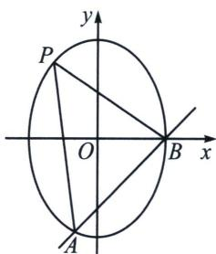

<!-- question-source:start -->
例1 (2025·重庆·三模 T18)已知椭圆 C: $\frac{y^{2}}{a^{2}}+\frac{x^{2}}{b^{2}}=1(a>b>0)$ 的离心率为 $\frac{\sqrt{2}}{2}$ ，C 与曲线 $y=\ln x$ 经过 x 轴上的同一点.

(1) 求 C 的方程;

(2)作曲线 $y=\ln x$ 在 $x=x_{0}$ 处的切线 l.

(i) 若 $x_{0}=1$ ，l 与 C 相交于 A，B 两点，P 是 C 上任意一点，求 $\triangle ABP$ 面积的最大值；

(ii) 当 $0 < x_{0} < \sqrt{2}$ 时，证明 l 与 C 有两个公共点.

(1)由题意, $C$ 经过点 $(1,0)$ , 则 $b = 1$ , 又 $e = \frac{c}{a} = \frac{\sqrt{2}}{2}$ , $a^2 - b^2 = c^2$ , 可得 $a = \sqrt{2}$ , $c = 1$ , 所以 $\frac{y^2}{2} + x^2 = 1$ ;

(2)(i)由 $y=\ln x$ 求导得 $y'=\frac{1}{x}$ ，当 $x_{0}=1$ 时，切线 l: y=x-1，联立 $\left\{\begin{aligned}y&=x-1\\ \frac{y^{2}}{2}&+x^{2}=1\end{aligned}\right.$ 消去 y，

得 $3x^{2} - 2x - 1 = 0$ ，则有 $x = 1$ 或 $-\frac{1}{3}$ ，所以 $|AB| = \sqrt{2}|x_A - x_B| = \frac{4\sqrt{2}}{3}$ ，设 $P(x_1, y_1)$ ，则点 $P$ 到 $l$ 的距离 $d = \frac{|x_1 - y_1 - 1|}{\sqrt{2}}$ ，因为 $\frac{y_1^2}{2} + x_1^2 = 1$ ，令 $t = x_1 - y_1 - 1$ ，则 $y_1 = x_1 - t - 1$ ，从而 $3x_1^2 - 2(t + 1)x_1 + (t + 1)^2 - 2 = 0$ ，令 $\Delta = 4(t + 1)^2 - 12[(t + 1)^2 - 2] \geqslant 0$ ，得 $-\sqrt{3} - 1 \leqslant t \leqslant \sqrt{3} - 1$ ，故 $|t| \leqslant \sqrt{3} + 1$ ， $d \leqslant \frac{\sqrt{3} + 1}{\sqrt{2}}$ .

所以 $\triangle ABP$ 面积的最大值为 $\frac{2(\sqrt{3} + 1)}{3}$ ，当且仅当 $t = -\sqrt{3} - 1$ ，即 $x_{1} = -\frac{\sqrt{3}}{3}$ ， $y_{1} = \frac{2\sqrt{3}}{3}$ 时取最大.

（ii）切线 $l: y - \ln x_0 = \frac{1}{x_0} (x - x_0)$ 即 $y = \frac{1}{x_0} x + \ln x_0 - 1$ ，带入 $2x^2 + y^2 = 2$ 中有 $\left(2 + \frac{1}{x_0^2}\right)x^2 + \frac{2}{x_0} (\ln x_0 - 1)x + (\ln x_0 - 1)^2 - 2 = 0$ ， $\left(2 + \frac{1}{x_0^2}\right) \neq 0$ ，

由题意只需证明 $\Delta > 0$ ，即 $\frac{4}{x_0^2} (\ln x_0 - 1)^2 - 4\left(2 + \frac{1}{x_0^2}\right)[(\ln x_0 - 1)^2 - 2] > 0$

即证： $\frac{1}{x_0^2} - (\ln x_0 - 1)^2 + 2 > 0$ ，令 $f(x) = \frac{1}{x^2} - (\ln x - 1)^2 + 2, 0 < x < \sqrt{2}$

(1) = 0$

所以当 $x \in (0, 1)$ 时， $g(x) > 0$ ， $f'(x) < 0$ ，当 $x \in (1, \sqrt{2})$ 时， $g(x) < 0$ ， $f'(x) > 0$

所以当 $x \in (0, 1)$ 时， $f(x)$ 单调递减，当 $x \in (1, \sqrt{2})$ 时， $f(x)$ 单调递增，所以 $f(x) \geqslant f
(1) = 2 > 0$ 得证.

(1)=2$ ，得证.
<!-- question-source:end -->

![[高中/总复习/专题/2026版高中《mst老唐说题》圆锥曲线专题（数学）/上册/第09章_圆锥曲线跨界综合/第三节_圆锥曲线与导数的综合/一_求交点个数/例题/answers/Q00048748A1.md]]
