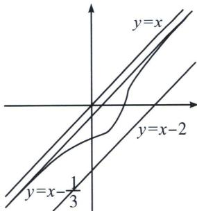

<!-- question-source:start -->
例3 (25 温州三模 T19) 设曲线 C: $x^{3}-xy-y^{3}=1$ .

(1)求证： $C$ 关于直线 $y = -x$ 对称；

(2)求证： $C$ 是某个函数的图象；

(3)试求所有实数 k 与 m，使得直线 $y=kx+m$ 在 C 的上方.

(1)证明：设点 $(x_0, y_0)$ 在曲线 $C$ 上，则 $x_0^3 - x_0y_0 - y_0^3 = 1$ ，点 $(x_0, y_0)$ 关于直线 $y = -x$ 的对称点为 $(-y_0, -x_0)$ ，因为 $(-y_0)^3 - (-y_0)(-x_0) - (-x_0)^3 = x_0^3 - x_0y_0 - y_0^3 = 1$ ，所以点 $(-y_0, -x_0)$ 在曲线 $C$ 上，故 $C$ 关于直线 $y = -x$ 对称

(2)只要满足曲线 C 与直线 $x=a(a\in\mathbf{R})$ 只有一个交点，则 C 就是某个函数的图象，

证明：由分析可知，设 $f(y)=x^{3}-xy-y^{3}-1$ ，证明 $\forall x\in R,\quad f(y)=0$ 只有一个零点即可， $f'(y)=-x-3y^{2}$ ，①当 $x\geqslant0$ 时， $f'(y)\leqslant0$ ，则 $f(y)$ 在定义域上单调递减，因此至多只有一个零点；

②当 $x < 0$ 时, 令 $f'(y) = 0$ , 解得 $y_1 = -\sqrt{\frac{-x}{3}}$ , $y_2 = \sqrt{\frac{-x}{3}}$ , 则 $f(y)$ 在 $\left(-\infty, -\sqrt{\frac{-x}{3}}\right)$ 单调递减, $\left(-\sqrt{\frac{-x}{3}}, \sqrt{\frac{-x}{3}}\right)$ 单调递增, $\left(\sqrt{\frac{-x}{3}}, +\infty\right)$ 单调递减, 所以 $f\left(\sqrt{\frac{-x}{3}}\right) = x^3 - x\sqrt{\frac{-x}{3}} - \frac{-x}{3}\sqrt{\frac{-x}{3}} - 1 = x^3 - \frac{2x}{3}\sqrt{\frac{-x}{3}} - 1$ , 设 $t = \sqrt{\frac{-x}{3}} \in (0, +\infty)$ , 则 $x = -3t^2$ , 所以 $f\left(\sqrt{\frac{-x}{3}}\right) = -27t^6 + 2t^3 - 1 = 2t^3 - (27t^6 + 1) \leqslant 2t^3 - 3\sqrt{3} t^3 < 0$ , 因此 $f(y)$ 在 $\left(-\infty, -\sqrt{\frac{-x}{3}}\right)$ 存在一根, 综上所述, $\forall x \in \mathbf{R}$ , $f(y) = 0$ 只有一个零点因此 $C$ 是某个函数的图象(如图1)

(3)先证明 $\forall(x_{0}, y_{0})\in C, x_{0}-2<y_{0}<x_{0}$ ，这里可设 $f(y)=x_{0}^{3}-x_{0}y-y^{3}-1$ ，所以 $f(x_{0})=-x_{0}^{2}-1<0=f(y_{0})$ ，所以 $y_{0}<x_{0}, f(x_{0}-2)=x_{0}^{3}-x_{0}(x_{0}-2)-(x_{0}-2)^{3}-1=5x_{0}^{2}-10x_{0}^{2}+7=5(x_{0}-1)^{2}+2>0$ ，所以 $x_{0}-2<y_{0}$ ；所以 C 的图象夹在 y=x 与 y=x-2 之间（如图 1），故 k=1。

联立 $\left\{\begin{aligned}y&=x+m\\ x^{3}&-xy-y^{3}=1\end{aligned}\right.$ 可得 $(3m+1)x^{2}+(3m^{2}+m)x+m^{3}+1=0,$

故 $\Delta = (3m^2 + m)^2 - 4(3m + 1)(m^3 + 1) = (3m + 1)[m^2(3m + 1) - 4(m^3 + 1)] = (3m + 1)(-m^3 + m^2 - 4)$ 令 $h(m) = -m^3 + m^2 - 4, h'(m) = -3m^2 + 2m = -3m\left(m - \frac{2}{3}\right)$ ，所以 $h(m)$ 在 $(- \infty, 0)$ 单调递减， $\left(0, \frac{2}{3}\right)$ 单调递增， $\left(\frac{2}{3}, +\infty\right)$ 单调递减，因为 $h\left(\frac{2}{3}\right) = -\frac{104}{27} < 0, h(-1) = -2 < 0, h(-2) = 8 > 0$ ，所以 $h(m)$ 在 $(-2, -1)$ 仅存在一个零点，所以当 $m \in \left[-\frac{1}{3}, +\infty\right)$ 时， $\Delta < 0$ ，方程无解，所以 $k = 1, m \in \left[-\frac{1}{3}, +\infty\right)$ .
<!-- question-source:end -->

![[高中/总复习/专题/2026版高中《mst老唐说题》圆锥曲线专题（数学）/上册/第09章_圆锥曲线跨界综合/第三节_圆锥曲线与导数的综合/一_求交点个数/例题/answers/Q00048750A1.md]]
