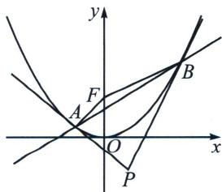

> [!faq]- 《圆锥曲线专题(上册)》例题解析
>
> > [!success]- **【答案】** 详见解析
>
> > [!note]- **【解析】**
> > 解析 (1) 易知 $F(0, 1)$ , 当 $x_{0} = 1$ 时, $P(1, 0)$ , 故直线 $PF$ 的方程为 $x + y - 1 = 0$ .
> >
> > (2)设 $A\left(x_{1}, \frac{x_{1}^{2}}{4}\right)$ , $B\left(x_{2}, \frac{x_{2}^{2}}{4}\right)$ , 对 $y = \frac{x^2}{4}$ , 求导可得 $y' = \frac{x}{2}$ , 故曲线 $E$ 在点 $A$ , $B$ 处的切线方程分别为$xx_{1}=2(y+y_{1})$ ， $xx_{2}=2(y+y_{2})$ ，而点 $P(x_{0},\ln x_{0})$ 同时在两条切线上，故方程 $x_{0}x=2(\ln x_{0}+y)$ 的两解分别为 $x_{1}$ ， $x_{2}$ ，所以对比 $\left\{\begin{aligned}AB:(x_{1}+x_{2})x=4y+x_{1}x_{2}\\ AB:x_{0}x=2(\ln x_{0}+y)\end{aligned}\right.$ ，得： $x_{1}+x_{2}=2x_{0}$ ， $x_{1}x_{2}=4\ln x_{0}$
> >
> > 故直线 AB 的斜率为 $\frac{x_{1}+x_{2}}{4}=\frac{x_{0}}{2}>0$ ，故直线 AB 的倾斜角为锐角.
> >
> > (3)记线段 $AB$ 的中点为 $M$ ，且 $\frac{x_1 + x_2}{2} = x_0$ ， $\frac{x_1^2 + x_2^2}{8} = \frac{(x_1 + x_2)^2 - 2x_1x_2}{8} = \frac{x_0^2}{2} -\ln x_0,$
> >
> > $l_{AB}: x_0x = 2(\ln x_0 + y)$ ，点 $P$ 到直线 $AB$ 的距离 $d = \frac{|x_0^2 - 4\ln x_0|}{\sqrt{x_0^2 + 4}}$ ，点 $F$ 到直线 $AB$ 的距离 $h = \frac{|2\ln x_0 + 2|}{\sqrt{x_0^2 + 4}}$ ，
> >
> > 
> >
> > 故 $\frac{S_1}{S_2} = \frac{\frac{1}{2}|AB|\cdot d}{\frac{1}{2}|AB|\cdot h} = \left|\frac{x_0^2 - 4\ln x_0}{2\ln x_0 + 2}\right|$ ，设函数 $f(x_0) = \frac{x_0^2 - 4\ln x_0}{2\ln x_0 + 2}$ ，则 $f'(x_0) = \frac{2x_0^2\ln x_0 + x_0^2 - 4}{2x_0(\ln x_0 + 1)^2}$ ，
> >
> > 设函数 $g(x_0) = 2x_0^2\ln x_0 + x_0^2 -4$ ，则在区间 $\left(\frac{1}{e}, +\infty\right)$ 上 $g'(x_0) = 4x_0(\ln x_0 + 1) > 0$ ，故 $g(x_0)$ 在区间 $\left(\frac{1}{e}, +\infty\right)$ 上单调递增，而 $g(1) = -3 < 0$ ， $g(2) = 8\ln 2 > 0$ ，故存在 $m \in (1, 2)$ ，使得 $g(m) = 0$ ，即 $f'(m) = 0$ ，当 $x_0 \in \left(\frac{1}{e}, m\right)$ 时， $f'(x_0) < 0$ ， $f(x_0)$ 单调递减；当 $x_0 \in (m, +\infty)$ 时， $f'(x_0) > 0$ ， $f(x_0)$ 单调递增，于是当 $x_0 = m$ 时， $f(x_0)$ 取得最小值，下面证明其为正数，令函数 $h(x_0) = x_0^2 - 4\ln x_0$ ，则 $h'(x_0) = 2x_0 - \frac{4}{x_0} = \frac{2}{x_0}(x_0^2 - 2)$ ，当 $x_0 \in \left(\frac{1}{e}, \sqrt{2}\right)$ 时， $h'(x_0) < 0$ ， $h(x_0)$ 单调递减；当 $x_0 \in (\sqrt{2}, +\infty)$ 时， $h'(x_0) > 0$ ， $h(x_0)$ 单调递增，故 $h(x_0) \geqslant h(\sqrt{2}) = 2 - 2\ln 2 > 0$ ，故 $\frac{S_1}{S_2} = |f(x_0)| = \frac{h(x_0)}{2\ln x_0 + 2} > 0$ ，故当 $x_0 = m \in (1, 2)$ 时， $\frac{S_1}{S_2}$ 取得最小值，故原命题得证.
