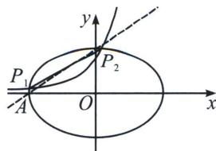

> [!faq]- 《圆锥曲线专题(上册)》例题解析
>
> > [!success]- **【答案】** 详见解析
>
> > [!note]- **【解析】**
> > 解析 (1)由于 $|PM| + |PM| \geqslant |MN| = 2\sqrt{2}$ , 当且仅当点 $P$ 在线段 $MN$ 上时, 取得等号
> >
> > 即 M, N 视角下 $f(x)$ 的基于 $2\sqrt{2}$ 的回点 P 只能在线段 $y = x (-1 \leqslant x \leqslant 1)$ ，与 $f(x) = e^{x} \sin x$ 的交点，
> >
> > $$
> > h (x) = e ^ {x} \sin x - x (- 1 \leqslant x \leqslant 1), h ^ {\prime} (x) = e ^ {x} (\sin x + \cos x) - 1 = \sqrt {2} e ^ {x} \sin \left(x + \frac {\pi}{4}\right) - 1.
> > $$
> >
> > $h''(x)=e^{x}(\sin x+\cos x+\cos x-\sin x)=2e^{x}\cos x$ ，因为 $-1\leqslant x\leqslant1$ ， $h''(x)>0$ ，所以 $h'(x)=\sqrt{2}e^{x}\sin(x+\frac{\pi}{4})-1$ 在 $[-1,1]$ 上单调递增，又 $h'(0)=0$ ，所以 $h(x)=e^{x}\sin x-x$ 在区间 $[-1,0)$ 上单调递减，在 $[0,1]$ 上单调递增，所以 $h(x)=e^{x}\sin x-x\geqslant h(0)=0$ ，因此 $h(x)$ 只有一个零点，即M，N视角下 $f(x)$ 的“基于 $2\sqrt{2}$ 的回点”个数有且只有一个 $(0,0)$ ；
> >
> > 解法二: 构造 $h(x) = \sin x - \frac{x}{e^x}$ , 易知 $h(0) = 0$ , $h'(x) = \cos x - \frac{1 - x}{e^x} = \frac{e^x \cos x + x - 1}{e^x}$ , 构造 $g(x) = \cos x + \frac{x^2}{2} - 1$ , $g'(x) = x - \sin x$ , $g''(x) = 1 - \cos x \geqslant 0$ , 所以当 $0 < x \leqslant 1$ 时, 易证 $g'(x) > 0$ , 当 $-1 \leqslant x < 0$ 时, $g'(x) < 0$ ; 所以当 $0 < x \leqslant 1$ 时, $h'(x) > \frac{e^x \left(1 - \frac{x^2}{2}\right) + x - 1}{e^x} > \frac{1 - \frac{x^2}{2} + x - 1}{e^x} = \frac{x - \frac{x^2}{2}}{e^x} > 0$ , 所以 $h(x) > h(0) = 0$ ; 当 $-1 \leqslant x < 0$ 时, $e^x \cos x < 1$ , 所以 $h'(x) < \frac{x}{e^x} < 0$ , 所以 $h(x) < h(0) = 0$ ; 因此 $h(x)$ 只有一个零点, 即 $M$ , $N$ 视角下 $f(x)$ 的“基于 $2\sqrt{2}$ 的回点”个数有且只有一个 $(0, 0)$ ;
> >
> > (2)
> > 解法一: 由于 $|PM| + |PN| = 2\sqrt{2} > |MN| = 2$ ，则由椭圆的定义可知 $P$ 在椭圆 $\frac{x^2}{2} + y^2 = 1$ 上，由题意可知 $P$ 是椭圆 $\frac{x^2}{2} + y^2 = 1$ 与 $f(x) = ae^x (0 < a \leqslant 1)$ 的交点，设 $P_1(x_1, y_1), P_2(x_2, y_2)$ ，不妨设 $x_1 < x_2$ ，利用指数均值不等式 $\frac{e^{x_1} - e^{x_2}}{x_1 - x_2} < \frac{e^{x_1} + e^{x_2}}{2}$ （自证），所以 $k = \frac{y_1 - y_2}{x_1 - x_2} = \frac{a(e^{x_1} - e^{x_2})}{x_1 - x_2} < \frac{a(e^{x_1} + e^{x_2})}{2} = \frac{y_1 + y_2}{2}$ ，所以 $y_1 + y_2 > 2k$ ，点 $P$ 在椭圆 $\frac{x^2}{2} + y^2 = 1$ 上， $\left\{ \begin{array}{l} \frac{x_1^2}{2} + y_1^2 = 1 \\ \frac{x_2^2}{2} + y_2^2 = 1 \end{array} \right.$ ， $\frac{(x_1 + x_2)(x_1 - x_2)}{2} + (y_1 + y_2)(y_1 - y_2) = 0$ ，所以 $x_1 + x_2 = -2k(y_1 + y_2)$ ，所以 $\frac{x_1^2 + x_2^2}{2} + y_1^2 + y_2^2 = 2$ ，
> >
> > $$
> > 2 = \frac {x _ {1} ^ {2} + x _ {2} ^ {2}}{2} + y _ {1} ^ {2} + y _ {2} ^ {2} > \frac {(x _ {1} + x _ {2}) ^ {2}}{4} + \frac {(y _ {1} + y _ {2}) ^ {2}}{2} = \frac {4 k ^ {2} (y _ {1} + y _ {2}) ^ {2}}{4} + \frac {(y _ {1} + y _ {2}) ^ {2}}{2} > 4 k ^ {4} + 2 k ^ {2}
> > $$
> >
> > 所以所以 $2k^{4}+k^{2}-1<0$ ，所以 $(2k^{2}-1)(k^{2}+1)<0$ ，解得 $k<\frac{\sqrt{2}}{2}$ .
> >
> > 注意：由于 $\frac{x_1 - x_2}{\ln x_1 - \ln x_2} < \frac{x_1 + x_2}{2}$ ，令 $x_{1} = e^{t_{1}}$ ， $x_{2} = e^{t_{2}}$ ，所以 $\frac{e^{t_1} - e^{t_2}}{t_1 - t_2} < \frac{e^{t_1} + e^{t_2}}{2}$ ；
> >
> > 解法二(数形结合): 如图, 椭圆的左顶点和上顶点连线 $AB$ 斜率 $k_{AB} = \frac{\sqrt{2}}{2}$ , 故本题只需证明 $k_{P_1P_2} < k_{AB} = \frac{\sqrt{2}}{2}$ ,
> >
> > 
> >
> > 由于 $f(x)=ae^{x}$ ， $(0<a\leqslant1)$ ，故 $0<y_{1}<y_{2}\leqslant1$ ，构造 $g(x)=(ae^{x})^{2}+\frac{x^{2}}{2}-1$ ， $g'(x)=2a^{2}e^{2x}+x$ ， $g''(x)=4a^{2}e^{2x}+1>0$ ，所以 $g'(x)$ 单调递增，由于 $g'(-\sqrt{2})=\frac{2a^{2}}{e^{\sqrt[3]{2}}}-\sqrt{2}<\frac{2}{e^{\sqrt[3]{2}}}-\sqrt{2}<0$ ， $g'(0)=2a^{2}>0$ ，故存在 $x_{0}\in(-\sqrt{2},0)$ ，使得 $g'(x_{0})=0$ ， $g(x)$ 在 $(- \sqrt{2},x_{0})$ 单调递减，在 $(x_{0},\sqrt{2})$ 单调递增， $g(-\sqrt{2})=\frac{a^{2}}{e^{\sqrt[3]{2}}}>0$ ， $g(0)=a^{2}-1\leqslant0$ ， $g(\sqrt{2})=a^{2}e^{\sqrt[3]{2}}>0$ ，所以存在 $x_{1}\in(-\sqrt{2},0]$ ，存在 $x_{2}\in[0,\sqrt{2})$ ，使得 $g(x_{1})=0$ ，显然 $P_{1}P_{2}$ 与直线 AB 在第二象限会有一个交点，设 $P_{1}P_{2}:\frac{x}{m}+\frac{y}{n}=1$ ，显然 $0<n\leqslant1$ ， $m<-\sqrt{2}$ ，所以 $k=-\frac{n}{m}<\frac{1}{\sqrt{2}}$ ，得证！
