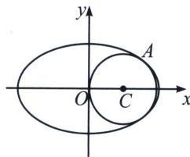

> [!faq]- 《圆锥曲线专题(上册)》例题解析
>
> > [!success]- **【答案】** 详见解析
>
> > [!note]- **【解析】**
> > 解析 (1)由已知得 $\left\{ \begin{array}{l} c = \frac{4}{5} \\ a^2 = b^2 + c^2 \end{array} \right.$ ，解得 $a = 5, b = 3, c = 4$ ，所以 $E$ 的方程为 $\frac{x^2}{25} + \frac{y^2}{9} = 1$ .
> >
> > (2)设 $M(x_{1},y_{1})$ 、 $A(x_{2},y_{2})$ ，则 $B(-x_2, - y_2)$ 。因为 $M$ 、 $A$ 在 $E$ 上，所以 $\left\{ \begin{array}{l}9x_1^2 +25y_1^2 = 9\times 25,\\ 9x_2^2 +25y_2^2 = 9\times 25, \end{array} \right.$ 两式相减，得 $9(x_{1}^{2} - x_{2}^{2}) + 25(y_{1}^{2} - y_{2}^{2}) = 0$ ，即 $\frac{y_1^2 - y_2^2}{x_1^2 - x_2^2} = -\frac{9}{25}$ 。所以直线 $MA$ 、 $MB$ 的斜率之积 $k_{1}k_{2} =$ $\frac{y_1 - y_2}{x_1 - x_2}\cdot \frac{y_1 + y_2}{x_1 + x_2} = \frac{y_1^2 - y_2^2}{x_1^2 - x_2^2} = -\frac{9}{25}.$
> >
> > (3)根据圆的位置及圆的对称性, 设圆心的坐标为 $C(r, 0) (r > 0)$ , 故可设圆 $C$ 的方程为 $(x - r)^2 + y^2 = r^2$ , 显然 $0 < r < \frac{5}{2}$ . 要求最大圆, 即求半径 $r$ 的最大值.
> >
> > 
> >
> > 如图所示，设 $E$ 右半侧上点 $A$ 的坐标为 $A(5\cos \theta, 3\sin \theta)$ ，则 $-\frac{\pi}{2} \leqslant \theta \leqslant \frac{\pi}{2}$ 。由于 $E$ 右半侧上点 $A$ 只能在圆 $C$ 外或者圆 $C$ 上，所以有 $(5\cos \theta - r)^2 + (3\sin \theta)^2 \geqslant r^2$ 对 $r \in \left(0, \frac{5}{2}\right)$ 及 $\theta \in \left[-\frac{\pi}{2}, \frac{\pi}{2}\right]$ 恒成立。
> >
> > 因此 $(5\cos \theta - r)^2 + (3\sin \theta)^2 - r^2 = 16\left(\cos \theta - \frac{5}{16}r\right)^2 + 9 - \frac{25}{16}r^2$ 在 $\theta \in \left[-\frac{\pi}{2}, \frac{\pi}{2}\right]$ 内的最小值 $T \geqslant 0$ . 因为 $r \in \left(0, \frac{5}{2}\right)$ , 所以 $\frac{5r}{16} \in \left(0, \frac{25}{32}\right) \subseteq (0, 1)$ , 所以当 $\cos \theta = \frac{5r}{16}$ 时有最小值 $T = 9 - \frac{25}{16}r^2 \geqslant 0$ , 解得 $r \leqslant \frac{12}{5}$ . 故所求最大圆的方程为 $\left(x - \frac{12}{5}\right)^2 + y^2 = \frac{144}{25}$ , 即 $x^2 + y^2 - \frac{24}{5}x = 0$ .
