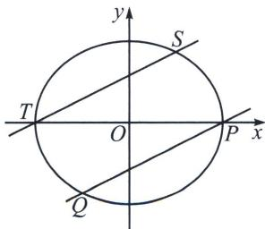

> [!faq]- 《圆锥曲线专题(上册)》例题解析
>
> > [!success]- **【答案】** 详见解析
>
> > [!note]- **【解析】**
> > 解析 (1)由题设, 直线 $PQ$ 的斜率为 $\frac{1}{2}$ , 则过 $S\left(1, \frac{3}{2}\right)$ 且平行于直线 $PQ$ 的直线方程 $y = \frac{1}{2}(x + 2)$ , 联立 $\left\{ \begin{array}{l} y = \frac{1}{2}(x + 2) \\ \frac{x^2}{4} + \frac{y^2}{3} = 1 \end{array} \right.$ , 可得 $x^2 + x - 2 = 0$ , 解得 $x = 1$ (舍) 或 $x = -2$ , 则 $T(-2, 0)$ ,
> >
> > 
> >
> > 所以 $P \oplus Q = (-2, 0)$ ，过 $S\left(1, \frac{3}{2}\right)$ 且平行于椭圆在 P 点处切线的直线方程为 x = 1，联立 $\left\{\frac{x^{2}}{4} + \frac{y^{2}}{3} = 1\right.$ ，
> > 可得 $\left\{\begin{aligned}x=1\\ y=\frac{3}{2}\end{aligned}\right.$ （舍）或 $\left\{\begin{aligned}x=1\\ y=-\frac{3}{2}\end{aligned}\right.$ ，故 $P_{2}=P\oplus P=\left(1,-\frac{3}{2}\right)$ ，过 $S\left(1,\frac{3}{2}\right)$ 且平行于 $PP_{2}$ 的直线方程为 $y=\frac{3}{2}x$ ，
> > 联立 $\left\{\begin{aligned}y=\frac{3}{2}x\\ \frac{x^{2}}{4}+\frac{y^{2}}{3}=1\end{aligned}\right.$ ，可得 $\left\{\begin{aligned}x=1\\ y=\frac{3}{2}\end{aligned}\right.$ （舍）或 $\left\{\begin{aligned}x=-1\\ y=-\frac{3}{2}\end{aligned}\right.$ ，故 $P_{3}=P\oplus P_{2}=\left(-1,-\frac{3}{2}\right)=Q$ ，
> > 所以 $P_{4}=P\oplus P_{3}=P\oplus Q=(-2,0)$ ，过 $S\left(1,\frac{3}{2}\right)$ 且平行于 $PP_{4}$ 的直线方程为 $y=\frac{3}{2}$ ，
> > 联立 $\left\{\begin{aligned}y=\frac{3}{2}\\ \frac{x^{2}}{4}+\frac{y^{2}}{3}=1\end{aligned}\right.$ ，可得 $\left\{\begin{aligned}x=1\\ y=\frac{3}{2}\end{aligned}\right.$ （舍）或 $\left\{\begin{aligned}x=-1\\ y=\frac{3}{2}\end{aligned}\right.$ ，故 $P_{5}=P\oplus P_{4}=\left(-1,\frac{3}{2}\right)$ ，
> > 过 $S\left(1,\frac{3}{2}\right)$ 且平行于 $PP_{5}$ 的直线方程为 $y=-\frac{1}{2}x+2$ ，联立 $\left\{\begin{aligned}y&=-\frac{1}{2}x+2\\ \frac{x^{2}}{4}+\frac{y^{2}}{3}&=1\end{aligned}\right.$ ，可得 $\left\{\begin{aligned}x=1\\ y=\frac{3}{2}\end{aligned}\right.$ ，故 $P_{6}=P\oplus P_{5}=\left(1,\frac{3}{2}\right)=S$ ，又对于椭圆上任意一点 P，都有 $P\oplus S=S\oplus P=P$ ，故 $P_{n}=P_{n+6k}, k\in N$ ，
> > 所以 $P_{2025}=P_{3+6\times337}=P_{3}=(-1,-\frac{3}{2})$ ;
> > (2)由 $\overrightarrow{PQ}=(2\cos2\varphi-2\cos2\theta,\sqrt{3}\sin2\varphi-\sqrt{3}\sin2\theta)$ , $\cos2\varphi-\cos2\theta=\cos[(\varphi+\theta)+(\varphi-\theta)]-\cos[(\varphi+\theta)-(\varphi-\theta)]=\cos(\varphi+\theta)\cos(\varphi-\theta)-\sin(\varphi+\theta)\sin(\varphi-\theta) - \cos(\varphi+\theta)\cos(\varphi-\theta)-\sin(\varphi+\theta)\sin(\varphi-\theta)=-2\sin(\varphi+\theta)\sin(\varphi-\theta),$ $\sin2\varphi-\sin2\theta=\sin[(\varphi+\theta)+(\varphi-\theta)]-\sin[(\varphi+\theta)-(\varphi-\theta)]=\sin(\varphi+\theta)\cos(\varphi-\theta)+\cos(\varphi+\theta)\sin(\varphi-\theta)-\sin(\varphi+\theta)\cos(\varphi-\theta)+\cos(\varphi+\theta)\sin(\varphi-\theta)=2\cos(\varphi+\theta)\sin(\varphi-\theta),$
> >
> > 所以 $\overrightarrow{PQ}=2\sin(\varphi-\theta)\cdot(-2\sin(\varphi+\theta),\sqrt{3}\cos(\varphi+\theta))$ ，同理 $\overrightarrow{MN}=2\sin(\beta-\alpha)\cdot(-2\sin(\beta+\alpha),\sqrt{3}\cos(\beta+\alpha))$ ，故 $\overrightarrow{PQ}//\overrightarrow{MN}$ ，则有 $-2\sqrt{3}\sin(\varphi+\theta)\cos(\beta+\alpha)+2\sqrt{3}\cos(\varphi+\theta)\sin(\beta+\alpha)=2\sqrt{3}\sin[(\beta+\alpha)-(\varphi+\theta)]=0$ ，所以 $(\beta+\alpha)-(\varphi+\theta)=k\pi,k\in\mathbf{Z}$ ，即 $\beta+\alpha=\varphi+\theta+k\pi,k\in\mathbf{Z}$ ，得证；
> >
> > (3)设 $P(2\cos2\theta, \sqrt{3}\sin2\theta)$ ， $P_{n}(2\cos2\theta_{n}, \sqrt{3}\sin2\theta_{n})$ ，由 $S\left(2\cos\frac{\pi}{3}, \sqrt{3}\sin\frac{\pi}{3}\right)$ ，点 P 处的切线平行于 $SP_{2}$ ，由(2)知 $\theta_{2}+\frac{\pi}{6}=2\theta+k_{1}\pi$ ， $k_{1}\in Z$ ，则 $\theta_{2}=2\theta-\frac{\pi}{6}+k_{1}\pi$ ， $k_{1}\in Z$ ，
> >
> > 由 $PP_{2} / / SP_{3}$ ，所以 $\theta_3 + \frac{\pi}{6} = \theta +\theta_2 + k_2\pi ,k_2\in \mathbf{Z},$ ，则 $\theta_3 = 3\theta -\frac{\pi}{3} +k_3\pi ,k_3\in \mathbf{Z},$
> >
> > 由 $PP_{3} / / SP_{4}$ ，所以 $\theta_4 + \frac{\pi}{6} = \theta +\theta_3 + k_4\pi ,k_4\in \mathbf{Z},$ ，则 $\theta_4 = 4\theta -\frac{\pi}{2} +k_5\pi ,k_5\in \mathbf{Z},$
> >
> > 若 $P_{4}=S$ ，则 $\frac{\pi}{6}=4\theta-\frac{\pi}{2}+k_{5}\pi,\quad k_{5}\in\mathbf{Z}$ ，即 $2\theta=\frac{\pi}{3}+\frac{k\pi}{2},\quad k\in\mathbf{Z}$
> >
> > 所以存在异于 S 的点 P，使得 $P_{4}=S$ ，坐标为 $\left(-\sqrt{3},\frac{\sqrt{3}}{2}\right)$ 或 $\left(-1,-\frac{3}{2}\right)$ 或 $\left(\sqrt{3},-\frac{\sqrt{3}}{2}\right)$ .
