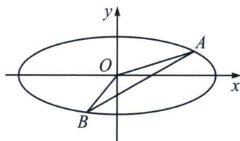

> [!faq]- 《圆锥曲线专题(上册)》例题解析
>
> > [!success]- **【答案】** 详见解析
>
> > [!note]- **【解析】**
> > 解析 (1) 设 $P(x_0, y_0)$ ，由极化恒等式可得 $\overrightarrow{PF_1} \cdot \overrightarrow{PF_2} = |PO|^2 - c^2$ ，且利用焦半径 $|PF_1| |PF_2| = (a + ex_0)(a - ex_0)$ （自证），且 $\left\{ \begin{array}{l} \frac{x_0^2}{a^2} + \frac{y_0^2}{b^2} = 1 \\ x_0^2 + y_0^2 = |OP|^2 \end{array} \right.$ ，故有 $|PF_1| |PF_2| = a^2 + b^2 - |OP|^2$ ，所以 $|PF_1| \cdot |PF_2| + \overrightarrow{PF_1} \cdot \overrightarrow{PF_2} = 2b^2 = 2$ 为定值.
> >
> > (2)若直线 $AB$ 与 $x$ 轴重合, 则直线 $AB$ 经过原点 $O$ , 此时, $A 、 B 、 O$ 不能构成三角形, 不合乎题意.
> >
> > 设直线 AB 的方程为 $x=my+n$ ，设点 $A(x_{1}, y_{1})$ 、 $B(x_{2}, y_{2})$ ，联立 $\left\{\begin{aligned}x&=my+n\\ \frac{x^{2}}{225}&+y^{2}=1\end{aligned}\right.$ 可得 $(m^{2}+225)y^{2}+2mny+(n^{2}-225)=0$ ，则 $\Delta=4mn^{2}-4(m^{2}+225)(n^{2}-225)>0$ ，可得 $m^{2}+225>n^{2}$ ，
> >
> > 
> >
> > 由韦达定理可得 $y_{1} + y_{2} = -\frac{2mn}{m^{2} + 225}$ ， $y_{1}y_{2} = \frac{n^{2} - 225}{m^{2} + 225}$ ，原点 $O$ 到直线 $AB$ 的距离为 $d = \frac{|n|}{\sqrt{m^2 + 1}}$ ，
> >
> > $S_{\triangle AOB} = \frac{1}{2}|AB|\cdot d = \frac{1}{2}\sqrt{1 + m^2}\cdot |y_1 - y_2|\cdot \frac{|n|}{\sqrt{1 + m^2}} = \frac{1}{2} |n|\cdot |y_1 - y_2| = \frac{1}{2}|n|\cdot \sqrt{(y_1 + y_2)^2 - 4y_1y_2} =$ $\frac{1}{2}\sqrt{\left(-\frac{2mn}{m^2 + 225}\right)^2 - \frac{4(n^2 - 225)}{m^2 + 225}}\cdot |n| = \frac{15n\sqrt{m^2 - n^2 + 225}}{m^2 + 225},$
> >
> > 设 $t^2 = m^2 + 225$ ，则 $S_{\triangle AOB} = \frac{15n\sqrt{t^2 - n^2}}{t^2} = 15n\sqrt{-\frac{n^2}{t^4} + \frac{1}{t^2}}$ ，设 $u = \frac{1}{t^2}$ ，则 $S_{\triangle AOB} = 15n\sqrt{-n^2u^2 + u}$ ，
> >
> > 因为二次函数 $y = -n^{2}u^{2} + u$ 的图象开口向下，对称轴为直线 $u = \frac{1}{2n^{2}}$ ，故 $S_{\triangle AOB} \leqslant 15n \sqrt{-n^{2} \cdot \left(\frac{1}{2n^{2}}\right)^{2} + \frac{1}{2n^{2}}} = \frac{15}{2}$ ，当且仅当 $u = \frac{1}{2n^{2}}$ 时，即当 $m^{2} + 225 = 2n^{2}$ 时，等号成立，由于 $m^{2} + 225 \geqslant 225$ 且 $m^{2} + 225 > n^{2}$ ，所以 $2n^{2} \geqslant 225$ 且 $2n^{2} > n^{2}$ ，只需 $2n^{2} \geqslant 225$ ，所以 $n \geqslant 11$ 且 $n \in N^{*}$ ，此时 $S_{\triangle AOB}$ 可取到最大值 $\frac{15}{2}$ ，当 $n \in \{1, 2, 3, \cdots, 10\}$ 时，此时 $n^{2} < \frac{225}{2}$ ，此时 $m^{2} + 225 - n^{2} > 0$ 恒成立，即 $\Delta > 0$ 恒成立，
> >
> > 此时，只需满足 $t^2 = m^2 + 225 \geqslant 225$ 即可，即 $u = \frac{1}{t^2} \in \left(0, \frac{1}{225}\right]$ ，所以，当 $u = \frac{1}{225}$ 时， $S_{\triangle AOB}$ 的最大值为 $\frac{n\sqrt{225 - n^2}}{15}$ ，综上所述， $S_n = \begin{cases} \frac{15}{2}, & n \geqslant 11, \\ \frac{n\sqrt{225 - n^2}}{15}, & n \leqslant 10, \end{cases}$ 。
> >
> > (i) 因为 2025 > 11，故 $S_{2025} = \frac{15}{2}$ ;
> >
> > (ii) 当 $n \leqslant 10$ 且 $n \in \mathbb{N}^*$ 时， $S_n = \frac{n\sqrt{225 - n^2}}{15}$ ，则 $\frac{1}{S_n^2} = \frac{225}{n^2(225 - n^2)} = \frac{1}{n^2} + \frac{1}{225 - n^2}$ ，
> >
> > $\sum_{n=1}^{10}\frac{1}{n^2}>1+\frac{1}{4}+\frac{1}{3\times 4}+\frac{1}{4\times 5}+\cdots+\frac{1}{10\times 11}=1+\frac{1}{4}+\frac{1}{3}-\frac{1}{4}+\frac{1}{4}-\frac{1}{5}+\cdots+\frac{1}{10}-\frac{1}{11}=\frac{5}{4}+\frac{1}{3}-\frac{1}{11}=\frac{3}{2}-\frac{1}{4}+\frac{1}{3}-\frac{1}{11}=\frac{3}{2}-\frac{1}{4}+\frac{1}{3}-\frac{1}{11}=\frac{3}{2}-\frac{1}{4}+\frac{1}{3}-\frac{1}{11}=\frac{3}{2}-\frac{1}{4}+\frac{1}{3}-\frac{\text{和}}{2}-\frac{\text{和}}{11}=\frac{3}{2}-\frac{1}{11}=\frac{3}{2}-\frac{1}{11}=\frac{3}{2}-\frac{1}{132}, \quad \sum_{n=1}^{10}\frac{1}{225-n^2}>\frac{10}{225-1^2}=\frac{10}{224}=\frac{5}{112}>\frac{1}{132}, \text{所以, } \sum_{n=1}^{10}\frac{1}{S_n^2}=\sum_{n=1}^{10}\frac{1}{n^2}+\sum_{n=1}^{10}\frac{1}{225-n^2}>\frac{3}{2}, \text{由于}\frac{1}{n^2}=\frac{4}{4n^2}<\frac{4}{4n^2-1}=\frac{4}{(2n-1)(2n+1)}=\frac{2}{2n-1}-\frac{2}{2n+1},$
> >
> > 所以 $\sum_{n=1}^{10}\frac{1}{n^2}<1+\left(\frac{2}{3}-\frac{2}{5}\right)+\left(\frac{2}{5}-\frac{2}{7}\right)+\cdots+\left(\frac{2}{19}-\frac{2}{21}\right)=\frac{5}{3}-\frac{2}{21},\quad\sum_{n=1}^{10}\frac{1}{225-n^2}<\frac{10}{225-10^2}=\frac{10}{125}=\frac{2}{25}<\frac{2}{21},$ 所以 $\sum_{n=1}^{10}\frac{1}{S_n^2}=\sum_{n=1}^{10}\frac{1}{n^2}+\sum_{n=1}^{10}\frac{1}{225-n^2}<\frac{5}{3}.$ 综上所述， $\frac{3}{2}<\frac{1}{S_1^2}+\frac{1}{S_2^2}+\frac{1}{S_3^2}+\cdots+\frac{1}{S_{10}^2}<\frac{5}{3}.$
> >
> > ## 二、构造递推式证明数列单调性与裂项放缩
