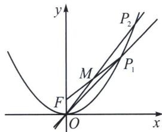

> [!faq]- 《圆锥曲线专题(上册)》例题解析
>
> > [!success]- **【答案】** 详见解析
>
> > [!note]- **【解析】**
> > 解析 (1)如图所示，联立 $\left\{ \begin{array}{l} y = x \\ x^2 = 4y \end{array} \right.$ ，解得 $\left\{ \begin{array}{l} x = 0 \\ y = 0 \end{array} \right.$ 或 $\left\{ \begin{array}{l} x = 4 \\ y = 4 \end{array} \right.$ ，故 $P_1(4, 4)$ 。又 $F(0, 1)$ ，所以 $M_1\left(2, \frac{5}{2}\right)$ ，$k_{1}=\frac{\frac{5}{2}-0}{2-0}=\frac{5}{4}$ ，故直线 $OP_{2}:y=\frac{5}{4}x$ ，联立 $\left\{\begin{aligned}y&=\frac{5}{4}x\\ x^{2}&=4y\end{aligned}\right.$ ，解得 $\left\{\begin{aligned}x&=0\\ y&=0\end{aligned}\right.$ 或 $\left\{\begin{aligned}x&=5\\ y&=\frac{25}{4}\end{aligned}\right.$ ，故 $P_{2}\left(5,\frac{25}{4}\right)$ .
> > (2)联立 $\left\{\begin{aligned}y=k_{n}x\\ x^{2}&=4y\end{aligned}\right.$ ，解得点 $P_{n+1}(4k_{n},4k_{n}^{2})$ ，所以 $M_{n+1}\left(2k_{n},\frac{4k_{n}^{2}+1}{2}\right)$ ， $k_{n+1}=\frac{\frac{4k_{n}^{2}+1}{2}-0}{2k_{n}-0}=k_{n}+\frac{1}{4k_{n}}$ 所以 $k_{n+1}-k_{n}=\frac{1}{4k_{n}}$ ．又因为 $k_{1}=\frac{5}{4}>0$ ，故 $k_{n}>0$ ，于是 $k_{n+1}-k_{n}>0$ ，即 $k_{n+1}>k_{n}$ ，故 $\{k_{n}\}$ 是递增数列。
> > 又由 $k_{n}>0$ ，可知 $\left\{\frac{1}{4k_{n}}\right\}$ 是递减数列，于是 $\{k_{n+1}-k_{n}\}$ 是递减数列.
> >
> > 
> >
> > (3)由(2)得，当 $n \geqslant 2$ 时， $P_{n}(4k_{n-1}, 4k_{n-1}^{2})$ ， $P_{n+1}(4k_{n}, 4k_{n}^{2})$ ，利用割补法，知
> >
> > $S_{n} = \frac{1}{2}\cdot 4k_{n}\cdot 4k_{n}^{2} - \frac{1}{2}(4k_{n}^{2} - 4k_{n - 1}^{2})(4k_{n} - 4k_{n - 1}) - \frac{1}{2}\cdot 4k_{n - 1}\cdot 4k_{n - 1}^{2} - 4k_{n - 1}^{2}(4k_{n} - 4k_{n - 1}) = 8k_{n}^{3} - 8k_{n - 1}^{3}$ $= 8(k_{n} + k_{n - 1})(k_{n} - k_{n - 1})^{2} - 16k_{n - 1}^{2}(k_{n} - k_{n - 1}) = 8\left(k_{n - 1} + \frac{1}{4k_{n - 1}}\right)^{3} - 8k_{n - 1}^{3} - 8\left(2k_{n - 1} + \frac{1}{4k_{n - 1}}\right)\left(\frac{1}{4k_{n - 1}}\right)^{2} - 4k_{n - 1}$ $= 8k_{n - 1}^{3} + 6k_{n - 1} + \frac{3}{2k_{n - 1}} +\frac{1}{8k_{n - 1}^{3}} -8k_{n - 1}^{3} - \frac{1}{k_{n - 1}} -\frac{1}{8k_{n - 1}^{3}} -4k_{n - 1} = 2k_{n - 1} + \frac{1}{2k_{n - 1}} = 2k_{n}(n\geqslant 2).$
> >
> > 而 $S_{1} = \frac{1}{2}\times 5\times \frac{25}{4} -\frac{1}{2}\times 4\times 4 - \frac{1}{2}\times (5 - 4)\times \left(\frac{25}{4} +4\right) = \frac{5}{2} = 2k_{1}$ ，故 $S_{n} = 2k_{n}$
> >
> > 而 $k_{n} \geqslant k_{1} = \frac{5}{4}$ ，故 $\sum_{i=1}^{n} S_{i} \geqslant 2nk_{1} = \frac{5}{2} n > \sqrt{6} n$ ；又 $\frac{1}{4k_{n}} \leqslant \frac{1}{4k_{1}} = \frac{1}{5} < \frac{1}{5} k_{1} \leqslant \frac{1}{5} k_{n}$ ，故 $k_{n+1} = k_{n} + \frac{1}{4k_{n}} < \frac{6}{5} k_{n}$ ，
> >
> > 由累乘法可知 $k_{n} < k_{1} \cdot \left(\frac{6}{5}\right)^{n - 1} = \frac{5}{4} \cdot \left(\frac{6}{5}\right)^{n - 1} (n \geqslant 2)$ ，而 $k_{1} = \frac{5}{4} \cdot \left(\frac{6}{5}\right)^{1 - 1}$ ，故 $k_{n} \leqslant \frac{5}{4} \cdot \left(\frac{6}{5}\right)^{n - 1}$ .
> >
> > $$
> > \sum_ {i = 1} ^ {n} S _ {i} = 2 \sum_ {i = 1} ^ {n} k _ {n} \leqslant 2 \times \frac {5}{4} \times \frac {\left(\frac {6}{5}\right) ^ {n} - 1}{\frac {6}{5} - 1} = \frac {2 5}{2} \left[ \left(\frac {6}{5}\right) ^ {n} - 1 \right] <   1 3 \cdot \left(\frac {6}{5}\right) ^ {n} - 1 3.
> > $$
> >
> > 综上， $\sqrt{6} n < \sum_{i=1}^{n} S_i < 13 \cdot \left(\frac{6}{5}\right)^n - 13.$
