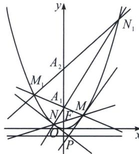

> [!faq]- 《圆锥曲线专题(上册)》例题解析
>
> > [!success]- **【答案】** 详见解析
>
> > [!note]- **【解析】**
> > 解析 (1)依题意可知, 动圆 $E$ 的圆心 $E$ 到点 $F\left(0, \frac{1}{2}\right)$ 与到直线 $y = -\frac{1}{2}$ 的距离相等, 根据抛物线定 339 老唐说题
> >
> > 义可得曲线 $\Gamma$ 是以 $F\left(0, \frac{1}{2}\right)$ 为焦点， $y = -\frac{1}{2}$ 为准线的抛物线，所以曲线 $\Gamma$ 的方程为 $x^2 = 2y$ ，则直线 $l: y = kx + \frac{1}{2}$ 经过抛物线的焦点，设 $M(x_M, y_M)$ ， $N(x_N, y_N)$ ，又 $x^2 = 2y$ 可化为 $y = \frac{1}{2} x^2$ ，则 $y' = x$ ，所以 $l_1: y - y_M = x_M(x - x_M)$ ， $l_2: y - y_N = x_N(x - x_N)$ ，即 $\left\{ \begin{array}{l} xx_M = y + y_M \\ xx_N = y + y_N \end{array} \right.$ ，由于点 $P(x_0, y_0)$ 均在两直线上，故 $MN: xx_0 = y + y_0$ ，对比 $l: y = kx + \frac{1}{2}$ ，故点 $P$ 的轨迹方程为 $y = -\frac{1}{2}$ .
> >
> > (2)(i) 设 $M_{n}(x_{Mn}, y_{Mn})$ ， $N_{n}(x_{Nn}, y_{Nn})$ ，则 $x_{Mn}^{2} = 2y_{Mn}$ ， $x_{Nn}^{2} = 2y_{Nn}$ ，又 $x_{M}^{2} = 2y_{M}$ ， $x_{N}^{2} = 2y_{N}$ ，则 $(x_{Mn} - x_{M})(x_{Mn} + x_{M}) = 2(y_{Mn} - y_{M})$ ，又 $x_{Mn} \neq x_{M}$ ，所以 $\frac{y_{Mn} - y_M}{x_{Mn} - x_M} = \frac{x_{Mn} + x_M}{2}$ ，即直线 $MM_{n}$ 的方程为 $y - y_{M} = \frac{x_{Mn} + x_M}{2}(x - x_M)$ ，整理得 $2y = x(x_{Mn} + x_M) - x_{Mn}x_M$ ，令 $x = 0$ ，可得 $2y_{n} = -x_{Mn}x_{M}$ ，①
> >
> > 
> >
> > 同理得 $NN_{n}$ 的方程为 $x(x_{Nn} + x_N) = 2y + x_{Nm}x_N$ ，令 $x = 0$ ，可得 $2y_{n} = -x_{Nm}x_{N}$ ，②
> >
> > 又直线 $M_{n}N_{n}$ 的斜率为 $\frac{y_{Mn} - y_{Nn}}{x_{Mn} - x_{Nn}} = \frac{x_{Mn} + x_{Nn}}{2}$ ，所以直线 $M_{n}N_{n}$ 的方程为 $x(x_{Mn} + x_{Nn}) = 2y + x_{Mn}x_{Nn}$ ，令 $x = 0$ ，得 $2y_{n+1} = -x_{Mn}x_{Nn}$ ，由①可知， $x_{M}x_{N} = -1$ ，①×②可得 $4y_{n}^{2} = x_{Mn}x_{M}x_{Nn}x_{N} = -x_{Mn}x_{Nn}$ .
> >
> > 于是可得 $4y_{n}^{2} = 2y_{n + 1}$ ，即 $2y_{n}^{2} = y_{n + 1}$ ，又因为 $y_{1} = 1$ ，则 $y_{n} > 0$ ，于是 $\log_2(2y_n^2) = \log_2y_{n + 1}$ ，即 $1 + 2\log_2y_n = \log_2y_{n + 1}$ ，即 $2 + 2\log_2y_n = \log_2y_{n + 1} + 1$ ，即 $2(\log_2y_n + 1) = \log_2y_{n + 1} + 1$ ，又 $\log_2y_1 + 1 = 1$ ，所以数列 $\{\log_2y_n + 1\}$ 是以1为首项，2为公比的等比数列，则 $\log_2y_n + 1 = 2^{n - 1}$ ，所以 $\log_2y_n = 2^{n - 1} - 1$ ，所以 $y_{n} = 2^{2^{n - 1} - 1}$
> >
> > (ii) 由 (i) 可知， $a_{n}=2^{n-1}$ ， $b_{n}=\log_{2}2^{n-1}=n-1$ ，则 $a_{n}b_{n}=(n-1)2^{n-1}$ ，
> >
> > 所以 $S_{n}=0+2+2\times2^{2}+\cdots+(n-2)2^{n-2}+(n-1)2^{n-1}$ ,
> >
> > 则 $2S_{n}=0+2^{2}+2\times2^{3}+\cdots+(n-2)2^{n-1}+(n-1)2^{n}$
> >
> > 两式作差可得 $-S_{n}=0+(2+2^{2}+2^{3}+\cdots+2^{n-1})-(n-1)2^{n}=\frac{2(1-2^{n-1})}{1-2}-(n-1)2^{n}$ ，所以 $S_{n}=(n-2)2^{n}+2$ .
> >
> > 令 $S_{n}=(n-2)2^{n}+2>2025$ ，即 $(n-2)2^{n}>2023$ .
> >
> > 当 n=1，2 时，显然不合题意；
> >
> > 当 $n \geqslant 3$ 时， $f(n) = (n - 2)2^n$ 随着 $n$ 的增大而增大，又 $f(7) = 5 \times 2^7 = \frac{5}{8} \times 2^{10} = \frac{5}{8} \times 1024 < 1024, f(8) = 6 \times 2^8 = \frac{6}{4} \times 2^{10} = \frac{3}{2} \times 1024 < 2023, f(9) = 7 \times 2^9 = \frac{7}{2} \times 2^{10} = \frac{7}{2} \times 1024 > 2023,$
> >
> > 则满足不等式 $S_{n}>2025$ 的 n 的最小值为 9.
