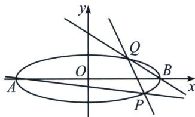

<!-- question-source:start -->
例4 (山东省齐鲁名校教研共同体 2024-2025 学年高三下学期第六次联考数 T19) 已知椭圆 $C: \frac{x^{2}}{a^{2}} + \frac{y^{2}}{b^{2}} = 1 (a > b > 0)$ 经过点 $\left(b, \frac{2\sqrt{2}}{3} b\right)$ .

(1)求 C 的离心率.

(2)设 A, B 分别为 C 的左、右顶点，P, Q 为 C 上异于 A, B 的两动点，且直线 BQ 的斜率恒为直线 AP 的斜率的 5 倍.

①当 b 的值确定时，证明：直线 PQ 过 x 轴上的定点；

②按下面方法构造数列 $\{b_n\}$ ：当 $b = b_{n}$ 时，直线 $PQ$ 过的定点为 $M(b_{n + 1},0)$ ，且 $b_{1} = 2$ ，设 $d_{n} = \frac{1}{b_{n} - \frac{(-1)^{n}}{3}}$ ，证明： $d_{1} + d_{2} + \dots +d_{n} <   1.$

(1) 因为椭圆 $C$ 经过点 $\left(b, \frac{2\sqrt{2}}{3} b\right)$ , 所以 $\frac{b^2}{a^2} + \frac{8b^2}{9b^2} = 1$ , 故 $\frac{b^2}{a^2} = \frac{1}{9}$ , 所以 $C$ 的离心率 $e = \sqrt{1 - \frac{b^2}{a^2}} = \frac{2\sqrt{2}}{3}$ .

(2)①由
(1)知 C 的方程为 $\frac{x^{2}}{9b^{2}} + \frac{y^{2}}{b^{2}} = 1$ ， $A(-3b, 0)$ ， $B(3b, 0)$ 。利用第三定义可知 $k_{AP}k_{BP} = -\frac{1}{9}$ （自证），又因为 $\frac{k_{BQ}}{k_{AP}} = 5$ ，所以 $k_{BQ}k_{BP} = -\frac{5}{9}$ ，将椭圆按照 $\overrightarrow{BO}:(-3b, 0)$ 平移，则椭圆 $C' : \frac{(x+3b)^{2}}{9b^{2}} + \frac{y^{2}}{b^{2}} = 1$ ，即 $x^{2} + 6bx + 9y^{2} = 0$ ，设直线 $P'Q'$ 方程为 $mx + ny = 1$ ，代入椭圆 $C'$ 得 $x^{2} + 6bx (mx + ny) + 9y^{2} = 0$ ，同除 $x^{2}$ 得 $9\left(\frac{y}{x}\right)^{2} + 6bn\frac{y}{x} + 1 + 6bm = 0$ ，由 $k_{1} \cdot k_{2} = \frac{1 + 6bm}{9} = -\frac{5}{9}$ ，解得 $m = -\frac{1}{b}$ ，所以 $P'Q'$ 过定点 $(-b, 0)$ ，即直线 PQ 过 x 轴上的定点 $(2b, 0)$ 。

②由①可知， $b_{n+1}=2b_{n}$ ，又 $b_{n}>0$ ， $b_{1}=2$ ，所以 $\{b_{n}\}$ 是首项为2，公比为2的等比数列．所以 $b_{n}=2^{n}$ ， $d_{n}=\frac{1}{2^{n}-\frac{(-1)^{n}}{3}}$ ．当n为偶数时， $d_{n-1}+d_{n}=\frac{1}{2^{n-1}+\frac{1}{3}}+\frac{1}{2^{n}-\frac{1}{3}}=\frac{2^{n}+2^{n-1}}{2^{n}\cdot2^{n-1}+\frac{2^{n-1}}{3}-\frac{1}{9}}<\frac{2^{n}+2^{n-1}}{2^{n}\cdot2^{n-1}}=\frac{1}{2^{n-1}}+\frac{1}{2^{n}}$

所以 $d_{1}+d_{2}+\cdots+d_{n-1}+d_{n}<\frac{1}{2}+\frac{1}{2^{2}}+\cdots+\frac{1}{2^{n-1}}+\frac{1}{2^{n}}=1-\frac{1}{2^{n}}<1.$

当 n 为奇数时，因为 $d_{n+1}=\frac{1}{2^{n+1}-\frac{1}{3}}>0$ ，所以 $d_{1}+d_{2}+\cdots+d_{n}<d_{1}+d_{2}+\cdots+d_{n}+d_{n+1}<1$ .

综上可得： $d_{1}+d_{2}+\cdots+d_{n}<1$ .
<!-- question-source:end -->

![[高中/总复习/专题/2026版高中《mst老唐说题》圆锥曲线专题（数学）/上册/第09章_圆锥曲线跨界综合/第四节_圆锥曲线与数列综合/三_斜率关系构造定点与数列递推/例题/answers/Q00048755A1.md]]
