<!-- source-part:1 pages:1-50 -->

$$
\vert A B \vert = \frac {2 P}{\sin^ {2} \theta}
$$

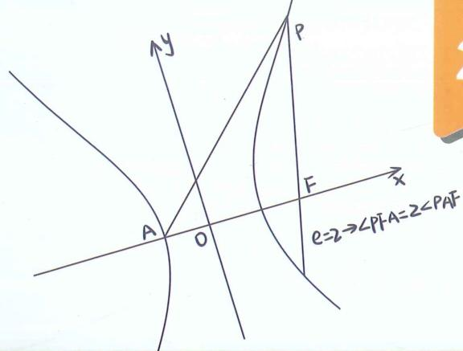

## 高中数学新思路 圆锥专题 技能强化篇

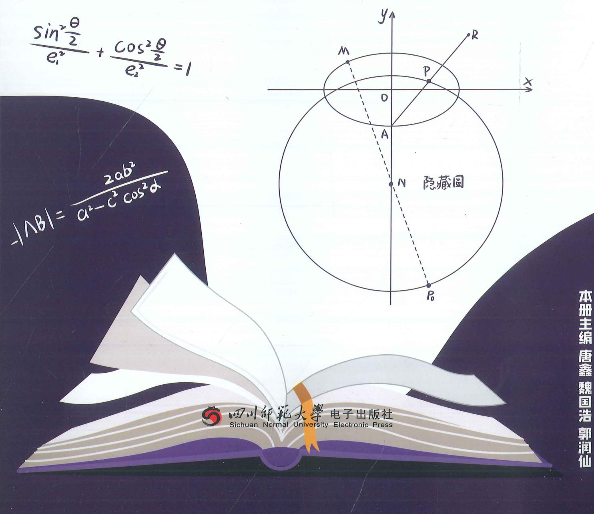

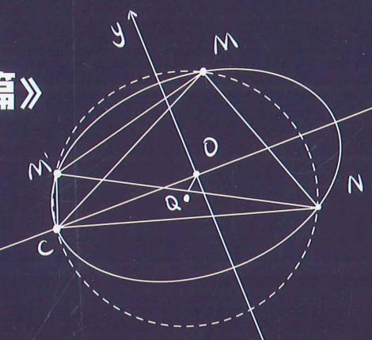

老唐说题团队教研产品
《高考数学满分突破 - 秒系列123》
《高中数学新思路 - 复习专题第一轮》
《高中数学新思路 - 复习专题第二轮》
《高中数学新思路 - 同步系列123》
《高中数学新思路 - 导数专题》
《高中数学新思路 - 圆锥曲线专题》
《MST新思路高中数学新定义 组合与
《高中物理新思路 力学篇》
《高中物理新思路 电学篇》
《高中物理新思路 综合实验篇》

$e\cos \theta  = \frac{\lambda  - 1}{\lambda  + 1}$

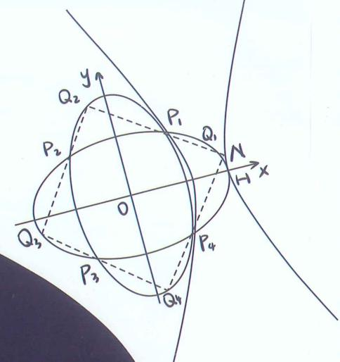

$$
\vert A B \vert = \frac {2 P}{\sin^ {2} \theta}
$$

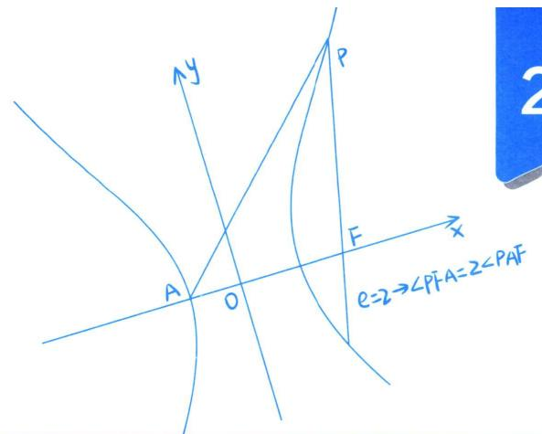

高中数学新思路
圆锥专题 技能强化篇

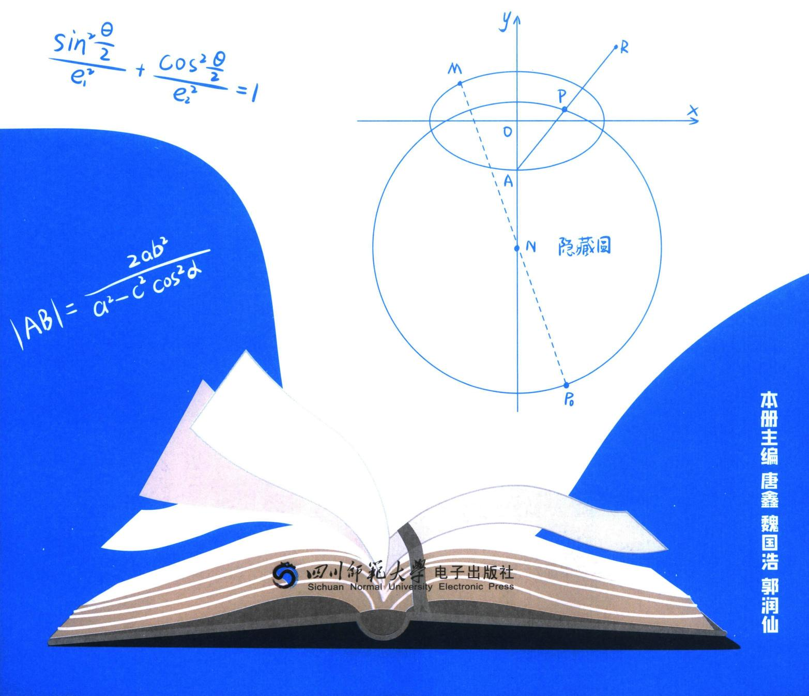

# 高中数学新思路 圆锥专题

主 编 唐 鑫 魏国浩 郭润仙

责任编辑 胡丽娜

封面设计 老唐说题工作室

出版发行 四川师范大学电子出版社

社址 四川省成都市锦江区静安路5号

邮政编码 610068

电话 028-84767799(总编室) 028-84769668(发行部)

网址 www.scnup.com

光盘生产 大连华录影音实业有限公司

手册印制 长沙湘之印彩色印刷有限公司

文本尺寸 $210 \mathrm{~mm} \times 285 \mathrm{~mm}$

印 张 8

字 数 140 千字

版 次 2024年4月第1版

印 次 2025年7月第3次印刷

I S B N 978-7-89541-168-5

本手册为电子出版物配套手册,为尊重阅读习惯而制,如发生质量问题,读者请与我们联系

本出版物中部分未能联系上的图文作者请与本社联系,以便支付稿酬

■版权所有 侵权必究■

## 唐鑫

唐鑫 昵称老唐，MST《老唐说题》创始人，《高考数学满分突破》系列丛书主编，《高中数学新思路》系列丛书主编。善于归纳总结并提炼精髓，将复杂问题简单化，抽象问题形象化和具体化。

受邀于衡水二中，正定中学，青岛二中，烟台一中，安阳一中，昆明一中，遵义四中，柳铁一高，钦州二中，惠东高级中学等国内重点高中讲座，广受好评！

## 魏国浩

魏国后 南开大学硕士研究生毕业，中学数学教师；山东理工大学特聘讲师，数学奥林匹克竞赛教练员，中国数学会会员；曾任多家教育研究所兼职研究员，多家教辅主编及编委。MST《老唐说题》创始人之一。

针对高中各年级数学教学有丰富的经验，教学成绩显著，善于发现学生的闪光点，对学生进行有的放矢的教育。

善于钻研更快、更巧的高中数学解题方法并推广应用，以

自己独有的方法推导并整理《平面法向量的求法》《一步搞定错位相减》《导数双变量问题综合探究》等五十余种高考题中独有的解法，并归纳整理《高考解题黄金模板》系列共54篇解题方法以及相关应用。

## 郭润仙

高中数学高级教师。所教班级数学高考成绩一直名列大理州第一；曾带出2011届李仕强、杨施薇大理州高考文理状元，2014届杨佯等多名大理州高考状元；培养了杨施薇、余建希、丰峰等多名清华、北大学子；辅导的蔡金明、马遥等多名学生获省级数学竞赛奖。

参与了省内外重要数学刊物的编辑，主编《高中数学同步周练（AB卷）》，《高中数学兵法500条》和《数学教学通讯》增刊的编委。发表数十篇论文。

## 部分讲座学校展示

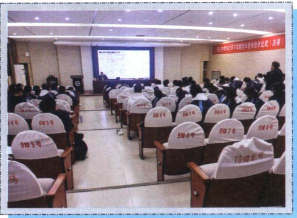  
雅礼中学

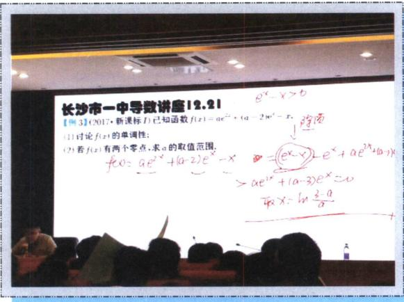  
长沙市一中

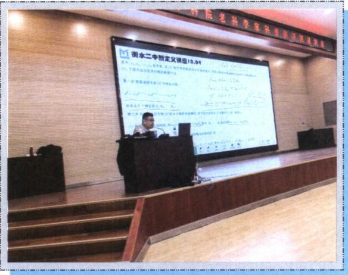  
衡水二中

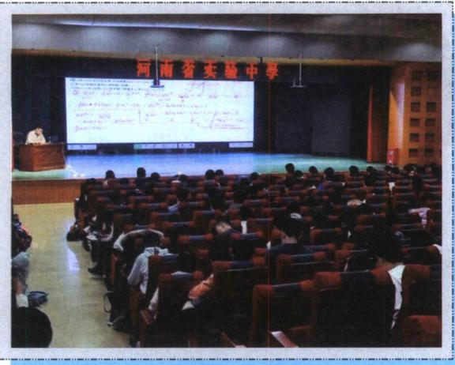  
河南省实验

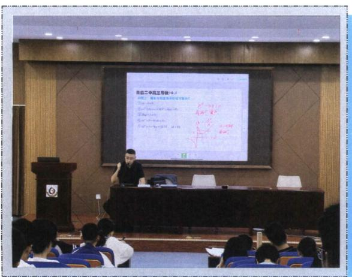  
青岛二中

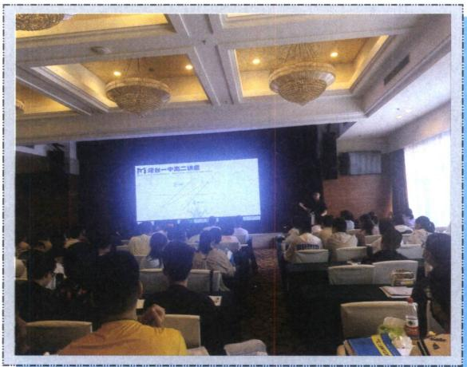  
烟台一中

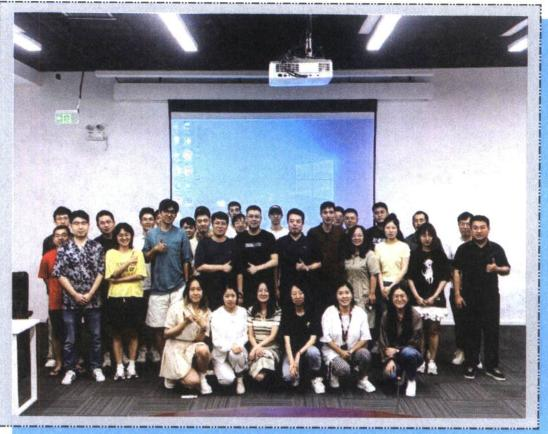  
北京高途总部

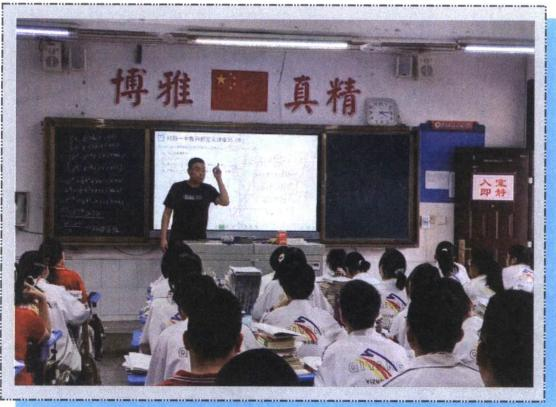  
祁阳一中

衡阳八中  
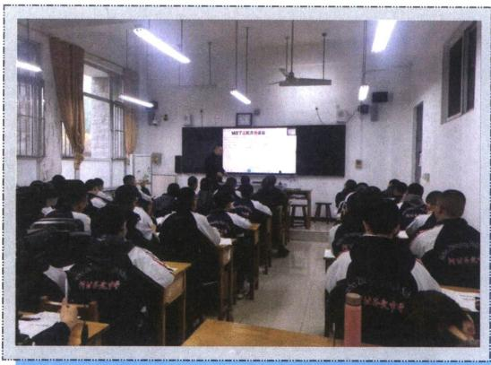

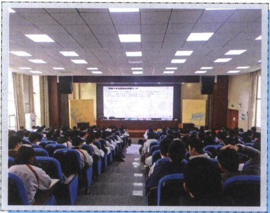

正定中学  
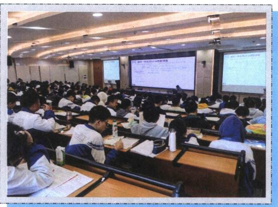  
郴州一中

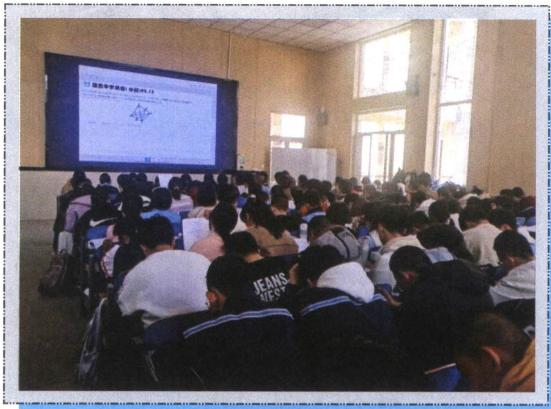  
康杰中学

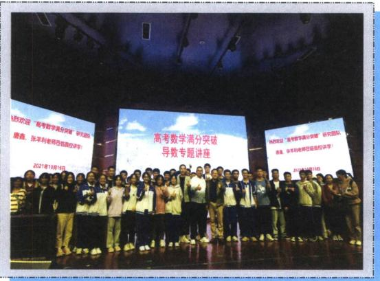  
钦州二中

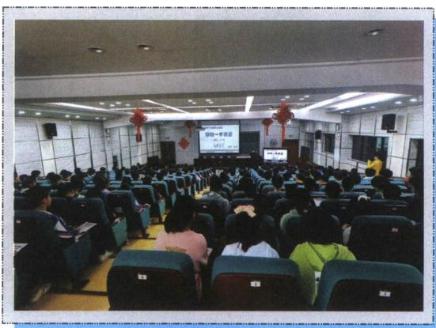  
柳铁一中

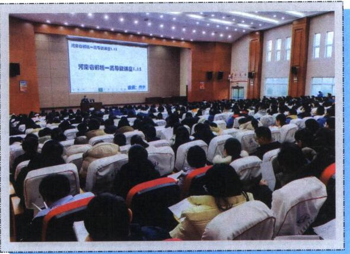  
河南郸城一高

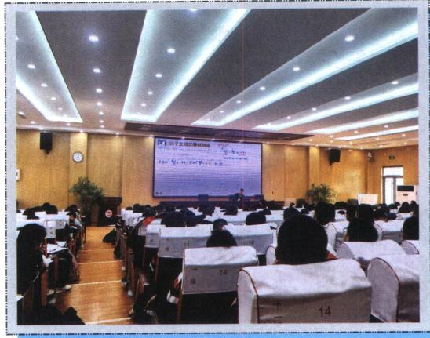  
菏泽一中

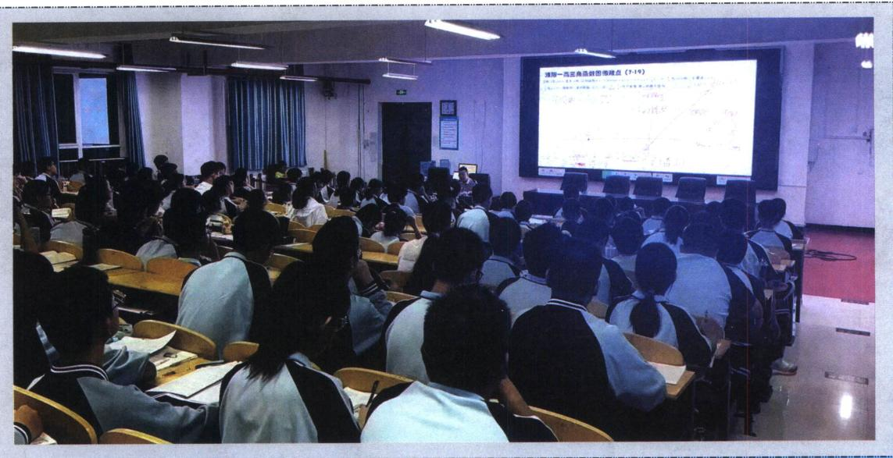  
濮阳一高

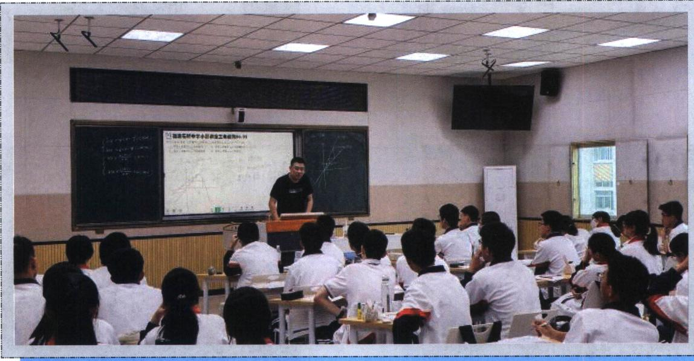  
石光中学

## 技能强化篇

第一节 反比例对合方程解决圆锥曲线与数列综合 …… 342

一、两点对合式构造双曲线中的等比数列 … 343

二、非等轴双曲线的仿射换元 …… 344

三、抛物线两点对合式构造等差等比数列 … 349

第二节 抛物线切线对合与两点对合数列构造综合 …… 353

一、抛物线蝴蝶定理 …… 353

二、切线与对合不动点 …… 356

三、平移顶点的抛物线两点对合方程 …… 358

第三节 椭圆双曲线的两点对合式 …… 359

一、椭圆与双曲线的两点对合式 …… 359

1. 椭圆两点对合式 …… 359

2. 双曲线右支的两点对合式 …… 360

3. 双曲线左支的两点对合式 …… 360

4. 双曲线左右两支的两点对合式 …… 361

二、对合方程简化单动点模型 …… 361

1. 椭圆 …… 361

2. 双曲线 …… 361

三、对合方程简化斜率关系模型 …… 362

四、两点对合方程简化相切圆问题 …… 365

五、两点对合方程简化轮换对称问题 …… 366

第11章 从定比点差到极点极线

第一节 单比与交比 …… 370

一、单比的概念及性质 …… 370

1. 单比的定义 …… 370

2. $\lambda + \mu$ 为定值的参数同构与点差法 … 370二、单比与交比 …… 372
1. 单比角元形式 …… 372
2. 交比的概念及性质 …… 372
3. 交比的射影不变性 …… 373
三、调和点列与定比点差 …… 377
1. 调和点列的概念 …… 377
2. 调和点列的性质 …… 377
3. 定比分点和调和分点支配下的圆锥曲线 …… 378
四、定点（极点）在坐标轴上的定比点差 … 379
类型一：定点（极点）在 x 轴 …… 379
类型二：定点（极点）在 y 轴 …… 380
五、定点（极点）不在坐标轴上的定比点差 … 382
第二节 极点极线定义与自极三角形 …… 384
一、极点极线的定义 …… 384
1. 二次曲线的替换法则 …… 384
2. 极点极线的代数定义 …… 385
3. 极点极线的几何意义 …… 385
二、极点极线定理证明 …… 386
1. 梅涅劳斯定理 …… 386
2. 梅涅劳斯定理的逆定理 …… 387
3. 塞瓦定理 …… 387
4. 塞瓦定理的逆定理 …… 387
三、极点极线的配极性质 …… 388
四、完全四边形与自极三角形 …… 388
1. 完全四边形定义 …… 388
2. 极点极线的综合模型——自极三角形 …… 388
第三节 蝴蝶定理与坎迪定理 …… 394
一、蝴蝶定理 …… 394

二、坎迪定理 …… 395
三、坎迪定理中点推论 …… 397
四、利用对称和焦弦常数构造斜率关系 …… 400

第12章 调和点列与调和线束定理与对合关系

第一节 调和点列与点的对合 …… 403
调和共轭定理 …… 403

第二节 调和线束两大定理的应用 …… 407
一、调和线束平行中点定理 …… 407
1. 利用调和梯形角度解读 …… 408
2. 射影到与坐标轴平行线的中点 …… 409
3. 调和等腰梯形对称构造 …… 412
4. 射影到斜线找中点与平行 …… 417
二、调和线束斜率公式 …… 419
1. 平行于坐标系的中点斜率翻译 …… 420
2. 斜率等差与斜率倒数等差模型 …… 427
3. 由自极三角形构造的射影中心和调和线束斜率坐标翻译 …… 430

第三节 角平分线与调和点列 …… 433
一、斜率和为0与内外角平分线解读 …… 433
二、内外角平分线与焦准模型 …… 435
1. 椭圆外角平分线与焦准模型 …… 435
2. 双曲线内角平分线与焦准模型 …… 435
3. 双外角平分线垂直模型 …… 435
三、内外角平分线隐藏阿氏圆 …… 437
隐藏的角平分线与阿氏圆构造 …… 438

第四节 斜率对合与斜率翻译 …… 440
一、斜率对合的原理 …… 440
1. 对合轴与对合中心的选取 …… 441
2. 斜率对合的基本作图原理 …… 441
二、对合中心在无穷远点的特殊值 …… 447
1. 当 $k_{1}+k_{2}=0$ 时，第三条边斜率为定值 …… 447

2. 当 $k_{1}k_{2}=\pm\frac{b^{2}}{a^{2}}$ 时，第三条边斜率为定值

...... 448

三、和型对合 $k_{1}+k_{2}$ 的三种模型 …… 449

1. 射影中心与一对合不动点横坐标相同
...... 449

2. 两对合不动点横坐标相同 …… 449

3. 射影中心与对合中心横坐标相同 … 450

四、倒数和型 $\frac{1}{k_{1}}+\frac{1}{k_{2}}$ 对合的三种模型 …… 450

1. 射影中心与一对合不动点纵坐标相同
...... 450

2. 两对合不动点纵坐标相同 …… 452

3. 射影中心与对合中心纵坐标相同 … 452

五、顶点角＋同轴轴点弦的对合方程 …… 454

1. 两类对合中心在坐标轴上的对合模型
...... 454

2. 对合中心在坐标轴上的面积转化 … 461

3. 对合中心在坐标轴上的斜率与共圆转化
...... 463

六、积型 $k_{1}k_{2}$ 对合的多解问题 …… 466

1. 射影中心在曲线上的直角构造 …… 466

2. 射影中心未知的调和线束由 $k_{3}+k_{4}=0$ 构造定值 …… 466

3. 射影中心未知的斜率乘积为定值的多解问题 …… 469

4. 费雷格(Fregier)定理 …… 469

七、对合方程 $ak_{1}k_{2}+b(k_{1}+k_{2})+c=0$ …… 471

1. 由调和线束斜率公式转化 …… 471

2. 中点平行弦模型 …… 473

第五节 斜率积的三次对合 …… 474

一、椭圆内接三角形的外心斜率定理 …… 474

二、等轴双曲线轮换对合与隐藏的垂心 …… 476

三、等轴双曲线反演与二阶曲线外心 …… 478

四、三次方程韦达定理与三次齐次化方程 … 478

第六节 从笛沙格定理到帕斯卡定理 …… 481

一、笛沙格对合 …… 482

二、帕斯卡（Pascal）定理及其逆定理…… 484

1. 寻找帕斯卡第六点 …… 485

2. 圆锥线的切线 …… 485

3. 帕斯卡圆锥曲线的内接四点形 …… 486

第七节 帕斯卡定理与对偶定理布利安桑定理……

…… 492

一、布利安桑（Brianchon）定理与退化二次曲线联立 …… 492

1. 对偶的两个定理——布利安桑定理与帕斯卡定理比较 …… 492

2. 外切五边形的布利安桑点 …… 493

3. 外切四边形的布利安桑点 …… 493

4. 外切三边形的布利安桑点 …… 493

二、热尔岗点 …… 494

三、退化二次曲线的布利安桑点 …… 495

四、双曲线渐近线和共轭直径 …… 495

第13章 新定义下的斜率调整与仿射

第一节 斜率调整法 …… 497

一、曲线上双定点单动点斜率调整原理 …… 497

二、斜率调整与斜率表示 …… 499

三、斜率调整与对合的综合 …… 500

四、斜率调整背景——斯坦纳定理 …… 502

1. 点的斯坦纳定理 …… 504

2. 线的斯坦纳定理 …… 504

第二节 仿射法与面积转化 …… 505

一、仿射法与面积变化 …… 505

二、切点圆面积最值 …… 511

三、斜率乘积 $-\frac{b^{2}}{a^{2}}$ 能仿射成直角的面积定值问题 …… 516四、重心三角形面积定值问题 …… 520
五、直径三角形面积最值问题 …… 521

第 14 章 新定义下的面积转化

第一节 过焦点弦的面积问题 …… 524
一、焦长转化为面积和差 …… 524
1. 焦长公式 …… 524
2. 面积之和 …… 524
3. 面积之差 …… 524
二、焦点弦中点连线隐藏定点与面积转化 … 528
三、焦点弦用角度转化斜率与面积 …… 529
四、焦弦中垂线与隐藏面积问题 …… 530
五、隐藏的焦弦常数与三角形面积比值转化 …… 533
六、焦弦的截距与面积转化问题 …… 537
七、焦点准线关联与面积比值转化 …… 538
八、焦半径与定比点差转化面积比值 …… 539
第二节 坐标面积公式与面积最值 …… 541
一、坐标面积公式推导 …… 541
二、坐标面积公式与柯西不等式求最值 …… 543
第三节 面积比值转化问题 …… 545
一、利用极点极线关系将坐标转化面积比 … 545
二、隐藏定点的斜率关系构造面积最值问题 …… 547
三、隐藏调和线束斜率关系与面积转化 …… 550
四、由中点隐藏轨迹方程构造面积最值问题 …… 552
五、由单动点三角换元构造面积比 …… 555
六、共轭点面积等比中项模型 …… 559
七、双圆锥曲线的双动点构造面积比 …… 560

# 10 章 万能的两点对合式 WANNENGDELIANGDIANDUIHESHI

过抛物线 $y^{2}=2px$ 上两点 $A(x_{1},y_{1})$ 、 $B(x_{2},y_{2})$ 的直线 AB 方程是： $(y_{1}+y_{2})y=2px+y_{1}y_{2}$

证明：利用 $k_{AB} = \frac{y_2 - y_1}{x_2 - x_1} = \frac{y_2 - y_1}{\frac{y_2^2}{2p} - \frac{y_1^2}{2p}}$ ，得到 $k_{AB} = \frac{2p}{y_1 + y_2}$ ，故直线 $AB$ 方程为： $y - y_{1} = \frac{2p}{y_{1} + y_{2}}\left(x - \frac{y_{1}^{2}}{2p}\right)$ 化简可得： $(y_{1} + y_{2})y = 2px + y_{1}y_{2}$

记忆方法：把抛物线化成标准方程，然后将最左端的二次自动降为一次，再在最左端和最右端加上“ $y_{1}+y_{2}$ 、 $y_{1}y_{2}$ ”皆可.

同理，如果抛物线的形式是 $x^{2}=2py(p>0)$ ，直线 AB 的方程是： $(x_{1}+x_{2})x=2py+x_{1}x_{2}$ .

注意 考试时，最好给出 $(y_{1}+y_{2})y=2px+y_{1}y_{2}$ 的推导过程。

关于对合，如果我们设立某种法则 $f$ ，我们发现 $(y_{1} + y_{2})y = 2px + y_{1}y_{2}$ 中，

![[高中/总复习/专题/2026版高中《mst老唐说题》圆锥曲线专题（数学）/下册/第10章_万能的两点对合式/第10章_万能的两点对合式.md]]
![[高中/总复习/专题/2026版高中《mst老唐说题》圆锥曲线专题（数学）/下册/第11章_从定比点差到极点极线/第11章_从定比点差到极点极线.md]]
![[高中/总复习/专题/2026版高中《mst老唐说题》圆锥曲线专题（数学）/下册/第12章_调和点列与调和线束定理与对合关系/第12章_调和点列与调和线束定理与对合关系.md]]
![[高中/总复习/专题/2026版高中《mst老唐说题》圆锥曲线专题（数学）/下册/第13章_新定义下的斜率调整与仿射/第13章_新定义下的斜率调整与仿射.md]]
![[高中/总复习/专题/2026版高中《mst老唐说题》圆锥曲线专题（数学）/下册/第14章_新定义下的面积转化/第14章_新定义下的面积转化.md]]
