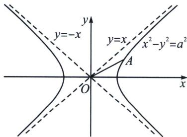
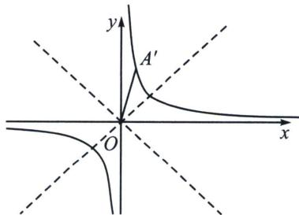

## 一、两点对合式构造双曲线中的等比数列

如图，将等轴双曲线 $x^{2}-y^{2}=a^{2}$ 绕原点逆时针旋转 $45^{\circ}$ ，即变成了初中的反比例函数 $y=\frac{k}{x}\left(k=\frac{a^{2}}{2}\right)$ ,

证明：记原双曲线上任意一点 A 满足： $z_{A}=x+yi$ ，作复数逆时针旋转 $\frac{\pi}{4}$ 得 $OA'=x'+y'i$ ，则： $z_{A}'=(x+yi)(\cos\frac{\pi}{4}+i\sin\frac{\pi}{4})=\frac{\sqrt{2}}{2}(x-y)+\frac{\sqrt{2}}{2}(x+y)i$ ，故 $\left\{\begin{aligned}x' &= \frac{\sqrt{2}}{2}(x-y) \\ y' &= \frac{\sqrt{2}}{2}(x+y)\end{aligned}\right.$ ，由于 $x^{2}-y^{2}=a^{2}$ ，

故 $x'y'=\frac{1}{2}(x^{2}-y^{2})=\frac{a^{2}}{2}$ ;

![[高中/总复习/专题/2026版高中《mst老唐说题》圆锥曲线专题（数学）/下册/第10章_万能的两点对合式/第一节_反比例对合方程解决圆锥曲线与数列综合/一_两点对合式构造双曲线中的等比数列/例题/Q00053123.md]]
