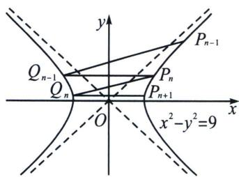
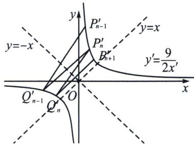
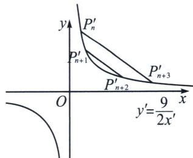

<!-- question-source:start -->
例1 (2024·新高考Ⅱ卷19题)已知双曲线 C: $x^{2}-y^{2}=m(m>0)$ ，点 $P_{1}(5,4)$ 在 C 上，k 为常数，0<k<1，按照如下方式依次构造点 $P_{n}(n=2,3,\cdots)$ ，过 $P_{n-1}$ 斜率为 k 的直线与 C 的左支交于点 $Q_{n-1}$ ，令 $P_{n}$ 为 $Q_{n-1}$ 关于 y 轴的对称点，记 $P_{n}$ 的坐标为 $(x_{n},y_{n})$ .

(1) 若 $k=\frac{1}{2}$ ，求 $x_{2}$ ， $y_{2}$ ;

(2)证明：数列 $\{x_{n}-y_{n}\}$ 是公比为 $\frac{1+k}{1-k}$ 的等比数列；

(3)设 $S_{n}$ 为 $\triangle P_{n}P_{n+1}P_{n+2}$ 的面积，证明：对任意的正整数 n， $S_{n}=S_{n+1}$ .

(1)因为 $P_{1}(5,4)$ 在 $C$ 上，所以 $25 - 16 = m$ ，解得 $m = 9$ ，过 $P(5,4)$ 且斜率为 $k = \frac{1}{2}$ 的直线方程为 $y - 4 = \frac{1}{2} (x - 5)$ ，即 $x - 2y + 3 = 0$ ，联立 $\left\{ \begin{array}{l} x^{2} - y^{2} = 9 \\ x - 2y + 3 = 0 \end{array} \right.$ ，解得 $\left\{ \begin{array}{l} x = 5 \\ y = 4 \end{array} \right.$ 或 $\left\{ \begin{array}{l} x = -3 \\ y = 0 \end{array} \right.$ ，

故 $Q_{1}(-3,0)$ , $P_{2}(3,0)$ , 过 $P_{n-1}$ 斜率为 $k$ 的直线与 $C$ 的左支交于点 $Q_{n-1}$ , 令 $P_{n}$ 为 $Q_{n-1}$ 关于 $y$ 轴的对称点, 所以 $x_{2}=3$ , $y_{2}=0$ ;

(2)将等轴双曲线 $x^{2} - y^{2} = 9$ 逆时针旋转 $\frac{\pi}{4}$ , 记原双曲线上任意一点 $P_{n}: (x_{n}, y_{n})$ 满足: $z_{P_{n}} = x_{n} + y_{n}i$ , 作复数逆时针旋转 $\frac{\pi}{4}$ 得到 $Z_{P_{n}^{\prime}} = x_{n}^{\prime} + y_{n}^{\prime}i$ , 则: $Z_{P_{n}^{\prime}} = (x_{n} + y_{n}i)\left(\cos \frac{\pi}{4} + i \sin \frac{\pi}{4}\right) = \frac{\sqrt{2}}{2}(x_{n} - y_{n}) + \frac{\sqrt{2}}{2}(x_{n} + y_{n})i$ , 故 $\left\{ \begin{array}{l} x_{n}^{\prime} = \frac{\sqrt{2}}{2}(x_{n} - y_{n}) \\ y_{n}^{\prime} = \frac{\sqrt{2}}{2}(x_{n} + y_{n}) \end{array} \right.$ , 由于 $x_{n}^{2} - y_{n}^{2} = 9$ , 故 $x_{n}^{\prime}y_{n}^{\prime} = \frac{1}{2}(x_{n}^{2} - y_{n}^{2}) = \frac{9}{2}$ , 本题仅需证 $\frac{x_{n}^{\prime}}{x_{n-1}^{\prime}}$ 为定值, 由于 $Q_{n-1}$ 与 $P_{n}$ 关于 $y$ 轴对称, 故 $Q_{n-1}^{\prime}$ 与 $P_{n}^{\prime}$ 关于 $y = -x$ 对称, 且新坐标系 $k^{\prime} = \frac{1 + k}{1 - k}(0 < k < 1)$ , 记 $P_{n-1}^{\prime}(x_{n-1}^{\prime}, y_{n-1}^{\prime}), P_{n}^{\prime}(x_{n}^{\prime}, y_{n}^{\prime})$ , 则 $Q_{n-1}^{\prime}(-y_{n}^{\prime}, -x_{n}^{\prime}), k^{\prime} = k_{P_{n-1}^{\prime}Q_{n-1}} = \frac{\frac{9}{2x_{n-1}^{\prime}} + \frac{9}{2y_{n}^{\prime}}}{x_{n-1}^{\prime} + y_{n}^{\prime}} = \frac{9}{2x_{n-1}^{\prime}y_{n}^{\prime}} = \frac{x_{n}^{\prime}}{x_{n-1}^{\prime}}$ , 故 $\frac{x_n - y_n}{x_{n-1} - y_{n-1}} = \frac{1 + k}{1 - k}$

(3)根据旋转后平行性质不变，故需要证明 $P_{n}^{\prime}P_{n + 3}^{\prime}\parallel P_{n + 1}^{\prime}P_{n + 2}^{\prime}$ ，由
(2)得， $P_{\mathrm{i}}^{\prime}\left(x_{\mathrm{i}},\frac{9}{2x_{\mathrm{i}}}\right),P_{j}^{\prime}\left(x_{j},$ $\frac{9}{2x_j}\bigg),k' = k_{P_n'P_j'} = -\frac{9}{2x_i'x_j'}$ ，反比例函数任意两点的对合式方程为： $\frac{2x_{\mathrm{i}}x_{j}}{9} y + x = x_{\mathrm{i}} + x_{j}$ 所以 $k_{P_n'P_n' + 3} = -\frac{9}{2x_{n + 3}^{\prime}x_{n}^{\prime}},k_{P_{n + 1}^{\prime}P_{n + 2}^{\prime}} = -\frac{9}{2x_{n + 2}^{\prime}x_{n + 1}^{\prime}}$ ，由于 $\{x_n^\prime \}$ 是等比数列，故 $x_{n}^{\prime}x_{n + 3}^{\prime} = x_{n + 1}^{\prime}x_{n + 2}^{\prime}$ 故 $k_{P_n'P_n' + 3} = k_{P_{n + 1}^{\prime}P_{n + 2}^{\prime}}.$

由于反比例的两点对合式简单, 故本题采用旋转成反比例的原因就很明显, 但凡涉及双曲线多线平行, 或者构造数列, 不妨想想这个简化后的对合方程, 所以说, 一个方法的选取, 在于简单, 在于简化。本题的背景源于四点共圆, 源于帕斯卡定理, 我们会在后面章节介绍。
<!-- question-source:end -->

![[高中/总复习/专题/2026版高中《mst老唐说题》圆锥曲线专题（数学）/下册/第10章_万能的两点对合式/第一节_反比例对合方程解决圆锥曲线与数列综合/一_两点对合式构造双曲线中的等比数列/例题/answers/Q00048756A1.md]]
