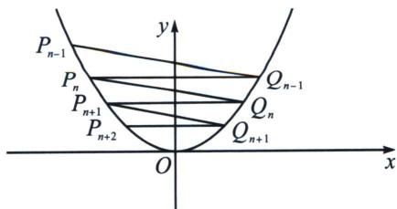

> [!faq]- 《圆锥曲线专题(下册)》例题解析
>
> > [!success]- **【答案】** 详见解析
>
> > [!note]- **【解析】**
> > 解析 (1) 因为点 $P_{1}(2, 1)$ 在抛物线 $C: x^{2} = 2py$ 上，则 $4 = 2p$ ，解得： $p = 2$ ，所以抛物线 $C$ 的方程 $x^{2} = 4y$ ；(2) 由 $P_{1}(2, 1)$ 可知 $x_{1} = 2, y_{1} = 1$ ，因为点 $P_{n}(x_{n}, y_{n})$ 在抛物线 $C: x^{2} = 4y$ 上，则 $y_{n} = \frac{x_{n}^{2}}{4}$ ，且 $Q_{n-1}(-x_{n}, y_{n})$ ，则过 $P_{n-1}(n = 2, 3, 4, \cdots)$ ，且斜率为 $-\frac{1}{2}$ 的直线对合式 $P_{n-1}Q_{n-1}: (x_{n-1} - x_{n})x = 4y - x_{n}x_{n-1}$ （请自证），故 $-\frac{1}{2} = \frac{x_{n-1} - x_{n}}{4}$ ，即 $-x_{n} = -x_{n-1} - 2$ ，所以 $x_{n} = x_{n-1} + 2$ ，所以数列 $x_{n}$ 是以首项为 2，公差为 2 的等差数列，所以 $x_{n} = 2 + 2(n - 1) = 2n$ ，即 $x_{n} = 2n (n \in \mathbf{N}^{*})$ ， $y_{n} = \frac{x_{n}^{2}}{4} = \frac{4n^{2}}{4} = n^{2}$ ，所以 $\frac{1}{x_{n} + y_{n}} = \frac{1}{n^{2} + 2n} = \frac{1}{2}\left(\frac{1}{n} - \frac{1}{n+2}\right)$ ，则 $T_{n} = \frac{1}{2}\left(1 - \frac{1}{3} + \frac{1}{2} - \frac{1}{4} + \frac{1}{3} - \frac{1}{5} + \cdots + \frac{1}{n} - \frac{1}{n+2}\right) = \frac{1}{2}\left(1 + \frac{1}{2} - \frac{1}{n+1} - \frac{1}{n+2}\right) = \frac{3}{4} - \frac{2n+3}{2(n+1)(n+2)} (n \in \mathbf{N}^{*})$ ；
> >
> > 
> >
> > (3)由(2)可知： $P_{n}(2n, n^{2})$ ， $P_{n+1}(2n+2, (n+1)^{2})$ ， $P_{n+2}(2n+4, (n+2)^{2})$ ，
> >
> > 所以直线 $P_{n}P_{n+2}$ 的对合方程为： $(2n+2n+4)x=4y+2n(2n+4)$ ，即 $(n+1)x-y-n^{2}-2n=0$ ，
> >
> > 则点 $P_{n + 1}$ 到直线 $P_{n}P_{n + 2}$ 的距离为 $d = \frac{|2(n + 1)^{2} - (n + 1)^{2} - n^{2} - 2n|}{\sqrt{(n + 1)^{2} + 1}} = \frac{1}{\sqrt{(n + 1)^{2} + 1}},$
> >
> > $$
> > \left| P _ {n} P _ {n + 2} \right| = \sqrt {(2 n + 4 - 2 n) ^ {2} + [ (n + 2) ^ {2} - n ^ {2} ] ^ {2}} = 4 \sqrt {(n + 1) ^ {2} + 1}
> > $$
> >
> > 所以 $\triangle P_{n}P_{n + 1}P_{n + 2}(n\in \mathbf{N}^{*})$ 的面积为 $S = \frac{1}{2}\mid P_nP_{n + 2}\mid d = 2.$
