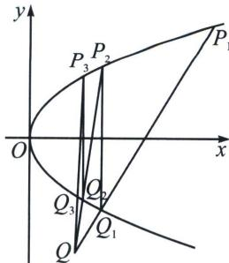

> [!faq]- 《圆锥曲线专题(下册)》例题解析
>
> > [!success]- **【答案】** 详见解析
>
> > [!note]- **【解析】**
> > 解析 (1) $P_{1}(4, 4)$ 为抛物线 $C: y^{2} = 2px (p > 0)$ 上一点，则 $16 = 8p$ ，解得 $p = 2$
> >
> > 所以抛物线 C 的方程为 $y^{2}=4x$ ， $k_{P_{1}Q}=\frac{4+4}{4-1}=\frac{8}{3}$ ，则直线 $P_{1}Q$ 的方程为 $y-4=\frac{8}{3}(x-4)$ ，整理的 $y=\frac{8}{3}x-\frac{20}{3}$ ，联立 $\left\{\begin{aligned}y^{2}&=4x\\ y&=\frac{8}{3}x-\frac{20}{3}\end{aligned}\right.$ ，消去 y 整理得 $16x^{2}-89x+100=0$ ，解得 x=4 或 $\frac{25}{16}$ ，将 $x=\frac{25}{16}$ 代入 $y=\frac{8}{3}x-\frac{20}{3}$ ，得 $y=-\frac{5}{2}$ ，所以 $Q_{1}\left(\frac{25}{16},-\frac{5}{2}\right)$ ，则 $P_{2}\left(\frac{25}{16},\frac{5}{2}\right)$ .
> >
> > 
> >
> > (i)无穷数列 $\{a_{n}\}$ 是等比数列，理由如下：
> >
> > 直线 $P_{n-1}Q$ 对合方程： $(y_{n-1}-y_{n})y=4x-y_{n-1}y_{n}$ ，由于过 $Q(1,-4)$ ，故 $4(y_{n-1}-y_{n})+4-y_{n-1}y_{n}=0$ ，
> >
> > 则 $\frac{a_n}{a_{n-1}} = \frac{y_n + 2}{y_n - 2} \cdot \frac{y_{n-1} - 2}{y_{n-1} + 2} = \frac{y_n y_{n-1} - 2 y_n + 2 y_{n-1} - 4}{y_n y_{n-1} + 2 y_n - 2 y_{n-1} - 4} = \frac{-6(y_n - y_{n-1})}{-2(y_n - y_{n-1})} = 3, a_1 = \frac{4 + 2}{4 - 2} = 3$ ，所以数列 $\{a_n\}$ 是首项为 3，公比为 3 的等比数列.
> >
> > (ii) 证明：由(i)得 $\frac{y_n + 2}{y_n - 2} = 3^n$ ，整理得 $y_n = \frac{2 \cdot 3^n + 2}{3^n - 1} = 2 + \frac{4}{3^n - 1}$ ，
> >
> > $$
> > \sum_ {i = 1} ^ {n} y _ {i} = 2 n + \frac {4}{3 ^ {1} - 1} + \frac {4}{3 ^ {2} - 1} + \dots + \frac {4}{3 ^ {n} - 1} <   2 n + 2 + \frac {2}{3 ^ {1}} + \dots + \frac {2}{3 ^ {n - 1}} = 2 n + 2 + \frac {\frac {2}{3} \left(1 - \frac {1}{3 ^ {n - 1}}\right)}{1 - \frac {1}{3}} = 2 n + 3 - \frac {1}{2 \cdot 3 ^ {n - 2}},
> > $$
> >
> > 因为 $2 \cdot 3^{n-2} > 0$ ，所以 $2n + 3 - \frac{1}{2 \cdot 3^{n-2}} < 2n + 3$ ，综上， $\sum_{i=1}^{n} y_i < 2n + 3$ .
