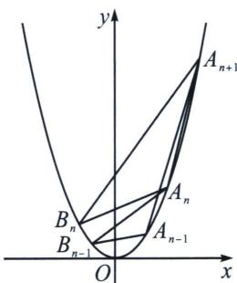

> [!faq]- 《圆锥曲线专题(下册)》例题解析
>
> > [!success]- **【答案】** 详见解析
>
> > [!note]- **【解析】**
> > 解析 (1)由题设中的变换方法有 $\left\{ \begin{array}{l} x' = 1 \times \cos \frac{\pi}{4} - 1 \times \sin \frac{\pi}{4} \\ y' = 1 \times \sin \frac{\pi}{4} + 1 \times \cos \frac{\pi}{4} \end{array} \right.$ ，故 $\left\{ \begin{array}{l} x' = 0 \\ y' = \sqrt{2} \end{array} \right.$ ，故 $P(0, \sqrt{2})$ 。
> >
> > 设 $l'$ 上的任意一点为 $P(x', y')$ ，旋转前对应的点为 $P(x, y)$ ，则 $\left\{ \begin{array}{l} x = x' \cos \left(-\frac{\pi}{4}\right) - y' \sin \left(-\frac{\pi}{4}\right) \\ y = x' \sin \left(-\frac{\pi}{4}\right) + y' \cos \left(-\frac{\pi}{4}\right) \end{array} \right.$ 即 $\left\{ \begin{array}{l} x = \frac{\sqrt{2}}{2} x' + \frac{\sqrt{2}}{2} y' \\ y = -\frac{\sqrt{2}}{2} x' + \frac{\sqrt{2}}{2} y' \end{array} \right.$ ，故 $-\frac{\sqrt{2}}{2} x' + \frac{\sqrt{2}}{2} y' = 2 \left( \frac{\sqrt{2}}{2} x' + \frac{\sqrt{2}}{2} y' \right) - 1$ 即 $-\frac{\sqrt{2}}{2} x' + \frac{\sqrt{2}}{2} y' = \sqrt{2} x' + \sqrt{2} y' - 1,$
> >
> > 整理得 $3x' + y' - \sqrt{2} = 0$ ，故 $l'$ ： $3x + y - \sqrt{2} = 0$ ，故 $l'$ 的斜率为 -3.
> >
> > (2)①设抛物线 C 上的点为 $P(x, y)$ ，旋转后对应的点为 $P'(x', y')$ ，
> >
> > 则 $\left\{\begin{aligned}x^{\prime}&=x\cos\frac{\pi}{4}-y\sin\frac{\pi}{4}\\ y^{\prime}&=x\sin\frac{\pi}{4}+y\cos\frac{\pi}{4}\end{aligned}\right.$ 即 $\left\{\begin{aligned}x^{\prime}&=\frac{\sqrt{2}}{2}x-\frac{\sqrt{2}}{2}y\\ y^{\prime}&=\frac{\sqrt{2}}{2}x+\frac{\sqrt{2}}{2}y\end{aligned}\right.$ ，故 $\left(\frac{\sqrt{2}}{2}x-\frac{\sqrt{2}}{2}y\right)^{2}+\left(\frac{\sqrt{2}}{2}x+\frac{\sqrt{2}}{2}y\right)^{2}+2\left(\frac{\sqrt{2}}{2}x-\frac{\sqrt{2}}{2}y\right)\left(\frac{\sqrt{2}}{2}x+\frac{\sqrt{2}}{2}y\right)$
> >
> > $\frac{\sqrt{2}}{2} y) + \sqrt{2}\left(\frac{\sqrt{2}}{2} x - \frac{\sqrt{2}}{2} y\right) - \sqrt{2}\left(\frac{\sqrt{2}}{2} x + \frac{\sqrt{2}}{2} y\right) = 0$ ，整理得： $x^{2} = y$ ，该抛物线的焦准距为 $\frac{1}{2}$ ，但旋转变换不改变焦准距，故斜抛物线的焦准距为 $\frac{1}{2}$ .
> > - **②**：由(1)可得 $A_{1}^{\prime}(0, \sqrt{2})$ 对应的 $A_{1}(1, 1)$ ，设曲线上有两个 $C'$ 上有两个 $P_{1}(a^{\prime}, b^{\prime})$ ， $P_{2}(s^{\prime}, t^{\prime})$ ，其对
> >
> > 应的点为 $S(a, b)$ ， $T(s, t)$ ，则 $\left\{\begin{aligned}a' &= a\cos\frac{\pi}{4} - b\sin\frac{\pi}{4}\\ b' &= a\sin\frac{\pi}{4} + b\cos\frac{\pi}{4}\end{aligned}\right.$ 且 $\left\{\begin{aligned}s' &= s\cos\frac{\pi}{4} - t\sin\frac{\pi}{4}\\ t' &= s\sin\frac{\pi}{4} + t\cos\frac{\pi}{4}\end{aligned}\right.$
> >
> > $$
> > \text {则} _ {s ^ {\prime} - a ^ {\prime}} ^ {t ^ {\prime} - b ^ {\prime}} = \frac {s \sin \frac {\pi}{4} + t \cos \frac {\pi}{4} - a \sin \frac {\pi}{4} - b \cos \frac {\pi}{4}}{s \cos \frac {\pi}{4} - t \sin \frac {\pi}{4} - a \cos \frac {\pi}{4} + b \sin \frac {\pi}{4}} = \frac {s - a + t - b}{s - a - (t - b)} = \frac {1 + \frac {t - b}{s - a}}{1 - \frac {t - b}{s - a}},
> > $$
> >
> > $$
> > k _ {P _ {1} P _ {2}} = \frac {s \sin \frac {\pi}{4} + t \cos \frac {\pi}{4} - a \sin \frac {\pi}{4} - b \cos \frac {\pi}{4}}{s \cos \frac {\pi}{4} - t \sin \frac {\pi}{4} - a \cos \frac {\pi}{4} + b \sin \frac {\pi}{4}} = \frac {s - a + t - b}{s - a - (t - b)} = \frac {1 + k _ {S T}}{1 - k _ {S T}}
> > $$
> >
> > 设 $A'_{n}$ 对应的点为 $A_{n}$ ， $B'_{n}$ 对应的点为 $B_{n}$ ，则 $A_{n}$ ， $B_{n}$ 在抛物线 $x^{2}=y$ 上且 $k_{A_{n-1}B_{n-1}}=\frac{1}{2^{n}}$ ， $k_{A_{n}B_{n-1}}=\frac{1}{2^{n-1}}$ ，设 $A_{n}(a_{n},a_{n}^{2})$ ， $B_{n}(b_{n},b_{n}^{2})$ ，则 $a_{1}=1$ ，
> >
> > 
> >
> > 又 $\frac{b_{n - 1}^2 - a_{n - 1}^2}{b_{n - 1} - a_{n - 1}} = \frac{1}{2^n}$ ，且 $\frac{b_{n - 1}^2 - a_n^2}{b_{n - 1} - a_n} = \frac{1}{2^{n - 1}}$ ，整理得到 $b_{n - 1} + a_{n - 1} = \frac{1}{2^n}$ ， $b_{n - 1} + a_n = \frac{1}{2^{n - 1}}$
> >
> > 所以 $a_{n} - a_{n - 1} = \frac{1}{2^{n}}$ ，而 $a_1 = 1$ ，故 $a_{n} - a_{1} = \frac{1}{2^{2}} +\frac{1}{2^{3}} +\dots +\frac{1}{2^{n}}$ ，故 $a_{n} = \frac{3}{2} -\frac{1}{2^{n}}$ ，而 $a_1 = 1$ 也符合该式，故 $a_{n}$ $= \frac{3}{2} -\frac{1}{2^n}$ 又 $A_{n}A_{n + 1}$ 的方程为 $y = \frac{a_{n + 1}^2 - a_n^2}{a_{n + 1} - a_n}(x - a_n) + a_n^2$ 即 $y = (a_{n + 1} + a_n)x - a_na_{n + 1}$
> >
> > 而 $\left|A_{n}A_{n+1}\right|=\sqrt{(a_{n+1}-a_{n})^{2}+(a_{n+1}^{2}-a_{n}^{2})^{2}}=\left|a_{n+1}-a_{n}\right|\sqrt{(a_{n+1}+a_{n})^{2}+1}$
> >
> > 而 $A_{n + 2}$ 到直线 $A_{n}A_{n + 1}$ 的距离为 $d = \frac{\left|(a_{n + 1} + a_n)a_{n + 2} - a_{n + 2}^2 - a_na_{n + 1}\right|}{\sqrt{(a_{n + 1} + a_n)^2 + 1}}$
> >
> > 故 $\triangle A_{n}A_{n + 1}A_{n + 2}$ 的面积为 $S_{n} = \frac{1}{2} dA_{n}A_{n + 1} = \frac{1}{2}|a_{n + 1} - a_n||(a_{n + 1} + a_n)a_{n + 2} - a_{n + 2}^2 -a_na_{n + 1}| =$ $\frac{1}{2}|a_{n + 1} - a_n||a_{n + 2}(a_{n + 1} - a_{n + 2}) + a_n(a_{n + 2} - a_{n + 1})| = \frac{1}{2} |(a_{n + 2} - a_n)(a_{n + 1} - a_{n + 2})||a_{n + 1} - a_n| = \frac{1}{2}\times \frac{1}{2^{n + 2}}\times$ $\frac{3}{2^{n + 2}}\times \frac{1}{2^{n + 1}} = \frac{3}{2^{3n + 6}}$ ，由于旋转变换不改变图形面积，故 $S_{n}^{\prime} = \frac{3}{2^{3n + 6}}$ ，故 $\sum_{i = 1}^{n}S_{n}^{\prime} = \frac{3}{512}\times \frac{1 - \left(\frac{1}{8}\right)^{n}}{1 - \frac{1}{8}} < \frac{3}{512}\times \frac{8}{7} < \frac{3}{64}$ $\times \frac{1}{7} = \frac{3}{448}.$
