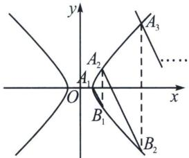

<!-- question-source:start -->
例2 (2025·山东潍坊·二模 T19) 双曲线 C: $x^{2}-y^{2}=a^{2}(a>0)$ 的左、右顶点分别为 A、 $A_{1}$ ，点 $A_{1}$ 到 C 的渐近线的距离为 $\frac{\sqrt{2}}{2}$ .

(1) 求 C 的方程;

(2) 按照如下方式依次构造点 $A_{n} (n \geqslant 2$ 且 $n \in \mathbb{N}$ ：过点 $A_{n-1}$ 作斜率为 $-2$ 的直线交 $C$ 于另一点 $B_{n-1}$ ，设 $A_{n}$ 是点 $B_{n-1}$ 关于实轴的对称点，记点 $A_{n}$ 的坐标为 $(x_{n}, y_{n})$ 。

(i) 证明：数列 $\{x_{n} - y_{n}\}$ 、 $\{x_{n} + y_{n}\}$ 是等比数列，并求数列 $\{x_{n}\}$ 和 $\{y_{n}\}$ 的通项公式；

(ii) 记 $\triangle A_{n}AA_{n+1}$ 的面积为 $S$ ， $\triangle A_{n}A_{1}A_{n+1}$ 的面积为 $T$ ，求 $\frac{S}{T}$ 的最大值.

## 解析 [答案]
(1) $x^{2}-y^{2}=1$

(2)(i)证明见解析， $x_{n}=\frac{3^{n-1}+\left(\frac{1}{3}\right)^{n-1}}{2}$ ， $y_{n}=\frac{3^{n-1}-\left(\frac{1}{3}\right)^{n-1}}{2}$ (ii) $\frac{5}{2}$ .

[详解]
(1)双曲线 C 的渐近线方程为 $x \pm y = 0$ ， $A_{1}(a, 0)$ ，则点 $A_{1}$ 到渐近线的距离为 $\frac{|a|}{\sqrt{2}} = \frac{\sqrt{2}}{2}$ ，所以 a = 1，所以 C 的方程为 $x^{2} - y^{2} = 1$ .

(2)(i)解法一: 因为 $A_{n}(x_{n}, y_{n})$ , 所以 $A_{n-1}(x_{n-1}, y_{n-1})$ 、 $B_{n-1}(x_{n}, -y_{n})$ , 直线 $A_{n-1}B_{n-1}$ 的方程为 $y + y_{n} = -2(x - x_{n})$ , 即 $y = -2x + 2x_{n} - y_{n}$ , 代入 $x^{2} - y^{2} = 1$ , 得 $3x^{2} - 4(2x_{n} - y_{n})x + (2x_{n} - y_{n})^{2} + 1 = 0$ , 根据韦达定理得 $x_{n-1} + x_{n} = \frac{4}{3}(2x_{n} - y_{n})$ . 所以 $y_{n} = \frac{5}{4}x_{n} - \frac{3}{4}x_{n-1}$ , $y_{n-1} = -2x_{n-1} + 2x_{n} - y_{n} = \frac{3}{4}x_{n} - \frac{5}{4}x_{n-1}$ ,

由题设有 $x_{1} + y_{1} = x_{1} - y_{1} = 1$ ，因为 $\frac{x_n - y_n}{x_{n-1} - y_{n-1}} = \frac{x_n - \left(\frac{5}{4}x_n - \frac{3}{4}x_{n-1}\right)}{x_{n-1} - \left(\frac{3}{4}x_n - \frac{5}{4}x_{n-1}\right)} = \frac{-\frac{1}{4}x_n + \frac{3}{4}x_{n-1}}{-\frac{3}{4}x_n + \frac{9}{4}x_{n-1}} = \frac{1}{3}$ ，所以 $\{x_{n} - y_{n}\}$ 是公比为 $\frac{1}{3}$ 的等比数列．因为 $\frac{x_n + y_n}{x_{n-1} + y_{n-1}} = \frac{x_n + \frac{5}{4}x_n - \frac{3}{4}x_{n-1}}{x_{n-1} + \frac{3}{4}x_n - \frac{5}{4}x_{n-1}} = \frac{\frac{9}{4}x_n - \frac{3}{4}x_{n-1}}{\frac{3}{4}x_n - \frac{1}{4}x_{n-1}} = 3$ ，所以 $\{x_{n} + y_{n}\}$ 是公比为3的等比数列，
<!-- question-source:end -->

![[高中/总复习/专题/2026版高中《mst老唐说题》圆锥曲线专题（数学）/下册/第10章_万能的两点对合式/第一节_反比例对合方程解决圆锥曲线与数列综合/二_非等轴双曲线的仿射换元/例题/answers/Q00048757A1.md]]
