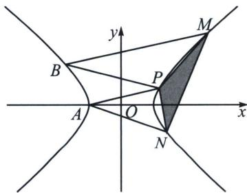
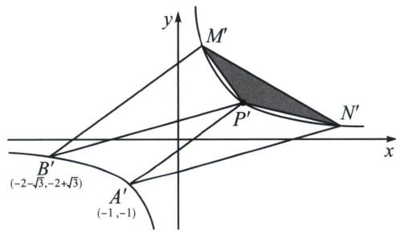

<!-- question-source:start -->
例3 (2024·天一大联考)已知双曲线 C 的中心是坐标原点，对称轴为坐标轴，且过 A(-2, 0)，B(-4, 3)两点.

(1) 求 C 的方程;

(2)设 P, M, N 三点在 C 的右支上， $BM \parallel AP$ ， $AN \parallel BP$ ，证明：

(i) 存在常数 $\lambda$ ，满足 $\overrightarrow{OM} + \overrightarrow{ON} = \lambda \overrightarrow{OP}$ ;

(ii) $\triangle MNP$ 的面积为定值.

(1) $\frac{x^2}{4} - \frac{y^2}{3} = 1$ ;

(2)(i) $\frac{x^{2}}{4}-\frac{y^{2}}{3}=1\rightarrow$ 转化为 $x^{\prime}y^{\prime}=1$ ， $A(-2,0)$ ， $B(-4,3)$ ，

$$
\left\{ \begin{array}{l} x ^ {\prime} = \left(\frac {\sqrt {2}}{2} x - \frac {\sqrt {6}}{3} y\right) \cdot \frac {\sqrt {2}}{2} \\ y ^ {\prime} = \left(\frac {\sqrt {2}}{2} x + \frac {\sqrt {6}}{3} y\right) \cdot \frac {\sqrt {2}}{2} \end{array} \Rightarrow A ^ {\prime} (- 1, - 1) = \left(x _ {1}, \frac {1}{x _ {1}}\right), B ^ {\prime} (- 2 - \sqrt {3}, - 2 + \sqrt {3}) = \left(x _ {2}, \frac {1}{x _ {2}}\right), \right.
$$

$M'\left(x_3, \frac{1}{x_3}\right), N'\left(x_4, \frac{1}{x_4}\right), P'\left(x_0, \frac{1}{x_0}\right)$ ，所以 $k_{B'M'} = \frac{\frac{1}{x_3} - \frac{1}{x_2}}{x_3 - x_2} = -\frac{1}{x_2 x_3} = k_1 \Rightarrow M'\left(-\frac{1}{k_1 x_2}, -k_1 x_2\right)$ ，同理， $k_{B'P'} = k_2 \Rightarrow P'\left(-\frac{1}{k_2 x_2}, -k_2 x_2\right)$ ， $k_{A'P'} = k_1 \Rightarrow P'\left(-\frac{1}{k_1 x_1}, -k_1 x_1\right)$ ， $k_{A'N'} = k_2 \Rightarrow N'\left(-\frac{1}{k_2 x_1}, -k_2 x_1\right)$ ，所以 $-k_1 x_1 = -k_2 x_2 \Rightarrow \frac{k_1}{k_2} = \frac{x_2}{x_1} = m = 2 + \sqrt{3}$ ，所以 $y_M' + y_N' = -k_1 x_2 - k_2 x_1 = -mk_2 x_2 - k_2 \frac{x_2}{m} = -k_2 x_2 \left(m + \frac{1}{m}\right) = y_P' \cdot \left(m + \frac{1}{m}\right)$ ，所以 $y_M' + y_N' = \lambda y_P' \Rightarrow \lambda = m + \frac{1}{m} = 2 + \sqrt{3} + \frac{1}{2 + \sqrt{3}} = 4.$

（ii） $S'_{\triangle PMN} = \frac{1}{2} S'_{\triangle OMN} = \frac{1}{4} |x_M'y_N'-x_N'y_M'| = \frac{1}{4}\left|\frac{k_2x_1}{k_1x_2} -\frac{k_1x_2}{k_2x_1}\right| = \frac{1}{4}\left|m^2 -\frac{1}{m^2}\right| = \frac{1}{4}\left(m + \frac{1}{m}\right)$ $\left(m-\frac{1}{m}\right)=2\sqrt{3}$ （面积公式推导省略）， $\left\{\begin{aligned}&x^{\prime}=\left(\frac{\sqrt{2}}{2}x-\frac{\sqrt{6}}{3}y\right)\cdot\frac{\sqrt{2}}{2}\\ &y^{\prime}=\left(\frac{\sqrt{2}}{2}x+\frac{\sqrt{6}}{3}y\right)\cdot\frac{\sqrt{2}}{2}\end{aligned}\right.$ 将原来横坐标和纵坐标分别缩小了 $\sqrt{2}$ 和 $\frac{3}{\sqrt{6}}$ 倍，再逆时针旋转 $45^{\circ}$ ，所以 $S_{\triangle PMN}=2\sqrt{3}\times\sqrt{2}\times\frac{3}{\sqrt{6}}=6$ .

注意 平行弦问题，建议转化为反比例函数 $y=\frac{1}{x}$ 后，得益于两点对合式： $x_{1}x_{2}y+x=x_{1}+x_{2}$ ，其斜率与坐标转化 $k=-\frac{1}{x_{1}x_{2}}$ 可谓一步到位。接下来两题是不是可以直接秒了呢？
<!-- question-source:end -->

![[高中/总复习/专题/2026版高中《mst老唐说题》圆锥曲线专题（数学）/下册/第10章_万能的两点对合式/第一节_反比例对合方程解决圆锥曲线与数列综合/二_非等轴双曲线的仿射换元/例题/answers/Q00048758A1.md]]
