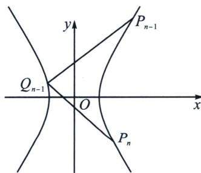
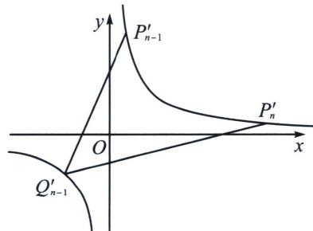

<!-- question-source:start -->
例4 (2025·温州1.5模第18题)已知双曲线 $C: \frac{x^2}{a^2} - \frac{y^2}{b^2} = 1 (a > 0, b > 0)$ 过点 $P_1(2, 2)$ , 其渐近线的方程为 $y = \pm 2x$ . 按照如下方式依次构造点 $P_n (n=2, 3, \cdots)$ : 过右支上点 $P_{n-1}$ 作斜率为 1 的直线与 C 的左支交于点 $Q_{n-1}$ , 过 $Q_{n-1}$ 再作斜率为 -1 的直线与 C 的右支交于点 $P_n (x_n, y_n)$ .

(1)求双曲线 C 的方程;

(2)用 $x_{n}$ ， $y_{n}$ 表示点 $Q_{n-1}$ 的坐标；

(3)求证: 数列 $\{2 x_{n} - y_{n}\}$ 是等比数列.

(1)由 $\left\{ \begin{array}{l} b = 2a \\ \frac{4}{a^2} - \frac{4}{b^2} = 1 \end{array} \right.$ ，解得 $\left\{ \begin{array}{l} a^2 = 3 \\ b^2 = 12 \end{array} \right.$ ，所以双曲线 $C$ 的方程为 $\frac{x^2}{3} - \frac{y^2}{12} = 1$ .

(2)
(3)令 $\left\{\begin{aligned}x_{n}^{\prime}&=\frac{x_{n}}{\sqrt{3}}-\frac{y_{n}}{2\sqrt{3}}=\frac{1}{\sqrt{2}}\left(\frac{\sqrt{2}x_{n}}{\sqrt{3}}-\frac{y_{n}}{\sqrt{6}}\right)\\ y_{n}^{\prime}&=\frac{x_{n}}{\sqrt{3}}+\frac{y_{n}}{2\sqrt{3}}=\frac{1}{\sqrt{2}}\left(\frac{\sqrt{2}x_{n}}{\sqrt{3}}+\frac{y_{n}}{\sqrt{6}}\right)\end{aligned}\right.$ ，所以 $y_{n}^{\prime}=\frac{1}{x_{n}^{\prime}}$ ，设 $P_{n-1}^{\prime}(x_{n-1}^{\prime},y_{n-1}^{\prime})$ ， $P_{n}^{\prime}(x_{n}^{\prime},y_{n}^{\prime})$

$Q'_{n-1}(x'_{Q}, y'_{Q})$ 将 $P_{n}$ 横坐标缩小 $\frac{\sqrt{6}}{2}$ 倍，纵坐标缩小 $\sqrt{6}$ 倍，再以原点为中心逆时针旋转 $\frac{\pi}{4}$ 后得到 $P'_{n}$ ，故 $k'=\frac{1+\frac{k}{2}}{1-\frac{k}{2}}=\frac{2+k}{2-k}$ ，所以 $k'_{P'_{n-1}Q'_{n-1}}=3, k'_{P'_{n}Q'_{n-1}}=\frac{1}{3}$ ，由反比例函数任意两点的对合式方程为： $x_{i}x_{j}y+x=x_{i}+x_{j}$ （请自证），故 $k'_{P'_{n-1}Q'_{n-1}}=-\frac{1}{x'_{n-1}x'_{Q}}=3, k'_{P'_{n}Q'_{n-1}}=-\frac{1}{x'_{n}x'_{Q}}=\frac{1}{3}$ ，两式相除得 $\frac{x'_{n}}{x'_{n-1}}=\frac{2x_{n}-y_{n}}{2x_{n-1}-y_{n-1}}=9$ ，即 $\{2x_{n}-y_{n}\}$ 为等比数列.

$$
x _ {Q} ^ {\prime} = \frac {x _ {Q}}{\sqrt {3}} - \frac {y _ {Q}}{2 \sqrt {3}} = - \frac {3}{x _ {n} ^ {\prime}} = - 3 y _ {n} ^ {\prime} = - \sqrt {3} x _ {n} - \frac {\sqrt {3}}{2} y _ {n}, y _ {Q} ^ {\prime} = \frac {x _ {Q}}{\sqrt {3}} + \frac {y _ {Q}}{2 \sqrt {3}} = \frac {1}{x _ {Q} ^ {\prime}} = - \frac {x _ {n} ^ {\prime}}{3} = - \frac {x _ {n}}{3 \sqrt {3}} + \frac {y _ {n}}{6 \sqrt {3}},
$$

所以 $x_{Q} = -\frac{5}{3} x_{n} - \frac{2}{3} y_{n}$ ， $y_{Q} = \frac{8}{3} x_{n} + \frac{5}{3} y_{n}$ ，即点 $Q_{n - 1}$ 的坐标为 $\left(-\frac{5}{3} x_n - \frac{2}{3} y_n,\frac{8}{3} x_n + \frac{5}{3} y_n\right)$
<!-- question-source:end -->

![[高中/总复习/专题/2026版高中《mst老唐说题》圆锥曲线专题（数学）/下册/第10章_万能的两点对合式/第一节_反比例对合方程解决圆锥曲线与数列综合/二_非等轴双曲线的仿射换元/例题/answers/Q00048759A1.md]]
