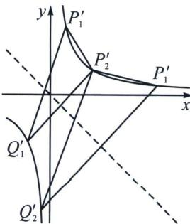
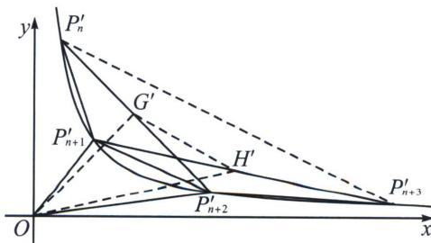

> [!faq]- 《圆锥曲线专题(下册)》例题解析
>
> > [!success]- **【答案】** 详见解析
>
> > [!note]- **【解析】**
> > 解析 (1)由题知 $m = 4 - 1 = 3$ ，所以双曲线 $C: 4x^{2} - y^{2} = 3$ ，又过点 $P_{1}(1, 1)$ ，斜率为1的直线方程为 $y = x$
> >
> > 由双曲线与直线的对称性可知 $Q_{1}(-1,-1)$ ，所以 $P_{2}(1,-1)$ ，又过 $P_{2}(1,-1)$ ，且斜率为 1 的直线方程为 $y+1=x-1$ ，即 y=x-2，由 $\left\{\begin{aligned}y&=x-2\\ 4x^{2}-y^{2}&=3\end{aligned}\right.$ ，解得 x=1 或 $x=-\frac{7}{3}$ ，当 $x=-\frac{7}{3}$ 时， $y=-\frac{7}{3}-2=-\frac{13}{3}$ ，所以 $Q_{2}\left(-\frac{7}{3},-\frac{13}{3}\right)$ ，所以 $P_{3}\left(\frac{7}{3},-\frac{13}{3}\right)$ ;
> >
> > 
> >
> > 
> >
> > (2) $4x^{2}-y^{2}=3$ ，作 $\left\{\begin{aligned}x^{\prime}=(2x-y)\cdot\frac{\sqrt{2}}{2}\\ y^{\prime}=(2x+y)\cdot\frac{\sqrt{2}}{2}\end{aligned}\right.\Rightarrow x^{\prime}y^{\prime}=\frac{3}{2}$ ，其几何意义为原来横坐标扩大2倍，再逆时针旋转 $45^{\circ}$ ，则 $P_{1}^{\prime}\left(\frac{\sqrt{2}}{2},\frac{3\sqrt{2}}{2}\right)$ ，由于坐标变化，原来斜率为1的直线变成 $k^{\prime}=\frac{1}{2}$ ，由于旋转，故 $k_{P_{n}^{\prime}Q_{n}^{\prime}}=\frac{1+k^{\prime}}{1-k^{\prime}}=3$ （如左图），本题转化为过斜率为3的一系列直线 $P_{n-1}^{\prime}Q_{n-1}^{\prime}\parallel P_{n}^{\prime}Q_{n}^{\prime}\parallel P_{n+1}^{\prime}Q_{n+1}^{\prime}$ 与反比例函数 $y=\frac{3}{2x}$ 的交点情况，且 $Q_{n-1}^{\prime}$ 与 $P_{n}^{\prime}$ 关于直线y=-x对称，令 $P_{n-1}^{\prime}(x_{n-1}^{\prime},y_{n-1}^{\prime})$ ， $P_{n}^{\prime}(x_{n}^{\prime},y_{n}^{\prime})$ 则有 $\left\{\begin{aligned}x_{n}^{\prime}=-y_{Qn-1}^{\prime}\\ y_{n}^{\prime}=-x_{Qn-1}^{\prime}\end{aligned}\right.$ ， $k_{P_{n-1}^{\prime}Q_{n-1}^{\prime}}=\frac{\frac{3}{2x_{n-1}^{\prime}}+\frac{3}{2y_{n}^{\prime}}}{x_{n-1}^{\prime}+y_{n}^{\prime}}=\frac{3}{2x_{n-1}^{\prime}y_{n}^{\prime}}=\frac{x_{n}^{\prime}}{x_{n-1}^{\prime}}=3$ ，所以 $\frac{2x_{n}-y_{n}}{2x_{n-1}-y_{n-1}}=3$ ，所以数列 $\{a_{n}\}$ 是以1为首项，3的公比的等比数列；
> >
> > (3)由(2)易得： $P^{\prime}_{n}\left(\frac{3^{n - 1}}{\sqrt{2}},\frac{3}{\sqrt{2}\cdot 3^{n - 1}}\right)$ ，则 $S^{\prime}_{1} = \frac{1}{2}\mid x^{\prime}_{n + 1}y_{n + 2} - x^{\prime}_{n + 2}y^{\prime}_{n + 1}| = \frac{1}{2}\left|\frac{3^n}{\sqrt{2}}\cdot \frac{3}{\sqrt{2}\cdot 3^{n + 1}} -\frac{3^{n + 1}}{\sqrt{2}}\cdot$ $\frac{3}{\sqrt{2}\cdot 3^n}\Big| = 2,\quad S'_2 = \frac{1}{2}\mid x_G'y_H'-x_H'y_G'\mid = \frac{1}{2}\left|\frac{x'_n + x'_{n + 2}}{2}\cdot \frac{y'_{n + 1} + y'_{n + 3}}{2} -\frac{x'_{n + 1} + x'_{n + 3}}{2}\cdot \frac{y'_n + y'_{n + 2}}{2}\right| =$ $\frac{1}{2}\left|\frac{25}{18} -\frac{25}{2}\right| = \frac{50}{9}$ 故 $\frac{S_1'}{S_2'} = \frac{S_1}{S_2} = \frac{9}{25}.$
