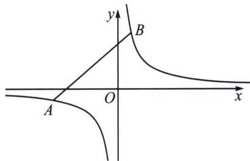

## 第一节 反比例对合方程解决圆锥曲线与数列综合

2024 年新高考Ⅱ卷 19 题，就是考查了神奇的反比例对合方程！

如图， $A(x_{1}, y_{1})$ 和 $B(x_{2}, y_{2})$ 分别是反比例函数（等轴双曲线） $y=\frac{m}{x}$ 上的两点，则 AB 的两点对合式方程为： $\frac{x_{1}x_{2}}{m}y+x=x_{1}+x_{2}$ .

证明：由于 $k_{AB} = \frac{\frac{m}{x_1} - \frac{m}{x_2}}{x_1 - x_2} = -\frac{m}{x_1x_2}$ ，故 $AB: y - \frac{m}{x_1} = -\frac{m}{x_1x_2}(x - x_1)$ ，即 $\frac{x_1x_2}{m} y + x = x_1 + x_2$

和抛物线的两点对合式一样，在这个两步就能证明的式子背后，隐藏了很多我们平时没抓住的信息，比如斜率的简化，比如构造相切的点到直线距离的快速同构，由于斜率只需要两点的坐标即可表示，命题者就抓住了这个特点，进行了圆锥与数列综合的命题。

![[高中/总复习/专题/2026版高中《mst老唐说题》圆锥曲线专题（数学）/下册/第10章_万能的两点对合式/第一节_反比例对合方程解决圆锥曲线与数列综合/一_两点对合式构造双曲线中的等比数列/一_两点对合式构造双曲线中的等比数列.md]]
![[高中/总复习/专题/2026版高中《mst老唐说题》圆锥曲线专题（数学）/下册/第10章_万能的两点对合式/第一节_反比例对合方程解决圆锥曲线与数列综合/二_非等轴双曲线的仿射换元/二_非等轴双曲线的仿射换元.md]]
![[高中/总复习/专题/2026版高中《mst老唐说题》圆锥曲线专题（数学）/下册/第10章_万能的两点对合式/第一节_反比例对合方程解决圆锥曲线与数列综合/三_抛物线两点对合式构造等差等比数列/三_抛物线两点对合式构造等差等比数列.md]]
