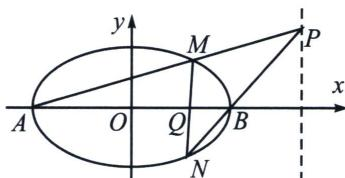

<!-- question-source:start -->
例2 (2020·新课标Ⅰ)已知 A, B 分别为椭圆 E: $\frac{x^{2}}{a^{2}} + y^{2} = 1 (a > 1)$ 的左、右顶点，G 为 E 的上顶点， $\overrightarrow{AG} \cdot \overrightarrow{GB} = 8$ . P 为直线 x = 6 上的动点，PA 与 E 的另一交点为 M，PB 与 E 的另一交点为 N.

(1)求 E 的方程;

(2)证明：直线 $MN$ 过定点.

## 解析
(1) $\frac{x^{2}}{9}+y^{2}=1$

(2)令 $M(3\cos \theta_{1},\sin \theta_{1})$ ， $N(3\cos \theta_2,\sin \theta_2)$ ，令 $t_1 = \tan \frac{\theta_1}{2}$ ， $t_2 = \tan \frac{\theta_2}{2}$

由于 $\cos \theta_{1}\cos \frac{\theta_{1} + \theta_{2}}{2} +\sin \theta_{1}\sin \frac{\theta_{1} + \theta_{2}}{2} = \cos \frac{\theta_1 - \theta_2}{2},$

$$
\cos \theta_ {2} \cos \frac {\theta_ {1} + \theta_ {2}}{2} + \sin \theta_ {2} \sin \frac {\theta_ {1} + \theta_ {2}}{2} = \cos \frac {\theta_ {1} - \theta_ {2}}{2},
$$

故 $M(3\cos \theta_{1},\sin \theta_{1})$ ， $N(3\cos \theta_2,\sin \theta_2)$ ，均在同构方程 $\frac{x}{3}\cos \frac{\theta_1 + \theta_2}{2} +y\sin \frac{\theta_1 + \theta_2}{2} = \cos \frac{\theta_1 - \theta_2}{2}$ 上，

即 $MN$ 的对合方程是 $\frac{x}{3}\cos \frac{\theta_1 + \theta_2}{2} + y\sin \frac{\theta_1 + \theta_2}{2} = \cos \frac{\theta_1 - \theta_2}{2}$ ，同除以 $\cos \frac{\theta_1}{2}\cos \frac{\theta_2}{2} (\theta_1 \neq \pi, \theta_2 \neq \pi)$ ，即 $MN: \frac{x}{3}(1 - t_1t_2) + y(t_1 + t_2) = 1 + t_1t_2$ ；

根据题意： $k_{AM}=\frac{y_{P}}{x_{P}-x_{A}}=\frac{y_{P}}{9}=\frac{\sin\theta_{1}}{3(1+\cos\theta_{1})}=\frac{t_{1}}{3}$ ， $k_{BN}=\frac{y_{P}}{x_{P}-x_{B}}=\frac{y_{P}}{3}=\frac{\sin\theta_{2}}{3(\cos\theta_{2}-1)}=-\frac{1}{3t_{2}}$

所以 $3 \cdot \frac{t_1}{3} = -\frac{1}{3t_2}$ ，即 $t_1t_2 = -\frac{1}{3}$ ，代回 $MN: \frac{x}{3}(1 - t_1t_2) + y(t_1 + t_2) = 1 + t_1t_2$ ，即 $\frac{4}{9} x + y(t_1 + t_2) =$

$\frac{2}{3}$ ，所以 $\left\{\begin{aligned}x&=\frac{3}{2}\\ y&=0\end{aligned}\right.$ 时符合题意，即直线MN过定点 $\left(\frac{3}{2},0\right)$ .
<!-- question-source:end -->
