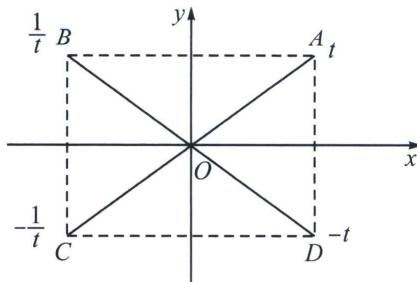
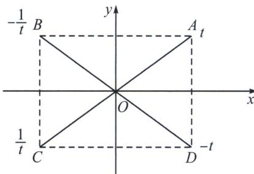

## 二、对合方程简化单动点模型

1. 椭圆

(1) 若 AB 关于 y 轴对称，则 $t_{A}t_{B}=1$ ;

(2) 若 AD 关于 x 轴对称，则 $t_{A} + t_{D} = 0$ ;

(3) 若 AC 关于原点对称，则 $t_{A}t_{C} = -1$ ;

证明：(1) $\tan\frac{B}{2}=\tan\frac{\pi-A}{2}=\frac{1}{\tan\frac{A}{2}}$ ，所以 $t_{A}t_{B}=1$ ；(2) $\tan\frac{D}{2}=\tan\frac{2\pi-A}{2}=-\tan\frac{A}{2}$ ，所以 $t_{A}+t_{D}=0$ ; $\tan\frac{C}{2}=\tan\frac{\pi+A}{2}=-\frac{1}{\tan\frac{A}{2}}$ ，所以 $t_{A}t_{C}=-1$ .

2. 双曲线

(1) 若 AB 关于 y 轴对称，则 $t_{A}t_{B} = -1$ ;

(2) 若 AD 关于 x 轴对称，则 $t_{A} + t_{D} = 0$ ;

(3) 若 AC 关于原点对称，则 $t_{A}t_{C}=1$ ;

![[高中/总复习/专题/2026版高中《mst老唐说题》圆锥曲线专题（数学）/下册/第10章_万能的两点对合式/第三节_椭圆双曲线的两点对合式/二_对合方程简化单动点模型/例题/Q00048771.md]]
