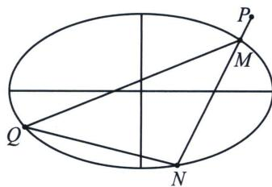

<!-- question-source:start -->
例7 (2025·MST 陪跑课群答读者问题)如图所示, 已知椭圆 $E: \frac{x^{2}}{4} + \frac{y^{2}}{3} = 1$ , 过点 $P(2, 1)$ 的直线交椭圆于 $M, N$ 两点, 过点 $N$ 作斜率为 $- \frac{3}{2}$ 的直线交椭圆于另一点 $Q$ , 求证: 直线 $MQ$ 过定点.

<!-- question-source:end -->

![[高中/总复习/专题/2026版高中《mst老唐说题》圆锥曲线专题（数学）/下册/第10章_万能的两点对合式/第三节_椭圆双曲线的两点对合式/五_两点对合方程简化轮换对称问题/例题/answers/Q00048777A1.md]]
