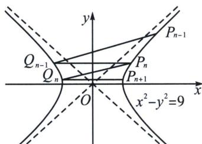
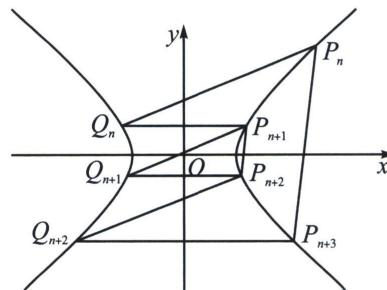

<!-- question-source:start -->
例8 (2024·新高考Ⅱ卷19题)已知双曲线 C: $x^{2}-y^{2}=m(m>0)$ ，点 $P_{1}(5,4)$ 在 C 上，k 为常数，0<k<1，按照如下方式依次构造点 $P_{n}(n=2,3,\cdots)$ ，过 $P_{n-1}$ 斜率为 k 的直线与 C 的左支交于点 $Q_{n-1}$ ，令 $P_{n}$ 为 $Q_{n-1}$ 关于 y 轴的对称点，记 $P_{n}$ 的坐标为 $(x_{n},y_{n})$ .

(1) 若 $k=\frac{1}{2}$ ，求 $x_{2}$ ， $y_{2}$ ;

(2)证明：数列 $\{x_{n} - y_{n}\}$ 是公比为 $\frac{1 + k}{1 - k}$ 的等比数列；

(3)设 $S_{n}$ 为 $\triangle P_{n}P_{n+1}P_{n+2}$ 的面积，证明：对任意的正整数 n， $S_{n}=S_{n+1}$ .

(1)因为 $P_{1}(5,4)$ 在 $C$ 上，所以 $25 - 16 = m$ ，解得 $m = 9$ ，过 $P(5,4)$ 且斜率为 $k = \frac{1}{2}$ 的直线方程为 $y - 4 = \frac{1}{2} (x - 5)$ ，即 $x - 2y + 3 = 0$ ，联立 $\left\{ \begin{array}{l} x^{2} - y^{2} = 9 \\ x - 2y + 3 = 0 \end{array} \right.$ ，解得 $\left\{ \begin{array}{l} x = 5 \\ y = 4 \end{array} \right.$ 或 $\left\{ \begin{array}{l} x = -3 \\ y = 0 \end{array} \right.$ ，

故 $Q_{1}(-3,0)$ , $P_{2}(3,0)$ , 过 $P_{n-1}$ 斜率为 $k$ 的直线与 $C$ 的左支交于点 $Q_{n-1}$ , 令 $P_{n}$ 为 $Q_{n-1}$ 关于 $y$ 轴的对称点, 所以 $x_{2}=3$ , $y_{2}=0$ ;

(2)设 $P_{n}\left(\frac{3}{\cos\theta_{n}}, 3\tan\theta_{n}\right)$ , 令 $t_{n}=\tan\frac{\theta_{n}}{2}$ (右支), $Q_{n-1}(-x_{n}, y_{n})$ (左支), 所以 $t_{Q_{n-1}}=-\frac{1}{t_{n}}$ , 故使用两点对合式得: $P_{n-1}Q_{n-1}: \frac{x}{3}\left(1-\frac{t_{n-1}}{t_{n}}\right)-\frac{y}{3}\left(t_{n-1}-\frac{1}{t_{n}}\right)=1+\frac{t_{n-1}}{t_{n}}$ , 即 $P_{n-1}Q_{n-1}: \frac{x}{3}(t_{n}-t_{n-1})-\frac{y}{3}(t_{n-1}t_{n}-1)=t_{n}+t_{n-1}$ , 所以 $k=\frac{t_{n-1}-t_{n}}{1-t_{n-1}t_{n}}$ , 由于 $P_{n}$ 均在双曲线右支, 所以 $\frac{1+k}{1-k}=\frac{(1-t_{n})(1+t_{n-1})}{(1+t_{n})(1-t_{n-1})}$ ,

所以 $\frac{x_n - y_n}{x_{n-1} - y_{n-1}} = \frac{\frac{3(1 - \sin\theta_n)}{\cos\theta_n}}{\frac{3(1 - \sin\theta_{n-1})}{\cos\theta_{n-1}}} = \frac{\frac{\cos\frac{\theta_n}{2} - \sin\frac{\theta_n}{2}}{\cos\frac{\theta_n}{2} + \sin\frac{\theta_n}{2}}}{\frac{\cos\frac{\theta_{n-1}}{2} - \sin\frac{\theta_{n-1}}{2}}{\cos\frac{\theta_{n-1}}{2} + \sin\frac{\theta_{n-1}}{2}}} = \frac{\frac{1 - t_n}{1 + t_n}}{\frac{1 - t_{n-1}}{1 + t_{n-1}}} = \frac{1 + k}{1 - k}$ , 命题得证;

(3)由右支两点对合式： $P_{n}P_{n + 3}$ ： $\frac{x}{3} (1 + t_nt_{n + 3}) - \frac{y}{3} (t_n + t_{n + 3}) = 1 - t_nt_{n + 3}, k_{P_nP_{n + 3}} = \frac{1 + t_nt_{n + 3}}{t_n + t_{n + 3}},$

$$
P _ {n + 1} P _ {n + 2}: \frac {x}{3} (1 + t _ {n + 1} t _ {n + 2}) - \frac {y}{3} (t _ {n + 1} + t _ {n + 2}) = 1 - t _ {n + 1} t _ {n + 2}, k _ {P _ {n + 1} P _ {n + 2}} = \frac {1 + t _ {n + 1} t _ {n + 2}}{t _ {n + 1} + t _ {n + 2}},
$$

由 $k = \frac{t_{n - 1} - t_n}{1 - t_{n - 1}t_n}$ 得： $t_n = \frac{k - t_{n - 1}}{kt_{n - 1} - 1}, t_{n - 1} = \frac{k + t_n}{kt_n + 1}$ ，所以 $k_{P_nP_{n + 3}} = \frac{1 + t_nt_{n + 3}}{t_nt_{n + 3}} = \frac{1 + \frac{k + t_{n + 1}}{kt_{n + 1} + 1}\cdot\frac{k - t_{n + 2}}{kt_{n + 2} - 1}}{\frac{k + t_{n + 1}}{kt_{n + 1} + 1} +\frac{k - t_{n + 2}}{kt_{n + 2} - 1}} =$ $\frac{(k^2 -1)(1 + t_{n + 1}t_{n + 2})}{(k^2 -1)(t_{n + 1} + t_{n + 2})} = k_{P_{n + 1}P_{n + 2}}$ ，所以 $P_{n + 1}P_{n + 2} / / P_nP_{n + 3}$ ，所以 $S_{n} = S_{n + 1}$

注意 涉及双曲线多线平行，两点对合式相比反比例得两点对合式，就是小巫见大巫，所以双曲线还是利用坐标系旋转仿射，方法永远是选择考场中计算量最小的。
<!-- question-source:end -->

![[高中/总复习/专题/2026版高中《mst老唐说题》圆锥曲线专题（数学）/下册/第10章_万能的两点对合式/第三节_椭圆双曲线的两点对合式/五_两点对合方程简化轮换对称问题/例题/answers/Q00048778A1.md]]
