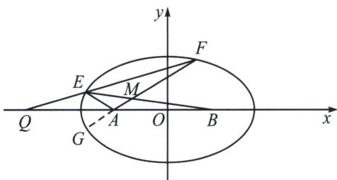

<!-- question-source:start -->
例10（南京二模18题(25陪跑课学员鲤鱼提问))在平面直角坐标系 $xOy$ 中，点 $A(-1,0)$ ， $B(1,0)$ ， $Q(-4,0)$ ，动点 $P$ 满足 $PA+PB=4$ ，记点 $P$ 的轨迹为 $C$ .

(1)求 C 的方程;

(2) 过点 Q 且斜率不为 0 的直线 l 与 C 相交于两点 E, F (E 在 F 的左侧). 设直线 AE, AF 的斜率分别为 $k_{1}$ , $k_{2}$ .

①求证： $\frac{k_{1}}{k_{2}}$ 为定值；

②设直线 AF，BE 相交于点 M，求证：MA-MB 为定值.

(1)c=1, $a=2\Rightarrow b=\sqrt{3}$ , $\Rightarrow\frac{x^{2}}{4}+\frac{y^{2}}{3}=1$ .

(2)①如图：

<!-- question-source:end -->

![[高中/总复习/专题/2026版高中《mst老唐说题》圆锥曲线专题（数学）/下册/第10章_万能的两点对合式/第三节_椭圆双曲线的两点对合式/五_两点对合方程简化轮换对称问题/例题/answers/Q00048780A1.md]]
