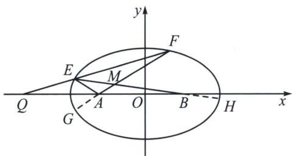

> [!faq]- 《圆锥曲线专题(下册)》例题解析
>
> > [!success]- **【答案】** 详见解析
>
> > [!note]- **【分析】**
> > 本题未单列分析。
>
> > [!note]- **【解析】**
> > 解析 设 $EF: \frac{x}{2}(1 - t_1 t_2) + \frac{y}{\sqrt{3}}(t_1 + t_2) = 1 + t_1 t_2$ 、由于过定点 $Q(-4, 0)$ ，故 $t_1 t_2 = 3$ ，延长 $FA$ 交椭圆于 $G$ ，则 $FG: \frac{x}{2}(1 - t_2 t_3) + \frac{y}{\sqrt{3}}(t_2 + t_3) = 1 + t_2 t_3$ ，由于过定点 $A(-1, 0)$ ，故 $t_2 t_3 = -3$ ，所以 $t_1 = -t_3$ ，所以 $E$ 与 $G$ 关于 $x$ 轴对称，即 $\frac{k_1}{k_2} = -1$ 为定值；
> > 
> > - **②**：不妨设 E、F 在 x 轴上方，由 BH: $\frac{x}{2}(1-t_{1}t_{4})+\frac{y}{\sqrt{3}}(t_{1}+t_{4})=1+t_{1}t_{4}$ ，由于过定点 B(1,0)，故 $t_{1}t_{4}=-\frac{1}{3}$ ,
> > 联立： $\left\{ \begin{array}{l}FG:\frac{x}{2} (1 - t_2t_3) + \frac{y}{\sqrt{3}} (t_2 + t_3) = 1 + t_2t_3\\ BH:\frac{x}{2} (1 - t_1t_4) + \frac{y}{\sqrt{3}} (t_1 + t_4) = 1 + t_1t_4 \end{array} \right.\Leftrightarrow \left\{ \begin{array}{l}FG:2x + \frac{y}{\sqrt{3}} (t_2 + t_3) = -2\\ BH:\frac{2x}{3} +\frac{y}{\sqrt{3}} (t_1 + t_4) = \frac{2}{3} \end{array} ,\left\{ \begin{array}{l}2x + \frac{y}{\sqrt{3}}\left(\frac{3}{t_1} -t_1\right) = -2\\ \frac{2x}{3} +\frac{y}{\sqrt{3}}\left(t_1 - \frac{1}{3t_1}\right) = \frac{2}{3} \end{array} ,\right. \right.$
> > $\left\{ \begin{array}{l} t_{1} = \frac{\sqrt{3}(2x - 1)}{-2y} \\ \frac{1}{t_{1}} = \frac{\sqrt{3}(2x + 1)}{-2y} \end{array} \right.$ ，两式相乘得 $12x^{2} - 4y^{2} = 3$ ，这恰好是以 $A$ 、 $B$ 为焦点的双曲线，因此 $MA - MB$ 为定值.
