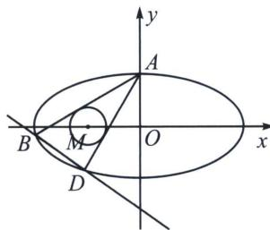

<!-- question-source:start -->
例5 (2025·重庆南坪中学期中第19题)如图, 已知椭圆 $C: \frac{x^{2}}{a^{2}} + \frac{y^{2}}{b^{2}} = 1 (a > b > 0)$ 的上顶点为 $A(0,$

3)，离心率为 $\frac{\sqrt{3}}{2}$ ，若过点A作圆 $M:(x+3)^{2}+y^{2}=r^{2}(0<r<3)$ 的两条切线分别与椭圆C相交于点B，D(不同于点A).

(1)求椭圆 C 的方程;

(2)设直线 AB 和 AD 的斜率分别为 $k_{1}$ ， $k_{2}$ ，求证： $k_{1} \cdot k_{2}$ 为定值；

(3)求证: 直线 $BD$ 过定点.

(1)因为椭圆 $C$ 的上顶点为 $A(0,3)$ ，离心率为 $\frac{\sqrt{3}}{2}$ ，所以 $\left\{ \begin{array}{l} b = 3 \\ \frac{c}{a} = \frac{\sqrt{3}}{2} \\ a^2 = b^2 + c^2 \end{array} \right.$ ，解得 $a = 6, b = 3, c = 3\sqrt{3}$ ，则椭圆 $C$ 的方程为 $\frac{x^2}{36} + \frac{y^2}{9} = 1$ ；

(2)证明：易知圆 M 的圆心为 $M(-3,0)$ ，半径为 r，设切线方程为 $y=kx+3$ ，此时 $\frac{|3-3k|}{\sqrt{1+k^{2}}}=r$ ，即 $(9-r^{2})k^{2}-18k+9-r^{2}=0$ ，因为两切线 AB，AD 的斜率分别为 $k_{1}$ ， $k_{2}(k_{1}\neq k_{2})$ ，

所以 $k_{1}$ ， $k_{2}$ 是方程 $(9-r^{2})k^{2}-18k+9-r^{2}=0$ 的两根，由韦达定理得 $k_{1}\cdot k_{2}=1$ ，则 $k_{1}\cdot k_{2}$ 为定值；

(3)设 $B(6\cos\theta_{1},3\sin\theta_{1})$ ， $D(6\cos\theta_{2},3\sin\theta_{2})$ ， $t_{1}=\tan\frac{\theta_{1}}{2}$ ， $t_{2}=\tan\frac{\theta_{2}}{2}$

$k_{AB}=\frac{3\sin\theta_{1}-3}{6\cos\theta_{1}}=-\frac{1}{2}\frac{1-t_{1}}{1+t_{1}}$ ，同理 $k_{AD}=-\frac{1}{2}\frac{1-t_{2}}{1+t_{2}}$ ， $k_{1}\cdot k_{2}=\frac{1}{4}\cdot\frac{1-t_{1}}{1+t_{1}}\cdot\frac{1-t_{2}}{1+t_{2}}=1$ ，所以 $3+5(t_{1}+t_{2})+3t_{1}t_{2}=0$ ，

BD: $\frac{x}{6}(1 - t_1t_2) + \frac{y}{3}(t_1 + t_2) = 1 + t_1t_2$ ，对比系数得： $\frac{x}{6} - 1 + \frac{y}{3}(t_1 + t_2) + \left(-\frac{x}{6} - 1\right)t_1t_2 = 0$ ，所以一定有 $\frac{\frac{x}{6} - 1}{3} = \frac{\frac{y}{3}}{5} = \frac{-\frac{x}{6} - 1}{3}$ ，所以 $x = 0, y = -5$ 。故直线 BD 过定点 $(0, -5)$ .
<!-- question-source:end -->

![[高中/总复习/专题/2026版高中《mst老唐说题》圆锥曲线专题（数学）/下册/第10章_万能的两点对合式/第三节_椭圆双曲线的两点对合式/四_两点对合方程简化相切圆问题/例题/answers/Q00048775A1.md]]
