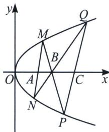
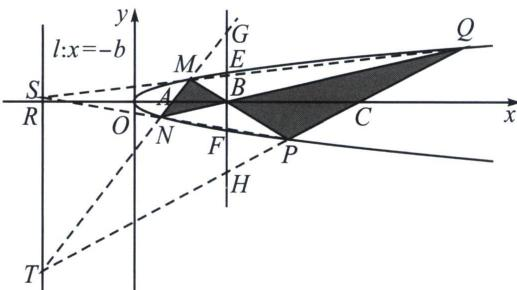

## 一、抛物线蝴蝶定理

蝴蝶定理我们会在后面介绍极点极线后给到背景解读，在抛物线的体系里，两点对合式就是无敌的存在.已知抛物线 $y^{2} = 2px(p > 0)$ ， $A(m,0)$ ， $B(n,0)$ ，过点 $A$ 的动直线交抛物线于 $M$ ， $N$ 两点，直线 $MB$ ， $NB$ 分别交抛物线于点 $P$ ， $Q$ ，则：

(1) 直线 PQ 恒过 x 轴的定点 $C(t, 0)$ ，其中 $n^{2} = m \cdot t$ ;

(2)假设直线 MN 和 PQ 的斜率都存在，则 $\frac{k_{MN}}{k_{PQ}} = \frac{n}{m} = \frac{|CB|}{|BA|}$ .

证明：解法一（两点对合式同构同构）：易得 $\left\{ \begin{array}{l} y_{M}y_{N} = -2pm① \\ y_{M}y_{P} = -2pn② \\ y_{N}y_{Q} = -2pn③ \\ y_{P}y_{Q} = -2pt④ \end{array} \right.$ ①×④=②×③有 $n^2 = mt$ ；

$$
\frac {k _ {M N}}{k _ {P Q}} = \frac {\frac {2 p}{y _ {M} + y _ {N}}}{\frac {2 p}{y _ {p} + y _ {Q}}} = \frac {y _ {P} + y _ {Q}}{y _ {M} + y _ {N}} = \frac {- \frac {2 p n}{y _ {M}} - \frac {2 p n}{y _ {N}}}{y _ {M} + y _ {N}} = \frac {- 2 p n}{y _ {M} y _ {N}} = \frac {- 2 p n}{- 2 p m} = \frac {n}{m}.
$$

解法二：如图所示，作出辅助线，补全自极三角形 TSB(参考下一章内容)，由于 $EF \parallel ST$ ，易得 BE=

## 高中数学 新思路 圆锥专题

$BF$ ，根据蝴蝶定理，显然有 $BG = BH$ ，故 $\frac{k_{MN}}{k_{PQ}} = \frac{|RC|}{|RA|} = \frac{t + n}{m + n} = \frac{|CB|}{|BA|} = \frac{t - n}{n - m} = \frac{2t}{2n} = \frac{2n}{2m}.$

![[高中/总复习/专题/2026版高中《mst老唐说题》圆锥曲线专题（数学）/下册/第10章_万能的两点对合式/第二节_抛物线切线对合与两点对合数列构造综合/一_抛物线蝴蝶定理/例题/Q00053131.md]]
![[高中/总复习/专题/2026版高中《mst老唐说题》圆锥曲线专题（数学）/下册/第10章_万能的两点对合式/第二节_抛物线切线对合与两点对合数列构造综合/一_抛物线蝴蝶定理/例题/Q00053132.md]]
![[高中/总复习/专题/2026版高中《mst老唐说题》圆锥曲线专题（数学）/下册/第10章_万能的两点对合式/第二节_抛物线切线对合与两点对合数列构造综合/一_抛物线蝴蝶定理/例题/Q00053133.md]]
