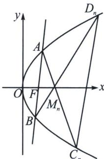

<!-- question-source:start -->
例2 (2025·河北张家口期末第18题)直线 $l$ 经过抛物线 $E: y^{2} = 4x$ 的焦点 $F$ , 且与 $E$ 交于 $A, B$ 两点 (点 $A$ 在 $x$ 轴上方), 点 $M_{n}(n, 0) (n \in \mathbf{N}^{*}$ , 且 $n \geqslant 2)$ 在 $x$ 轴上, 直线 $AM_{n}, BM_{n}$ 分别与 $E$ 交于点 $C_{n}, D_{n}$ , 记直线 $C_{n}D_{n}$ 与 $x$ 轴交点的横坐标为 $x_{n}$ .

(1)若直线 l 垂直于 x 轴，求直线 $C_{2}D_{2}$ 的方程.

(2)证明： $\sum_{i=2}^{n}\frac{1}{x_{i}}<\frac{3}{4}.$

(1) 易知抛物线 $E$ 得焦点为 $F(1, 0)$ , 若直线 $l$ 垂直于 $x$ 轴, 此时直线 $l$ 的方程为 $x = 1$ , 将 $x = 1$ 代入抛物线的方程中, 解得 $y = \pm 2$ , 因为点 $A$ 在 $x$ 轴上方, 所以 $y_A = 2$ , $y_B = -2$ , 因为 $M_2(2, 0)$ ,

所以 $l_{AM_{2}}: y=\frac{2-0}{1-2}(x-2)$ ， $l_{BM_{2}}: y=\frac{-2-0}{1-2}(x-2)$ ，即 $l_{AM_{2}}: y=-2(x-2)$ ， $l_{BM_{2}}: y=2(x-2)$ ，
联立 $\left\{\begin{aligned}y&=-2(x-2)\\ y^{2}&=4x\end{aligned}\right.$ ，解得 $\left\{\begin{aligned}x&=1\\ y&=2\end{aligned}\right.$ 或 $\left\{\begin{aligned}x&=4\\ y&=-4\end{aligned}\right.$ ，即 $C_{2}(4,-4)$ ，同理得 $D_{2}(4,4)$ ，则直线 $C_{2}D_{2}$ 的方程为x=4；

(2)证明: 设直线 $AB$ 对合式方程为 $(y_{1} + y_{2})y = 4x + y_{1}y_{2}$ (请自证), 由于过 $F(1,0)$ , 所以 $y_{1}y_{2} = -4$ , 同理 $AC_{n}: (y_{1} + y_{C})y = 4x + y_{1}y_{C}, BD_{n}: (y_{2} + y_{D})y = 4x + y_{2}y_{D}$ , 由于都过 $M_{n}(n,0)$ ( $n \in \mathbb{N}^{*}$ , 且 $n \geqslant 2$ ), 故 $\left\{ \begin{array}{l} y_{1}y_{C} = -4n \\ y_{2}y_{D} = -4n \end{array} \right.$ , 所以 $y_{C}y_{D} = -4n^{2}$ , 结合 $C_{n}D_{n}: (y_{C} + y_{D})y = 4x + y_{C}y_{D}$ , 所以 $x_{n} = n^{2}$ , 此时 $\frac{1}{x_{n}} = \frac{1}{n^{2}}$ , 则 $\sum_{i=2}^{n} \frac{1}{x_{i}} = \frac{1}{2^{2}} + \frac{1}{3^{2}} + \cdots + \frac{1}{n^{2}}$ , 因为 $\frac{1}{n^{2}} < \frac{1}{n(n-1)} = \frac{1}{n-1} - \frac{1}{n}$ . 所以 $\sum_{i=2}^{n} \frac{1}{x_{i}} \leqslant \frac{1}{4} + \frac{1}{2} - \frac{1}{3} + \cdots + \frac{1}{n-1} - \frac{1}{n} = \frac{3}{4} - \frac{1}{n} < \frac{3}{4}$ .
<!-- question-source:end -->

![[高中/总复习/专题/2026版高中《mst老唐说题》圆锥曲线专题（数学）/下册/第10章_万能的两点对合式/第二节_抛物线切线对合与两点对合数列构造综合/一_抛物线蝴蝶定理/例题/answers/Q00048765A1.md]]
