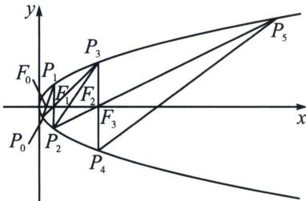
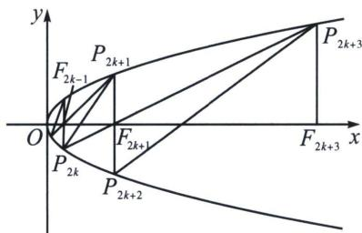

<!-- question-source:start -->
例3（2025·东北三省三校·二模 T19）已知抛物线 C: $y^{2}=4x$ ，焦点为 $F_{0}$ 。抛物线上有一点 $P_{1}(x_{1},y_{1})(x_{1}>1,y_{1}>0)$ ，直线 $F_{0}P_{1}$ 与抛物线的另一个交点为 $P_{0}$ 。按照如下方式依次构造点 $F_{2k-1}$ ， $P_{2k}$ ， $P_{2k+1}$ ， $F_{2k}(k=1,2,3,\cdots)$ ，过 $P_{2k-1}$ 作 x 轴的垂线，垂足为 $F_{2k-1}$ ，垂线与抛物线 C 的另一个交点为 $P_{2k}$ 。作直线 $P_{2k-2}F_{2k-1}$ ，与抛物线 C 的另一个交点为 $P_{2k+1}$ ，直线 $P_{2k}P_{2k+1}$ 与 x 轴的交点为 $F_{2k}$ 。记 $P_{n}(x_{n},y_{n})$ ， $F_{n}(m_{n},0)$ ， $m_{1}=m$ ， $(n=0,1,2,\cdots)$ 。

(1) 若 $P_{1}(2, 2\sqrt{2})$ ，求 $m_{0}, m_{1}, m_{2}, m_{3}$ ;

(2)求证: 数列 $\{m_{n}\}$ 是等比数列, 并用 $m$ 表示数列 $\{m_{n}\}$ 的通项公式;

(3)对任意的正整数 k， $\triangle P_{2k-2}P_{2k-1}F_{2k-1}$ 与 $\triangle F_{2k-1}P_{2k}P_{2k+1}$ 的面积之比是否为定值？若是，请用 m 表示这个定值；若不是，请说明理由.

(1) $m_{0} = 1, F_{1}(2,0), m_{1} = 2$ ，直线 $P_{1}F_{0}: x = \frac{\sqrt{2}}{4} y + 1$ ，联立可得 $P_{0}\left(\frac{1}{2}, -\sqrt{2}\right)$ ，直线 $P_{0}F_{1}: x = \frac{3\sqrt{2}}{4} y + 2$ ，联立可得 $P_{3}(8,4\sqrt{2})$ ，则 $F_{3}(8,0)$ ，由 $P_{3}(8,4\sqrt{2}), P_{2}(2,-2\sqrt{2})$ ，可得 $F_{2}(4,0)$ ，综上可得： $m_{0} = 1, m_{1} = 2, m_{2} = 4, m_{3} = 8$ ；

## 高中数学 新思路 圆锥专题

(2)一方面，对任意的自然数 $k$ ，都有直线 $P_{2k}P_{2k + 1}$ 过点 $F_{2k}(m_{2k},0)$ ， $P_{2k}P_{2k + 1}$ ： $(y_{2k} + y_{2k + 1})y = 4x + y_{2k}$ $y_{2k + 1}$ ，代入点 $F_{2k}(m_{2k},0)$ ，所以 $y_{2k}y_{2k + 1} = -4m_{2k}$ ①，另一方面，对任意的自然数 $k$ ，都有直线 $P_{2k}P_{2k + 3}$ 过点 $F_{2k + 1}(m_{2k + 1},0)$ ，所以 $P_{2k}P_{2k + 3}$ ： $(y_{2k} + y_{2k + 3})y = 4x + y_{2k}y_{2k + 3}$ ，代入点 $F_{2k + 1}(m_{2k + 1},0)$ ，所以 $y_{2k}y_{2k + 3} = -4m_{2k + 1}$ ②，

同理， $y_{2k+1}y_{2k+2}=-4m_{2k+1}$ ③， $y_{2k+2}y_{2k+3}=-4m_{2k+2}$ ④，所以由②×③=①×④得： $m_{2k+1}^{2}=m_{2k}\cdot m_{2k+2}$ ，即： $\frac{m_{2k+2}}{m_{2k+1}}=\frac{m_{2k+1}}{m_{2k}}$ ，综上可得：递推知数列 $\{m_{n}\}$ 是等比数列，且公比为 $\frac{m_{1}}{m_{0}}=m$ 。又 $m_{0}=1$ ，故 $m_{n}=m^{n}(n=0,1,2,3,\cdots)$ 。

(3)解法一：对任意的自然数 $k$ ， $\frac{S_{\triangle P_{2k}P_{2k + 1}F_{2k + 1}}}{S_{\triangle P_{2k + 2}P_{2k + 3}F_{2k + 1}}} = \frac{\frac{1}{2}|F_{2k + 1}P_{2k + 1}|\cdot|F_{2k + 1}P_{2k}|\sin\angle P_{2k + 1}F_{2k + 1}P_{2k}}{\frac{1}{2}|F_{2k + 1}P_{2k + 3}|\cdot|F_{2k + 1}P_{2k + 2}|\sin\angle P_{2k + 2}F_{2k + 1}P_{2k + 3}} =$ $\frac{|F_{2k + 1}F_{2k - 1}|}{|F_{2k + 3}F_{2k + 1}|} = \frac{m^{2k + 1} - m^{2k - 1}}{m^{2k + 3} - m^{2k + 1}} = \frac{m^{2k + 1} - m^{2k - 1}}{m^2(m^{2k + 1} - m^{2k - 1})} = \frac{1}{m^2},$
<!-- question-source:end -->

![[高中/总复习/专题/2026版高中《mst老唐说题》圆锥曲线专题（数学）/下册/第10章_万能的两点对合式/第二节_抛物线切线对合与两点对合数列构造综合/一_抛物线蝴蝶定理/例题/answers/Q00048766A1.md]]
