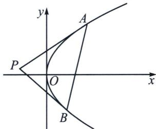

## 二、切线与对合不动点

我们以抛物线 $y^{2} = 2px$ 的两点对合方程 $(y_{1} + y_{2})y = 2px + y_{1}y_{2}$ 为例，如果 $y_{1} = y_{2}$ ，此时一定有 $y_{1} = f(y_{1})$ ，所以方程为 $yy_{1} = p(x + x_{1})$ ，这就是过抛物线上点 $A(x_{1},y_{1})$ 的切线方程，那么 $A$ 点就是抛物线的切点，类比于不动点概念是 $f(x) = x$ ，故切点也叫对合不动点，如图，过点 $P$ 作抛物线两条切线 $PA$ 和 $PB$ ，

则 $AB$ 是两个对合不动点, 他们的连线叫做对合轴, 那么点 $P$ 就是对合中心, 也是著名的切线和切点弦, 这个在后来被我们叫做极点极线, $\triangle PAB$ 我们也称之为阿基米德三角形.

我们易知 $\left\{ \begin{array}{l} PA: yy_{1} = p(x + x_{1}) \\ PB: yy_{2} = p(x + x_{2}) \end{array} \right.$ ，设对合中心坐标 $P(x_{0}, y_{0})$ ，则一定有 $\left\{ \begin{array}{l} y_{0}y_{1} = p(x_{0} + x_{1}) \\ y_{0}y_{2} = p(x_{0} + x_{2}) \end{array} \right.$ ，故 $A(x_{1}, y_{1})$ 和 $B(x_{2}, y_{2})$ 均在同构方程 $yy_{0} = p(x + x_{0})$ 上，根据两点确定一条直线，则对合轴方程 $AB: yy_{0} = p(x + x_{0})$ ，结合对合方程 $AB: (y_{1} + y_{2})y = 2px + y_{1}y_{2}$ ，则易得 $\left\{ \begin{array}{l} y_{1} + y_{2} = 2y_{0} \\ y_{1}y_{2} = 2px_{0} \end{array} \right.$ ，这样就把阿基米德三角形的一切数据揽括其中。

![[高中/总复习/专题/2026版高中《mst老唐说题》圆锥曲线专题（数学）/下册/第10章_万能的两点对合式/第二节_抛物线切线对合与两点对合数列构造综合/二_切线与对合不动点/例题/Q00048767.md]]
