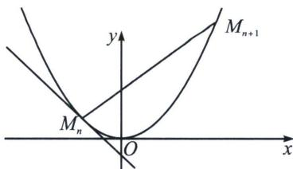

> [!faq]- 《圆锥曲线专题(下册)》例题解析
>
> > [!success]- **【答案】** 详见解析
>
> > [!note]- **【解析】**
> > 解析 (1)抛物线 $C$ 的准线方程为 $y = -\frac{p}{2}$ , 所以 $|MF| = y_0 + \frac{p}{2}$ , 所以 $y_0 + \frac{p}{2} = 1 + y_0$ ,
> >
> > 解得 p=2，所以 C 的方程为 $x^{2}=4y$ .
> >
> > 
> >
> > (2)(i)证明：设 $M_{n}\left(x_{n}, \frac{x_{n}^{2}}{4}\right)$ ，因为 $y' = \frac{x}{2}$ ，所以点 $M_{n}$ 处的切线斜率为 $\frac{x_{n}}{2}$ ，所以直线 $M_{n}M_{n+1}$ 斜率为 $-\frac{2}{x_{n}}$ ，所以直线 $M_{n}M_{n+1}: (x_{n+1} + x_{n})x = 4y + x_{n+1}x_{n}$ （请自证），由于 $k = -\frac{2}{x_{n}} = \frac{x_{n+1} + x_{n}}{4}$ ，可得 $x_{n+1} = -\frac{8}{x_{n}} - x_{n}$ ，即 $M_{n+1}$ 的横坐标为 $-\frac{8}{x_{n}} - x_{n}$ ，所以 $y_{n+1} = \frac{x_{n+1}^{2}}{4} = \frac{1}{4}\left(\frac{64}{x_{n}^{2}} + x_{n}^{2} + 16\right) = \frac{x_{n}^{2}}{4} + \frac{16}{x_{n}^{2}} + 4 = y_{n} + \frac{16}{x_{n}^{2}} + 4 > y_{n} + 4$ ，当 $n \geqslant 2$ 时，有 $y_{n} = (y_{n} - y_{n-1}) + (y_{n-1} - y_{n-2}) + \cdots + (y_{2} - y_{1}) + y_{1} > 4(n-1) + 1 = 4n-3$ ，又由 $y_{1} = 1$ ，故 $y_{n} \geqslant 4n - 3 (n \in \mathbf{N}^{*})$ ，所以 $|M_{n}F| \geqslant 4n - 2$ ，
> >
> > （ii）证明：易知直线 $M_{n}M_{n + 1}$ ： $y = -\frac{2x}{x_n} +\frac{x_n^2}{4} +2$ ， $F$ 到直线 $M_{n}M_{n + 1}$ 的距离为 $\frac{1 + \frac{x_n^2}{4}}{\sqrt{1 + \left(\frac{2}{x_n}\right)^2}}$ ， $|M_nM_{n + 1}| =$ $\sqrt{1 + \left(\frac{2}{x_n}\right)^2}|x_{n + 1} - x_n| = \sqrt{1 + \left(\frac{2}{x_n}\right)^2}\left|\frac{8}{x_n} +2x_n\right|$ ，所以 $S_{n} = \left(1 + \frac{x_{n}^{2}}{4}\right)\left|\frac{4}{x_{n}} +x_{n}\right| = \frac{(x_{n}^{2} + 4)^{2}}{4|x_{n}|}\geqslant \frac{4|x_n|(x_n^2 +4)}{4|x_n|} =$ $x_{n}^{2} + 4$ ，因为 $x_{n + 1}^{2} = \left(-\frac{8}{x_n} -x_n\right)^2 = x_n^2 +\frac{64}{x_n^2} +16 > x_n^2 +16,$
> >
> > 由(1)知 $y_{n} \geqslant 4n - 3 (n \in \mathbb{N}^{*})$ ，即 $\frac{x_{n}^{2}}{4} \geqslant 4n - 3$ ，所以当 $n \geqslant 2$ 时， $x_{n}^{2} > 16n - 12$ ，所以当 $n \geqslant 2$ 时， $S_{n} > x_{n}^{2} + 4 > 16n - 8 = 8 (2n - 1)$ ，所以 $\frac{1}{S_{n}^{2}} < \frac{1}{64} \times \frac{1}{(2n - 1)^{2}} < \frac{1}{64}\left[\frac{1}{(2n - 1)(2n - 3)}\right] = \frac{1}{128}\left(\frac{1}{2n - 3} - \frac{1}{2n - 1}\right)$ ，
> >
> > 当 n=1 时， $\frac{1}{S_{1}^{2}}=\frac{1}{64}<\frac{17}{128}$ ,
> >
> > 当 $n \geqslant 2$ 时， $\sum_{k=1}^{n} \frac{1}{S_k^2} < \frac{1}{64} + \frac{1}{128} \left( \frac{1}{1} - \frac{1}{3} + \frac{1}{3} - \frac{1}{5} + \cdots + \frac{1}{2n-3} - \frac{1}{2n-1} \right) = \frac{1}{64} + \frac{1}{128} \left( 1 - \frac{1}{2n-1} \right) < \frac{1}{64} + \frac{1}{128} = \frac{3}{128} < \frac{17}{128}$ ，所以 $\sum_{k=1}^{n} \frac{1}{S_k^2} < \frac{17}{128}$ .
