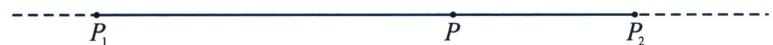

## 一、单比的概念及性质

## 1. 单比的定义

如果共线三点 $P_{1}, P_{2}, P$ 满足 $\overrightarrow{P_{1}P} = \lambda \overrightarrow{PP_{2}}$ ，则 $\lambda$ 称为共线三点 $P_{1}, P_{2}, P$ 的单比，也可以表示为 $P$ 分 $\overrightarrow{P_{1}P_{2}}$ 为 $\lambda$ 。其中 $P_{1}, P_{2}$ 称为基点， $P$ 称为分点。

对单比的概念我们需要理解以下几点：

(1)单比的定义是有顺序的，共线三点 $P_{1}$ ， $P_{2}$ ， $P$ 的顺序不可随意调整，起点 $\rightarrow$ 分点 $= \lambda$ （分点 $\rightarrow$ 终点）；

(2)当 $P$ 位于线段 $P_{1}$ , $P_{2}$ 之间时, $\lambda > 0$ , 否则, 当 $P$ 位于线段 $P_{1}$ , $P_{2}$ 之外时, $\lambda < 0$ , $P$ 为线段 $P_{1} P_{2}$ 中点时 $\lambda = 1$ ;

(3)如果 $P_{1}$ ， $P_{2}$ 为定点， $\lambda$ 也给定，则点 P 的位置唯一确定；

(4)在平面直角坐标系中， $P_{1}(x_{1},y_{1})$ ， $P_{2}(x_{2},y_{2})$ ，由向量坐标运算，得出定比分点公式：

$$
x _ {P} = \frac {x _ {1} + \lambda x _ {2}}{1 + \lambda}, y _ {P} = \frac {y _ {1} + \lambda y _ {2}}{1 + \lambda}
$$

(5)所谓共线三点的单比，即为定比分点中的定比.

最早出现定比分点高考题是在 2006 年山东高考卷，由于年代久远，所以我们就用同类型题来解读.

## 2. $\lambda + \mu$ 为定值的参数同构与点差法

当圆锥曲线上两点作为定比分点，线段两个端点分别位于焦点和另一条坐标轴上时，这里会涉及一个 $\lambda + \mu$ 为定值的问题，我们介绍参数同构法，点差思想来处理.

![[高中/总复习/专题/2026版高中《mst老唐说题》圆锥曲线专题（数学）/下册/第11章_从定比点差到极点极线/第一节_单比与交比/一_单比的概念及性质/例题/Q00053142.md]]
![[高中/总复习/专题/2026版高中《mst老唐说题》圆锥曲线专题（数学）/下册/第11章_从定比点差到极点极线/第一节_单比与交比/一_单比的概念及性质/例题/Q00053143.md]]
