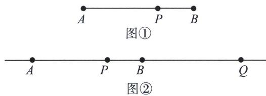
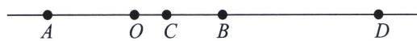

## 三、调和点列与定比点差

## 1. 调和点列的概念

如下图①，点 $P$ 在线段 $AB$ 上，则满足 $\frac{|\overrightarrow{AP}|}{|\overrightarrow{PB}|} = \lambda (\lambda > 0)$ 的点 $P$ 是唯一存在的。但是，如果将线段 $AB$ 改为直线 $AB$ ，此时，满足 $\frac{|\overrightarrow{AP}|}{|\overrightarrow{PB}|} = \lambda$ 的点有两个，如下图②，不妨记另一个点为 $Q$ ，则 $\frac{AP}{PB} = \frac{AQ}{QB} = \lambda (\lambda \neq 1)$ ，在此种情况下，我们称点 $A$ 、 $P$ 、 $B$ 、 $Q$ 为调和点列，或者称点 $P$ 、 $Q$ 调和分割点 $A$ 、 $B$ 。按照交比的调和比解释，就是 $(AB, PQ) = -1$

特别的，当 $\lambda=1$ 时，即点 P 为 AB 的中点，则 Q 为无穷远点.

## 2. 调和点列的性质

如下图所示：对于线段 $AB$ 的内分点 $C$ 和外分点 $D$ 满足 $C$ 、 $D$ 调和分割线段 $AB$ ，即 $\frac{AC}{CB} = \frac{AD}{DB}$ ，设 $O$ 为线段 $AB$ 的中点，则有以下结论成立：

①点 A、B 也调和分割 C、D，即 $\frac{CA}{AD} = \frac{CB}{BD}$ ;

② $\frac{2}{AB}=\frac{1}{AC}+\frac{1}{AD}$ (AB 是 AC 与 AD 的调和平均数).

![[高中/总复习/专题/2026版高中《mst老唐说题》圆锥曲线专题（数学）/下册/第11章_从定比点差到极点极线/第一节_单比与交比/三_调和点列与定比点差/例题/Q00048786.md]]
![[高中/总复习/专题/2026版高中《mst老唐说题》圆锥曲线专题（数学）/下册/第11章_从定比点差到极点极线/第一节_单比与交比/三_调和点列与定比点差/例题/Q00048787.md]]
