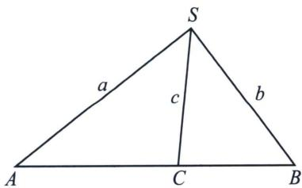
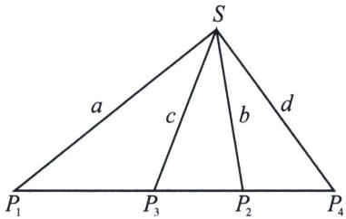
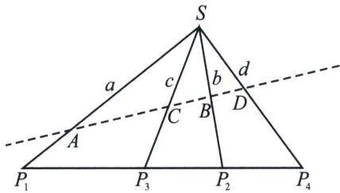

## 二、单比与交比

## 1. 单比角元形式

两条直线的有向角满足下面几个性质：

(1)如果直线 a 逆时针旋转到直线 b，则 $(a, b)$ 为正角；如果直线 a 顺时针旋转到直线 b，则 $(a, b)$ 为负角；

(2) $\sin(a, b) = -\sin(b, a)$ .

如下图，分别连接共线三点 A, C, B 与其所在直线外一点 S，记所形成的直线分别为 a, c, b，若 $\overrightarrow{AC} = \lambda \overrightarrow{CB}$ ，则 $\lambda = \frac{SA \sin(a, c)}{SB \sin(c, b)}$ .

证明： $\lambda = \frac{S_{\triangle SAC}}{S_{\triangle SBC}} = \frac{\frac{1}{2}SA\cdot SC\cdot\sin(a,c)}{\frac{1}{2}SB\cdot SC\cdot\sin(c,b)} = \frac{SA\sin(a,c)}{SB\sin(c,b)}$

## 2. 交比的概念及性质

点列的交比: 如果共线四点 $P_{1}, P_{2}, P_{3}, P_{4}$ 满足 $\overrightarrow{P_{1}P_{3}} = \lambda \overrightarrow{P_{3}P_{2}}, \overrightarrow{P_{1}P_{4}} = \mu \overrightarrow{P_{4}P_{2}}$ , 则 $\frac{\lambda}{\mu}$ 称为共线四点 $P_{1}, P_{2}, P_{3}, P_{4}$ 的交比, 记为 $(P_{1}, P_{2}; P_{3}, P_{4})$ 。其中 $P_{1}, P_{2}$ 称为基点偶 (对), $P_{3}, P_{4}$ 称为分点偶 (对).

不妨共线四点 $P_{1}, P_{2}, P_{3}, P_{4}$ 所在直线不与坐标轴垂直，并设 $P_{1}(x_{1}, y_{1}), P_{2}(x_{2}, y_{2}), P_{3}(x_{3}, y_{3}), P_{4}(x_{4}, y_{4})$ ，则： $(P_{1}, P_{2}; P_{3}, P_{4}) = \frac{(x_{3} - x_{1})(x_{2} - x_{4})}{(x_{2} - x_{3})(x_{4} - x_{1})} = \frac{(y_{3} - y_{1})(y_{2} - y_{4})}{(y_{2} - y_{3})(y_{4} - y_{1})}$ .

由上述计算公式，不难得到点列交比的简单性质：

性质 1：基点偶与分点偶交换，交比的值不变，即 $(P_{1}, P_{2}; P_{3}, P_{4})=(P_{3}, P_{4}; P_{1}, P_{2})$ .

性质 2: 基点偶的两个字母交换, 或者分点偶的两个字母交换, 交比值变为原来交比值的倒数, 即

$$
(P _ {2}, P _ {1}; P _ {3}, P _ {4}) = (P _ {1}, P _ {2}; P _ {4}, P _ {3}) = \frac {1}{(P _ {1} , P _ {2} ; P _ {3} , P _ {4})}
$$

性质3：交换中间两个字母，或交换两端的两个字母，交比的值变为1减去原来的交比值，即 $(P_{1}, P_{3}; P_{2}, P_{4}) = (P_{4}, P_{2}; P_{3}, P_{1}) = 1 - (P_{1}, P_{2}; P_{3}, P_{4})$

性质 4：如果四个不同的共线点中三点及其交比值已知，则第四点必唯一确定.

点列交比的角元形式：如下图，分别连接共线四点 $P_{1}$ ， $P_{2}$ ， $P_{3}$ ， $P_{4}$ 与其所在直线外一点 S，记所形成

的直线分别为 $a, b, c, d$ ，则 $(P_1, P_2; P_3, P_4) = \frac{\sin(a, c)\sin(d, b)}{\sin(c, b)\sin(a, d)}$ .

从交比的角元形式可以看出，交比 $(P_{1}, P_{2}; P_{3}, P_{4})$ 的值只与直线的有向角有关系，与线段长度没有关系。于是我们很容易据此得到交比的射影不变性.

## 3. 交比的射影不变性

交比的射影不变性：如图所示，过点 S 引四条相交直线，分别与另外两条直线交于 A, B, C, D 和 $P_{1}$ ， $P_{2}$ ， $P_{3}$ ， $P_{4}$ ，则 $(P_{1}, P_{2}; P_{3}, P_{4}) = (A, B; C, D)$

交比的射影不变性，是交比的角元形式的直接推论，交比的射影不变性表明，交比经中心射影后不变.

关于交比射影不变性的斜率公式，我们会在后面章节进行解读，交比射影不变性的推论，结合调和点列，基本上可以打通高考.

![[高中/总复习/专题/2026版高中《mst老唐说题》圆锥曲线专题（数学）/下册/第11章_从定比点差到极点极线/第一节_单比与交比/二_单比与交比/例题/Q00048783.md]]
![[高中/总复习/专题/2026版高中《mst老唐说题》圆锥曲线专题（数学）/下册/第11章_从定比点差到极点极线/第一节_单比与交比/二_单比与交比/例题/Q00048784.md]]
![[高中/总复习/专题/2026版高中《mst老唐说题》圆锥曲线专题（数学）/下册/第11章_从定比点差到极点极线/第一节_单比与交比/二_单比与交比/例题/Q00048785.md]]
