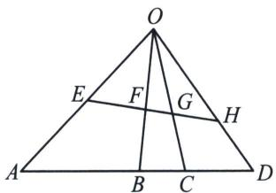

<!-- question-source:start -->
例3 (2024·济南期末)射影几何学中, 中心投影是指光从一点向四周散射而形成的投影, 如图, $O$ 为透视中心, 平面内四个点 $E$ , $F$ , $G$ , $H$ 经过中心投影之后的投影点分别为 $A$ , $B$ , $C$ , $D$ . 对于四个有序点 $A$ , $B$ , $C$ , $D$ , 定义比值 $x = \frac{\frac{CA}{CB}}{\frac{DA}{DB}}$ 叫做这四个有序点的交比, 记作(ABCD).

(1)证明： $(EFGH)=(ABCD)$ ;

(2)已知(EFGH)= $\frac{3}{2}$ ，点B为线段AD的中点， $AC=\sqrt{3}OB=3$ ， $\frac{\sin\angle ACO}{\sin\angle AOB}=\frac{3}{2}$ ，求 $\cos A$ .

<!-- question-source:end -->

![[高中/总复习/专题/2026版高中《mst老唐说题》圆锥曲线专题（数学）/下册/第11章_从定比点差到极点极线/第一节_单比与交比/二_单比与交比/例题/answers/Q00053144A1.md]]
